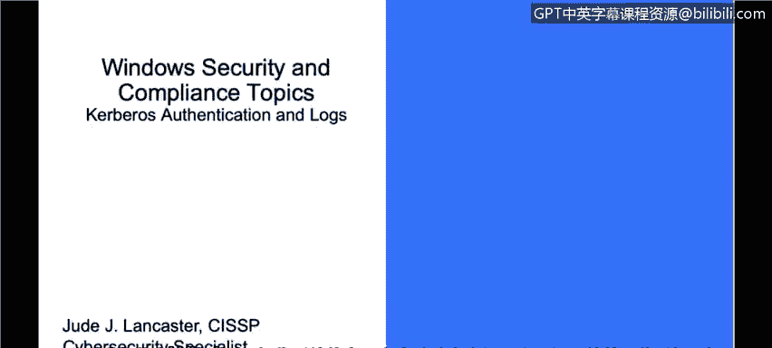
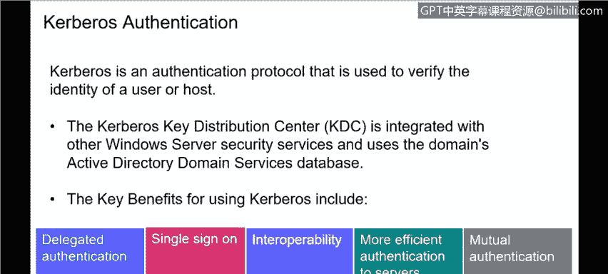
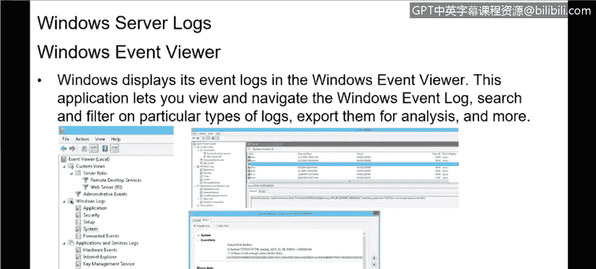
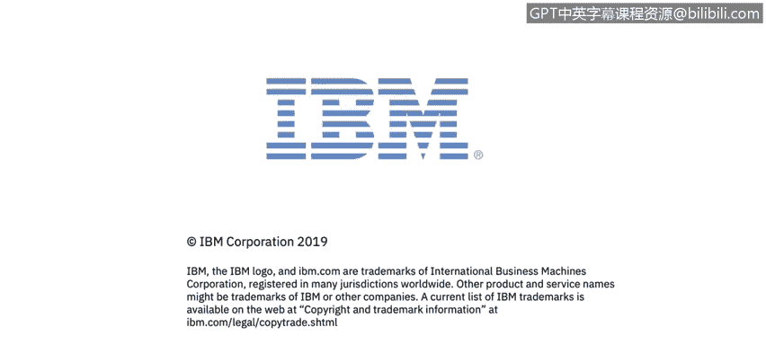

# 课程3：《网络安全合规框架与系统管理》：31：Kerberos认证与日志管理 🔐

在本节课中，我们将学习Windows操作系统环境下的两个核心安全概念：Kerberos认证协议和Windows服务器日志管理。理解这些内容对于维护系统安全和进行合规性审计至关重要。

---

上一节我们介绍了Windows操作系统在安全与合规中的角色，本节中我们来看看Windows环境中一个关键的认证协议——Kerberos。

**Kerberos认证**是一种用于验证用户或主机身份的认证协议。在Windows环境中，它主要与活动目录（Active Directory, AD）结合使用。当用户登录到通过AD连接的系统时，大多数AD系统会利用Kerberos作为认证协议。

其核心组件是**Kerberos密钥分发中心（KDC）**，它集成在活动目录中，是Windows安全服务的一部分，并使用域活动目录服务数据库。对于初学者而言，重要的是理解Kerberos是Windows内部用于认证和保护AD环境的主要机制。

以下是Kerberos认证的几个关键优势：

*   **委托认证**：认证可以委托给活动目录林中的不同资源，方便同一AD内的其他资源和用户之间进行安全交互。
*   **单点登录（SSO）**：用户登录AD后，任何利用该AD登录的服务都将自动完成认证，用户无需多次登录即可访问AD环境内的资源，兼顾了便利性与安全性。
*   **互操作性**：只要资源是AD的一部分且用户已通过AD认证，用户就可以访问这些资源，而无需关心资源的具体特性，这简化了最终用户的访问过程。
*   **高效性**：由于Kerberos内置于AD中，无需部署独立的认证服务，提高了效率。
*   **相互认证**：它提供了使用内置在活动目录中的同一用户名和密码登录多个服务的能力。

需要指出的是，尽管Kerberos提供了强大的单因素认证，但许多组织为了增加安全层，会在此基础上启用双因素认证（2FA）。例如，结合AD密码和第三方认证服务（如Google Authenticator或Microsoft Authenticator）。

---

了解了身份验证机制后，我们接下来探讨如何监控和审计系统活动，这就引出了Windows日志的重要性。

**Windows服务器日志**是记录计算机中发生事件的记录。无论是服务器、台式机还是笔记本电脑，任何Windows系统（乃至任何操作系统）都会生成日志。这些日志记录了由人员或运行进程触发的事件，其目的在于追踪系统活动、排查问题，并协助调查安全事件。

从安全管理的角度来看，日志是一个非常重要的组成部分。安全专家通常会帮助客户聚合和分析这些日志，以识别可能导致潜在入侵、安全事件或任何需要调查的异常活动。

在Windows系统中，最常见的日志存储位置是**Windows事件日志**。它包含了操作系统以及在该服务器上运行的许多其他Windows应用程序（如SQL Server或IIS）的日志。这些日志采用**结构化数据格式**，便于搜索和分析。当然，也有一些日志可能以**文本格式**写入，允许管理员手动阅读。

许多组织会使用**日志聚合器**或**安全信息与事件管理（SIEM）** 系统来集中管理成百上千台机器的日志。这些工具将所有日志收集到一处，并自动进行分析，以突出显示需要安全人员进一步调查的异常情况。这正是网络安全的要义之一：监控系统、分析日志，并利用自动化工具来聚合和分析日志，以发现潜在威胁。

---

**本节课总结**

本节课我们一起学习了Windows环境下的两个核心安全组件。首先，我们探讨了**Kerberos认证协议**，它是Windows活动目录中用于验证身份的主要机制，提供了单点登录、委托认证等关键安全优势。接着，我们介绍了**Windows服务器日志管理**，了解了日志对于系统监控、故障排查和安全事件调查的重要性，并简要说明了如何使用事件查看器以及借助日志聚合器或SIEM系统进行高效的日志分析。掌握这些知识是成为一名合格的网络安全分析师的基础。