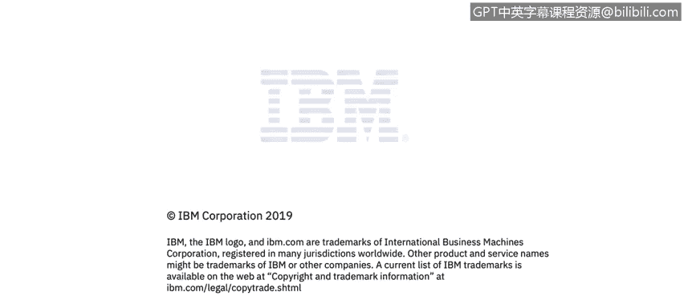

# 课程3：《网络安全合规框架与系统管理》：33：Linux简介 🐧

在本节课中，我们将要学习Linux操作系统的基础知识，包括它为何被广泛使用、其历史背景、核心工作原理以及主要特性。

## 概述

Linux是一个多用户、多任务的操作系统，它提供了多种功能，包括软件资源管理、目录和文件系统管理，并允许程序执行。

## Linux的历史

上一节我们了解了Linux的基本定义，本节中我们来看看它的发展历程。

Unix操作系统始于1969年的贝尔实验室，最初用汇编语言编写。1973年，Thompson和Ritchie成功地用C语言重写了Unix。1991年9月，Linus Torvalds发布了后来成为Linux内核的第一个版本。Torvalds通过将其许可证置于GNU通用公共许可证（GPL）下，极大地推动了开源社区的发展。GNU GPL是一个广泛使用的自由软件许可证，它保证了最终用户运行、研究、共享和修改软件的自由。

## 为何选择Linux？

了解了Linux的起源后，我们来看看它为何受到青睐。

Linux系统足够灵活，允许用户利用各种支持工具（如编译器、科学库、调试器和性能监视器）来构建应用程序。Linux拥有四个使其成为科学计算领域优秀操作系统的关键特性：**性能**、**功能性**、**灵活性**和**可移植性**。Unix系统可以针对特定任务进行优化，例如运行小型便携设备或大型超级计算机。

## Linux的工作原理

现在，我们来看看Linux是如何工作的。Linux主要由两个核心组件构成：**内核**和**外壳**。

内核是Linux操作系统的核心，它直接与硬件交互并管理进程。它负责管理系统和用户、进程、设备、文件以及内存。

外壳是内核的一个接口。用户通过外壳输入命令，内核接收来自外壳的任务并执行它们。外壳主要重复执行以下四个任务：
1.  显示提示符。
2.  读取命令。
3.  处理并解释命令。
4.  执行命令。

## 总结

本节课中，我们一起学习了Linux操作系统的基本概念。我们回顾了它的历史，探讨了其灵活、高性能、功能丰富和可移植的特性，这些特性使其在从嵌入式设备到超级计算机的各种场景中都非常适用。最后，我们了解了Linux的核心工作组件：负责与硬件直接交互和管理资源的内核，以及作为用户与内核之间桥梁的外壳。理解这些基础知识是进一步学习Linux系统管理和网络安全的重要一步。