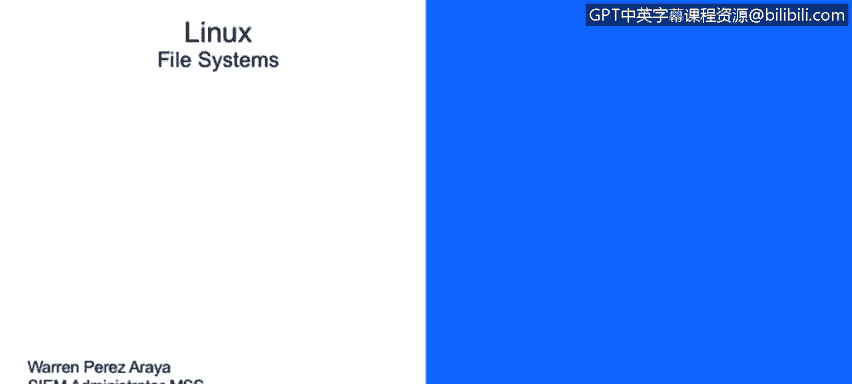
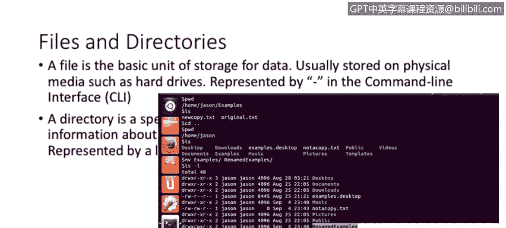
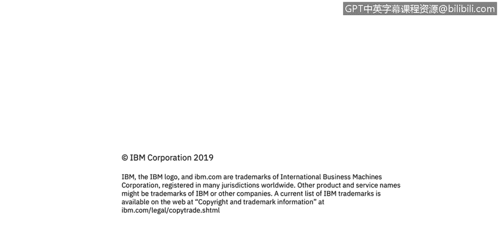

# 课程3：《网络安全合规框架与系统管理》：34：Linux文件系统和目录结构 📂




在本节课中，我们将要学习Linux操作系统中的文件系统和目录结构。理解Linux如何组织文件和目录，是进行系统管理和安全配置的基础。我们将从基本概念开始，逐步深入到核心目录的用途。

## 文件与目录

首先，我们来区分文件和目录这两个基本概念。

文件是存储数据的基本单元。它本质上是在物理介质（如硬盘、U盘）上存储信息的一个单位。在命令行中，文件通常由连字符 `-` 表示。

目录则是一种特殊类型的文件。它本身不存储用户数据，而是存储关于其他文件的信息，相当于一个文件容器。在概念上，它类似于Windows操作系统中的“文件夹”。在Linux命令行中，目录由字母 `d` 表示。

以下是一个示例，展示了如何区分文件和目录：
```
drwxr-xr-x  2 user user  4096 Jan 1 12:34 Documents
-rw-r--r--  1 user user   123 Jan 1 12:34 report.txt
```
在上面的列表中，`Documents` 行首的 `d` 表明它是一个目录，而 `report.txt` 行首的 `-` 表明它是一个普通文件。



## Linux目录结构

上一节我们介绍了文件和目录的基本概念，本节中我们来看看Linux独特的目录结构。它与Windows的盘符（如C:、D:）设计有很大不同。

Linux的目录结构是一个单一的树状层次结构，一切都始于根目录，用正斜杠 `/` 表示。系统中的所有其他文件、目录和设备都“挂载”在这个根目录之下。只有root用户（系统管理员）拥有根目录的完全访问权限，这是出于系统安全的设计。

请注意，根目录 `/` 与root用户的家目录 `/root` 是不同的概念，后者是root用户的个人工作空间。

以下是Linux系统中一些最重要和常用的核心目录及其用途：

**`/bin` 目录**
此目录包含系统的基本二进制可执行文件（命令）。许多常用的命令都存放在这里，例如：
*   `ps` - 查看进程状态
*   `ls` - 列出目录内容
*   `cp` - 复制文件
*   `mv` - 移动或重命名文件

**`/sbin` 目录**
此目录也包含可执行文件，但这些命令通常用于系统维护和管理任务，需要root权限才能执行。例如：
*   `iptables` - 配置防火墙规则
*   `reboot` - 重启系统
*   `ifconfig` - 查看和配置网络接口（较新系统使用 `ip` 命令）

**`/etc` 目录**
这是系统配置文件的集中存放地。几乎所有系统程序和已安装应用程序的配置文件都位于此目录或其子目录下。例如，如果你安装了Apache网页服务器，其配置文件通常位于 `/etc/apache2/` 目录中。

**`/var` 目录**
此目录专为存储经常变化（可变）的文件而设计。一个典型的例子是日志文件。大多数应用程序和系统服务都会将运行日志写入 `/var/log/` 目录下的文件中。

**`/tmp` 目录**
此目录用于存放临时文件。系统重启时，该目录下的所有内容通常会被清空。因此，它不适合存储需要持久保存的数据。

**`/home` 目录**
这是所有普通用户的个人家目录所在地。系统为每个用户创建一个以其用户名命名的子目录（例如用户 `warren` 的家目录是 `/home/warren`）。用户对自己的家目录拥有完全控制权，用于存放个人文件和数据。

**`/boot` 目录**
此目录包含系统启动所需的文件，如引导加载程序（GRUB）和内核镜像。它在系统启动过程中被使用。

## 总结



本节课中我们一起学习了Linux文件系统的核心概念。我们首先明确了文件与目录的区别，然后深入探讨了Linux独特的树状目录结构，从根目录 `/` 开始，逐一介绍了 `/bin`、`/sbin`、`/etc`、`/var`、`/tmp`、`/home` 和 `/boot` 等关键目录的用途。理解这些目录的布局和功能，是有效进行Linux系统管理、故障排查和安全加固的重要第一步。