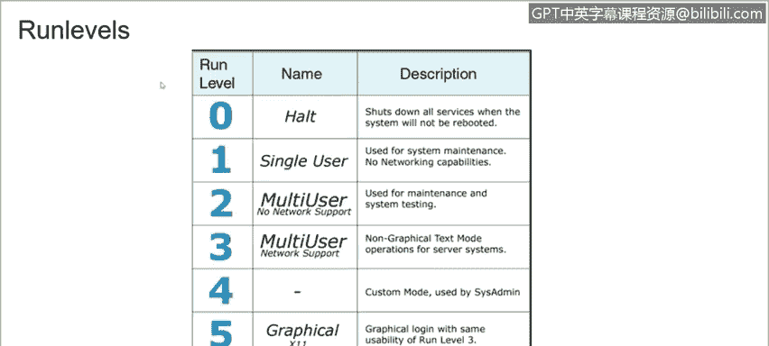
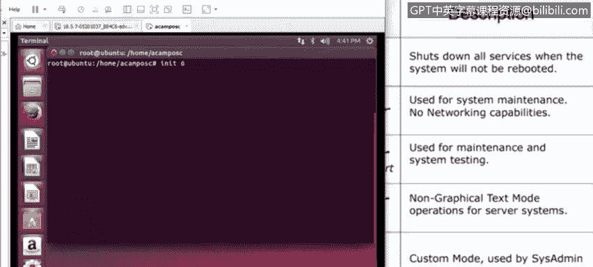

# 课程3：《网络安全合规框架与系统管理》：35：Linux运行级别 🐧


在本节课程中，我们将学习Linux操作系统中的“运行级别”概念。运行级别决定了系统启动时加载哪些服务和进程，是系统管理和故障排查的重要工具。

## 概述


运行级别定义了Linux系统启动后的不同操作状态。理解运行级别有助于我们控制系统启动行为，例如选择进入图形界面、纯命令行模式或单用户维护模式。

## 什么是运行级别？

当Linux系统启动时，内核会首先启动一个名为 **`init`** 的进程。`init` 进程负责启动系统中的所有其他进程。

例如，当你启动Linux计算机时，内核启动 `init`，然后 `init` 执行启动脚本来初始化硬件、启动网络服务和图形桌面环境。

然而，`init` 并非只执行一套固定的启动脚本。系统存在多个不同的运行级别，每个级别都有自己对应的一套启动脚本。

例如，一个运行级别可能会启动网络服务和图形桌面，而另一个运行级别可能只启动命令行界面且不启用网络。这意味着你可以通过切换运行级别，从图形桌面模式切换到无网络的文本控制台模式，而无需手动逐个停止或启动不同的服务。

## 运行级别详解

以下是Linux中标准的运行级别定义及其含义：

*   **运行级别 0**：**关机**。此级别会关闭所有服务并关闭系统。
    *   命令：`init 0` 或 `shutdown -h now`
*   **运行级别 1**：**单用户模式**。系统以超级用户（root）身份启动，不启动守护进程或网络服务。此模式主要用于系统恢复或维护环境。
    *   命令：`init 1`
*   **运行级别 2, 3, 4**：**多用户模式**。这些级别提供完整的多用户支持，包括网络服务。运行级别 3 是标准的无图形界面多用户模式，运行级别 5 则在此基础上增加了图形登录界面。运行级别 2 和 4 在许多发行版中通常未定义或与级别 3 相同。
    *   命令（例如切换到级别3）：`init 3`
*   **运行级别 5**：**带图形界面的多用户模式**。这是大多数桌面Linux系统的默认启动级别。
    *   命令：`init 5`
*   **运行级别 6**：**重启**。此级别会关闭所有服务并重新启动系统。
    *   命令：`init 6` 或 `reboot`

## 实践演示

现在，让我们在一个虚拟机中查看和切换运行级别。

首先，登录系统。你可以使用 `who -r` 或 `runlevel` 命令来查看当前系统的运行级别。

```bash
who -r
# 或
runlevel
```



要切换到另一个运行级别，例如重启系统（运行级别 6），可以使用 `init` 命令：

```bash
sudo init 6
```

执行此命令后，系统将开始关闭所有服务并重新启动。



## 总结


本节课我们一起学习了Linux的运行级别。我们了解到运行级别是系统启动状态的定义，由 `init` 进程管理，不同的级别对应不同的服务组合。掌握运行级别的概念和切换方法，对于系统管理员进行状态控制、故障恢复和维护工作至关重要。记住，运行级别 0 是关机，1 是单用户维护模式，3 是多用户文本模式，5 是带图形界面的多用户模式，而 6 是重启。