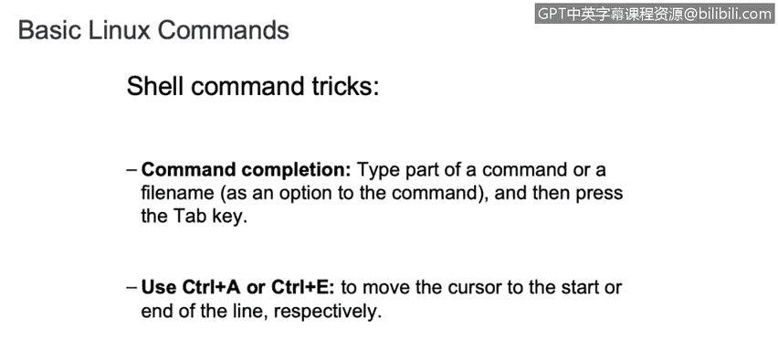
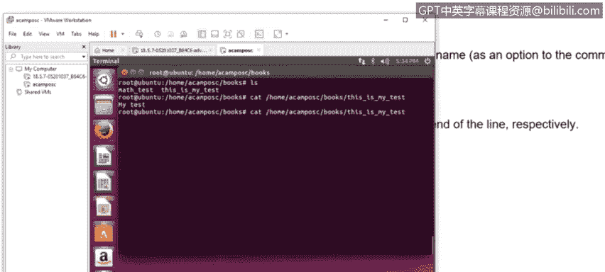
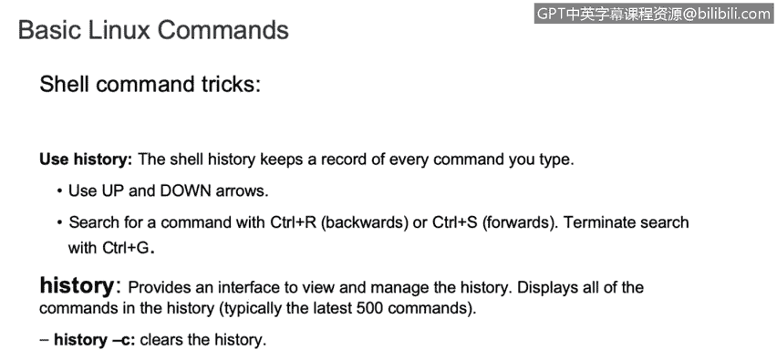
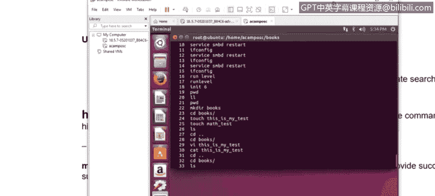
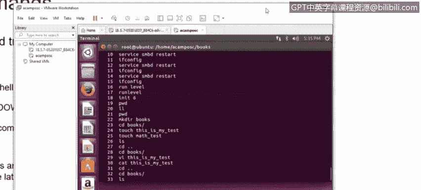
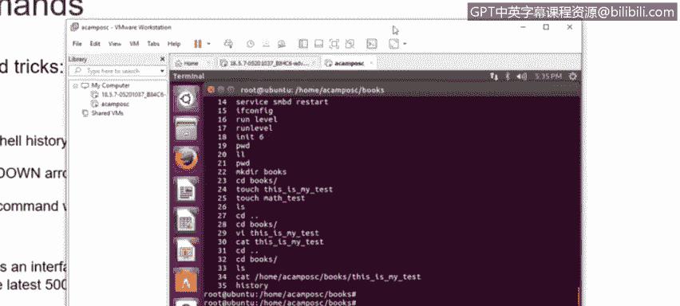
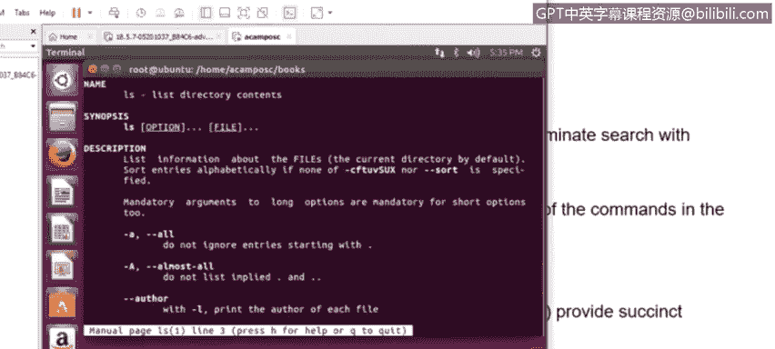
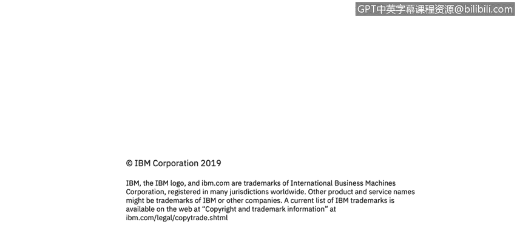

# 课程3：《网络安全合规框架与系统管理》：37：Linux内部与外部命令 🐧


在本节课中，我们将要学习Linux命令的一个基础但重要的分类：内部命令与外部命令。理解这两者的区别，对于高效使用Linux命令行至关重要。


## 概述

Linux命令主要分为内部命令和外部命令。内部命令是Shell程序的一部分，随Shell启动而加载；外部命令则是独立的可执行文件，存储在文件系统的特定目录中。本节将详细介绍如何区分它们，并分享一些提升命令行效率的技巧。

## 内部命令

上一节我们介绍了命令的基本概念，本节中我们来看看什么是内部命令。

内部命令，也称为内置命令，是直接构建在Shell程序（如Bash、Zsh）内部的命令。它们不依赖于外部文件，因此执行速度更快，并且其行为可能因使用的Shell不同而略有差异。

可以使用 `type` 命令来检查一个命令是否为内部命令。其基本语法是：

```bash
type [命令名称]
```

如果输出中包含“shell builtin”字样，则该命令为内部命令。例如，检查 `cd` 命令：

```bash
type cd
```
输出可能为：`cd is a shell builtin`



**核心概念**：内部命令是Shell程序固有的组成部分，系统需要时可随时执行，无需从磁盘加载外部文件。

## 外部命令

了解了内部命令后，我们再来看看外部命令。

外部命令是独立的可执行程序文件，它们与特定的Shell无关，通常可以在任何Linux发行版中找到。这些程序文件主要存放在 `/bin`、`/usr/bin`、`/sbin`、`/usr/sbin` 等标准目录中。

使用 `type` 命令检查外部命令时，会显示该命令对应的可执行文件路径。例如，检查 `ls` 命令：

```bash
type ls
```
输出可能为：`ls is /usr/bin/ls`

**核心概念**：外部命令是存储在文件系统中的独立可执行文件，其执行需要Shell找到并加载对应的程序。



## 命令行实用技巧



在继续深入之前，掌握一些命令行操作技巧可以极大提升工作效率。以下是几个常用技巧：

**使用Tab键自动补全**
在输入命令、文件或目录名时，按 `Tab` 键可以自动补全名称。如果存在多个匹配项，按两次 `Tab` 键会列出所有可能性。



**使用快捷键移动光标**
*   `Ctrl + A`：将光标快速移动到命令行的开头。
*   `Ctrl + E`：将光标快速移动到命令行的末尾。



**查看与调用历史命令**
*   `history` 命令：列出之前执行过的所有命令历史记录。
*   `上/下方向键`：在历史命令中向前或向后浏览。
*   `!<历史编号>`：直接执行历史记录中对应编号的命令。



**查阅命令手册**
`man` 命令用于查看任何命令的详细手册页，包括其功能、选项和用法示例。


```bash
man [命令名称]
```
例如，查看 `ls` 命令的手册：`man ls`。按 `q` 键可以退出手册页。

## 总结





本节课中我们一起学习了Linux内部命令与外部命令的核心区别。内部命令内置于Shell，执行高效；外部命令是独立的可执行文件，存储在特定目录。我们还掌握了几项提升效率的命令行技巧，包括使用 `type` 命令进行区分、利用Tab键补全、快捷键移动光标、查看命令历史以及通过 `man` 命令获取帮助。理解这些基础知识是成为一名熟练的Linux系统管理员或网络安全分析师的重要第一步。