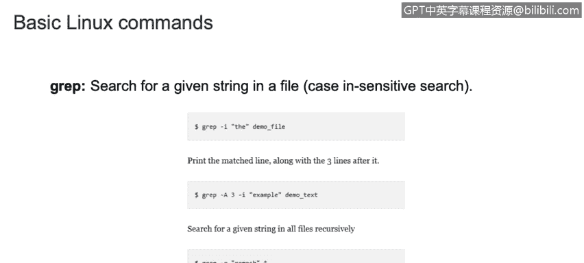
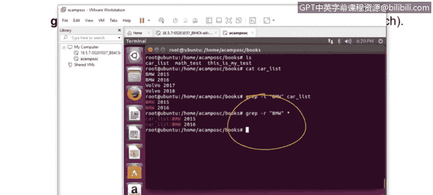
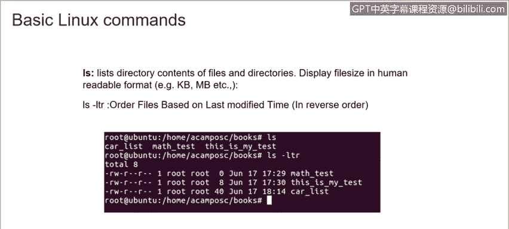

# 课程3：《网络安全合规框架与系统管理》：38：Linux基本命令（1）🚀


在本节课中，我们将学习Linux操作系统中的一些基础命令及其用途。掌握这些命令是进行系统管理和安全分析的基础。

---


## 操作系统信息与导航

上一节我们介绍了课程概述，本节中我们来看看如何查看系统信息和在文件系统中导航。

**`uname`** 命令用于显示当前运行的操作系统信息。

例如，运行 `uname` 命令会显示我们正在运行Linux。如果想获取更详细的信息，可以添加 `-a` 标志，它将提供额外信息，如当前Linux内核版本、系统主机名和日期。

**`cd`** 命令用于切换到不同的目录。

以下是一个目录结构示例：
```
home
├── alex
├── jack
│   └── test
└── eric
```

假设我们当前在 `home` 目录。要进入 `alex` 目录，只需输入 `cd alex`。如果我们在 `home` 目录，想进入 `jack` 下的 `test` 子目录，则需要输入 `cd jack/test`。使用 `cd` 命令可以在不同目录和子目录间移动。

如果想返回上一级目录，例如从 `test` 返回 `jack`，可以使用 `cd ..` 命令。同理，从 `alex` 返回 `home`，也输入 `cd ..`。

有时我们可能不清楚自己当前在哪个目录路径下。这时可以使用 **`pwd`** 命令来显示当前所在位置的完整路径。例如，输入 `pwd` 可能会显示 `/home/jack/test`。

---

## 文件归档与压缩

了解了如何导航后，我们来看看如何管理文件，例如创建归档和压缩文件。

**`tar`** 命令用于创建新的归档文件。

要创建归档，需要键入 `tar` 命令，加上表示“创建”的标志（如 `-c`），然后指定归档文件名和目标目录。例如：
```bash
tar -cvf archive_name.tar /path/to/directory
```

要提取归档文件中的信息，需要使用表示“提取”的标志（如 `-x`）：
```bash
tar -xvf archive_name.tar
```

如果只想查看归档文件中包含哪些内容，可以使用 `-tvf` 标志：
```bash
tar -tvf archive_name.tar
```

**`gzip`** 命令用于压缩文件。

使用 `gzip` 命令后接文件名即可压缩该文件。例如：
```bash
gzip filename
```
压缩后的文件会带有 `.gz` 扩展名。

要解压缩文件，使用 `gunzip` 命令：
```bash
gunzip filename.gz
```



**`zip`** 和 **`unzip`** 命令用于处理zip压缩包。

使用 `zip` 命令创建压缩文件：
```bash
zip archive_name.zip file_to_compress
```

使用 `unzip` 命令解压文件：
```bash
unzip archive_name.zip
```

如果只想查看zip文件的内容而不解压，可以使用 `unzip -l` 命令：
```bash
unzip -l archive_name.zip
```

---



## 文件搜索与列表

处理完文件后，经常需要查找或列出它们。以下是相关命令。

**`grep`** 命令用于在文件中搜索特定文本。

例如，假设我们有一个包含汽车信息的文件 `carlist.txt`，内容很多。我们想找出所有包含“BMW”的行。可以这样操作：
```bash
grep "BMW" carlist.txt
```
这会将所有包含“BMW”的行打印出来。

如果想递归地在当前目录及其所有子目录的文件中搜索“BMW”，可以使用 `-r` 标志：
```bash
grep -r "BMW" .
```

**`find`** 命令用于查找具有特定名称或属性的文件。



它的功能与 `grep` 类似，但主要用于查找文件。基本用法是：
```bash
find /path/to/search -name "filename"
```
这将显示找到文件的路径。

`find` 命令非常强大，还可以用于查找特定大小的文件、特定扩展名的文件，甚至查找主目录中的空文件。

**`ls`** 命令用于列出目录中的文件和子目录。

最基本的 `ls` 命令会显示当前目录的内容。添加 `-lh` 标志可以以人类可读的格式（如KB、MB）显示文件大小。

**`ls -ltr`** 命令则能提供更多信息。它会以长格式列出文件，显示如修改时间、文件权限等信息，并按时间倒序排列（最新修改的文件在最后）。

---

## 系统关机与重启

最后，我们学习如何安全地关闭或重启Linux系统。

**`shutdown`** 命令用于关闭服务器。

要立即关闭系统，可以使用：
```bash
shutdown -h now
```

如果希望系统在10分钟或20分钟后关闭，可以这样设置：
```bash
shutdown -h +10  # 10分钟后关闭
shutdown -h +20  # 20分钟后关闭
```
时间可以任意设置，例如1小时30分钟后关闭，需要换算成90分钟（`+90`）。

如果希望关闭后重新启动系统，使用 `-r` 标志：
```bash
shutdown -r
```

若要在重启时强制检查文件系统，可以加上 `-F` 标志：
```bash
shutdown -rF
```

关于 `shutdown -r`、`reboot` 和 `init 6` 命令，它们在新旧Linux发行版中可能略有区别，但本质上执行相同的内部过程，都是用来重启设备。

---


本节课中我们一起学习了Linux的基本命令，包括查看系统信息（`uname`, `pwd`）、目录导航（`cd`）、文件归档与压缩（`tar`, `gzip`, `zip`）、文件搜索与列表（`grep`, `find`, `ls`）以及系统关机重启（`shutdown`）。这些是日常系统管理和安全运维中最常用到的工具，熟练掌握它们至关重要。