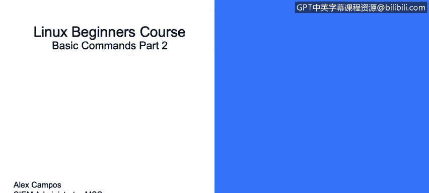
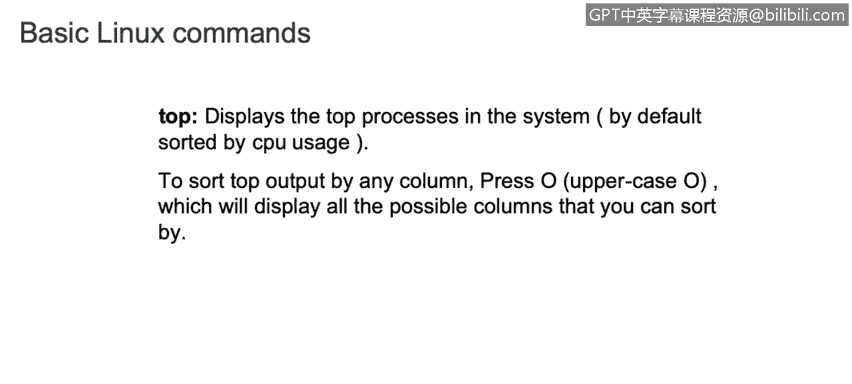
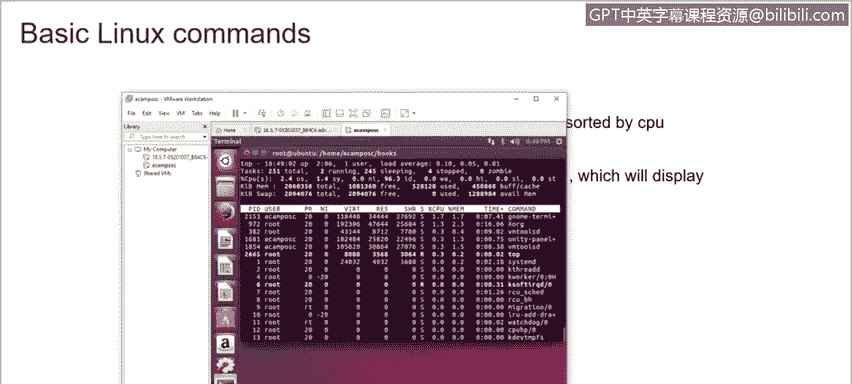
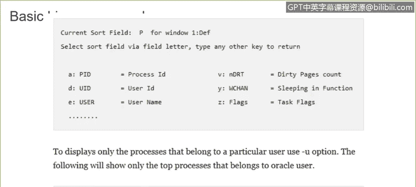
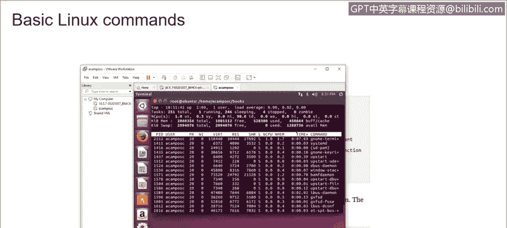
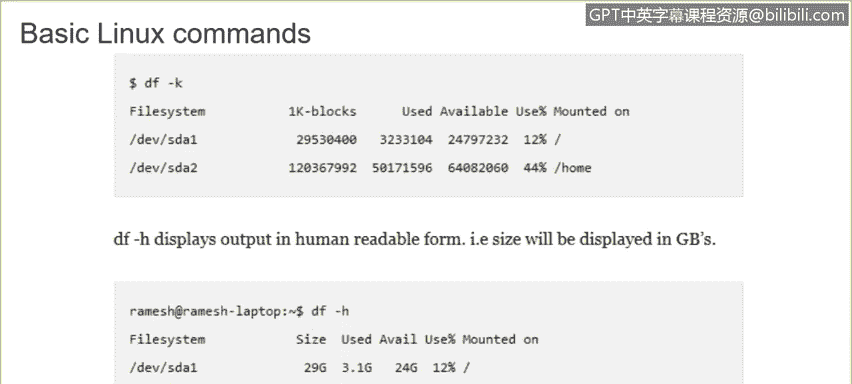
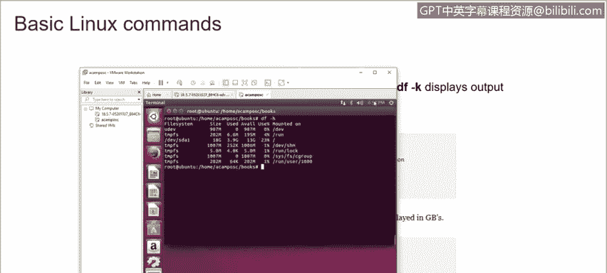

# 课程3：《网络安全合规框架与系统管理》：39：Linux基本命令(2)


在本节课程中，我们将继续学习Linux操作系统中的一些核心命令。上一节我们介绍了一些基础的文件和目录操作命令，本节中我们将重点了解用于系统监控、进程管理和网络文件传输的命令。


## FTP与SFTP命令



FTP（文件传输协议）和SFTP（安全文件传输协议）用于连接远程服务器并传输多个文件。两者的命令相似。

要连接远程服务器，只需使用 `ftp` 命令加上目标服务器的IP地址或主机名。

```bash
ftp 192.168.1.100
```

连接后，即可开始从该设备下载所需的信息。

## PS命令：查看系统进程

`ps` 命令用于显示系统中正在运行的进程信息。

如果你想查看特定服务的进程信息，可以使用 `ps -ef` 命令，并通过管道符 `|` 配合 `more` 命令分页查看。

```bash
ps -ef | more
```

若要以树状结构查看当前运行的进程，可以使用 `-eHf` 选项。

```bash
ps -eHf | more
```

也可以直接使用 `ps` 命令，它将显示所有进程的ID。要查看某个特定进程的详细信息，只需使用 `ps` 命令加上该进程的ID。

```bash
ps [进程ID]
```

## FREE命令：查看内存使用情况

`free` 命令用于显示系统中可用内存的所有信息。

直接运行 `free` 命令，会显示系统总内存、已用内存和空闲内存。但有时这些以字节为单位的数值难以解读。

我们可以添加 `-g` 选项，以吉字节（GB）为单位显示信息。

```bash
free -g
```

此外，也可以使用 `-k` 选项查看千字节（KB），或使用 `-m` 选项查看兆字节（MB）。`free` 命令会显示系统内存使用的所有信息。



## TOP命令：监控系统进程



`top` 命令用于动态显示系统中占用资源最多的进程。

运行 `top` 命令后，你将看到系统中所有正在运行的进程列表，同时还能看到CPU和内存的使用情况。

如果只想显示属于特定用户的进程，可以使用 `-u` 选项。

```bash
top -u [用户名]
```

例如，在一个拥有众多用户的大型环境中，我们可以使用此命令来专门监控某个用户的进程。



## DF命令：查看磁盘空间



`df` 命令用于显示环境中磁盘空间的使用情况。

使用 `-k` 选项，输出将以字节为单位显示。而使用 `-h` 选项，输出将以人类易读的形式（如K、M、G）显示。

```bash
df -h
```



例如，在我们的虚拟机中运行 `df -h`，将看到所有关于磁盘空间使用情况的信息。



如果使用 `-T` 标志，它将显示Linux发行版中每个分区所使用的文件系统类型。

```bash
df -T
```

## KILL命令：终止进程

`kill` 命令用于终止环境中正在运行的进程。

在终止进程前，首先了解该进程的ID至关重要。使用 `ps -ef` 命令可以显示进程ID及其信息。

终止进程的命令格式为 `kill -9 [进程ID]`。使用此命令时必须格外小心，因为进程一旦被终止将无法恢复。

例如，在以下案例中，我们试图查找所有属于“beam”的进程ID。

```bash
ps -ef | grep beam
```

假设命令显示进程ID为7243，我们只需运行以下命令即可终止该进程。

```bash
kill -9 7243
```

---


本节课中，我们一起学习了Linux中用于系统监控和管理的几个关键命令。我们了解了如何使用 `ps` 和 `top` 查看进程，用 `free` 检查内存，用 `df` 查看磁盘空间，以及如何使用 `kill` 命令安全地终止进程。掌握这些命令是进行有效系统管理和故障排查的基础。