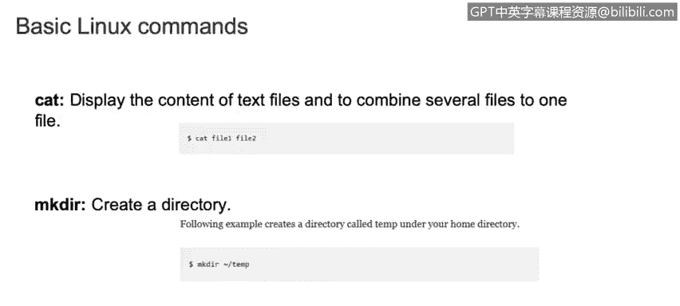
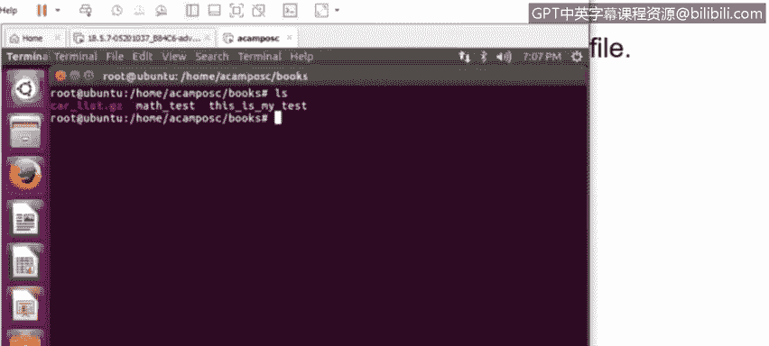

# 课程3：《网络安全合规框架与系统管理》：40：Linux基本命令(3) 🐧

在本节课中，我们将继续学习Linux操作系统中的一些核心命令。上一节我们介绍了文件和目录的查看、创建与导航命令，本节中我们将重点学习文件的删除、复制、移动、内容查看以及一些其他实用命令，帮助你更高效地管理系统。

## 概述
本节教程将涵盖以下Linux基本命令：`rm`（删除）、`cp`（复制）、`mv`（移动）、`cat`（查看文件内容）、`mkdir`（创建目录）、`ifconfig`（网络接口配置）、`whatis`（命令简述）、`locate`（文件定位）、`tail`（查看文件尾部）、`less`（分页查看文件）、`su`（切换用户）和`wget`（网络下载）。掌握这些命令是进行系统管理和故障排查的基础。

---

### 删除文件与目录：`rm` 命令
`rm` 命令用于删除文件或目录。使用不同的选项可以控制删除行为。

以下是 `rm` 命令的常见用法：
*   **删除文件**：使用 `rm` 命令后接文件名。例如，`rm file.txt` 会直接删除该文件。
*   **交互式删除**：添加 `-i` 选项会在删除前请求确认。命令格式为 `rm -i file.txt`。这在防止误删重要文件时非常有用。
*   **递归删除目录**：要删除一个包含子目录和文件的目录，必须使用 `-r` 选项。命令格式为 `rm -r directory_name`。如果不加此选项，系统将不允许删除非空目录。
*   **删除空目录**：对于空目录，可以使用 `rmdir` 命令，格式为 `rmdir directory_name`。

### 复制文件与目录：`cp` 命令
`cp` 命令用于复制文件或目录。

以下是 `cp` 命令的关键点：
*   **基本复制**：命令格式为 `cp source_file destination_file`。
*   **保留属性**：使用 `-p` 选项可以在复制时保留原文件的属性（如所有权和时间戳）。
*   **覆盖确认**：使用 `-i` 选项会在覆盖已存在的目标文件前进行提示。确保使用正确的选项至关重要，以避免意外数据丢失。

### 移动与重命名：`mv` 命令
`mv` 命令用于移动或重命名文件和目录，其语法与 `cp` 命令类似。

以下是 `mv` 命令的说明：
*   **基本移动/重命名**：命令格式为 `mv source destination`。
*   **覆盖确认**：使用 `-i` 选项会在覆盖现有文件前提示。
*   **详细模式**：使用 `-v` 选项会显示命令执行过程中的详细信息。

### 查看文件内容与创建目录
了解如何查看文件内容和创建目录是日常操作的一部分。

*   **查看文件内容**：`cat` 命令用于显示文本文件的全部内容。例如，`cat myfile.txt` 会显示该文件的所有文本。
*   **创建目录**：`mkdir` 命令用于创建新目录。例如，`mkdir new_folder` 会创建一个名为 `new_folder` 的目录。
*   **创建多级目录**：使用 `-p` 选项可以一次性创建多级嵌套的目录。例如，`mkdir -p parent/child/grandchild` 会创建完整的目录路径。

### 网络接口管理：`ifconfig` 命令
`ifconfig` 命令用于显示和配置网络接口。

以下是 `ifconfig` 的常见操作：
*   **查看所有接口**：使用 `ifconfig -a` 可以查看所有网络接口及其状态。
*   **启用/禁用接口**：要启用（如 `eth0`）或禁用一个接口，可以使用 `ifconfig eth0 up` 或 `ifconfig eth0 down`。

### 命令帮助与文件查找
Linux提供了强大的工具来获取命令帮助和查找文件。

*   **命令简述**：`whatis` 命令提供指定命令的简短描述。例如，`whatis ls` 会解释 `ls` 命令的用途。它与 `man` 命令不同，`man` 会提供完整的手册页，包括所有可用选项。
*   **定位文件**：`locate` 命令能快速在系统中搜索文件。例如，`locate filename` 会列出所有包含该名称的文件路径。

### 文件查看进阶：`tail` 和 `less` 命令
处理大型文件（如日志文件）时，`tail` 和 `less` 命令非常实用。

*   **查看文件尾部**：`tail` 命令默认显示文件的最后10行。可以使用 `-n` 选项指定行数，例如 `tail -n 20 logfile.txt` 显示最后20行。
*   **分页查看大文件**：`less` 命令用于分页查看大文件内容，不会一次性加载全部内容。按**空格键**向下翻页，按 **`B`** 键向上翻页。在故障排查或调查时，使用 **`Ctrl+F`**（向前）和 **`Ctrl+B`**（向后）滚动窗口非常高效。

### 用户切换与文件下载
最后，我们来看两个系统管理和维护中常用的命令。

*   **切换用户**：`su` 命令用于切换用户账户。例如，`su - username` 会切换到指定用户的环境。也可以执行单条命令，如 `su -c “ls /home” username`，以指定用户身份执行 `ls` 命令后返回原账户。
*   **从网络下载**：`wget` 命令是一个非交互式网络下载器，可以直接从URL下载文件到当前系统，例如 `wget http://example.com/software.tar.gz`。这比手动下载再上传到服务器环境更为便捷。

---

## 总结
本节课我们一起学习了Linux系统中另一组基础且强大的命令。我们掌握了如何使用 `rm`、`cp`、`mv` 来管理文件和目录；使用 `cat`、`tail`、`less` 来查看文件内容；使用 `mkdir` 创建目录结构；使用 `ifconfig` 管理网络；使用 `whatis` 和 `locate` 获取帮助和查找文件；以及使用 `su` 切换用户和 `wget` 下载网络资源。这些命令是每位系统管理员和安全分析师工具箱中的必备工具，熟练掌握它们将为后续的深入学习和实际工作打下坚实基础。