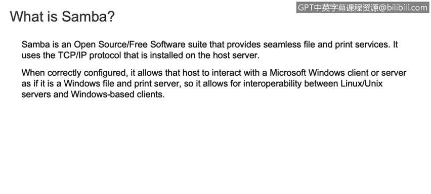
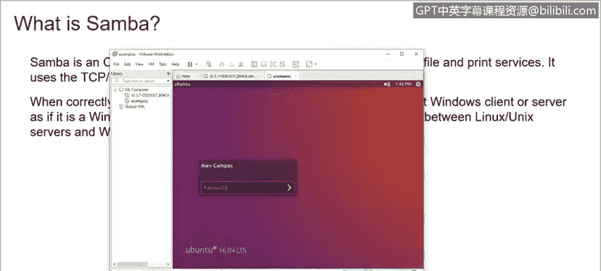
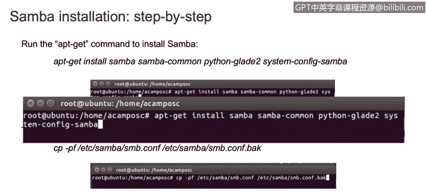
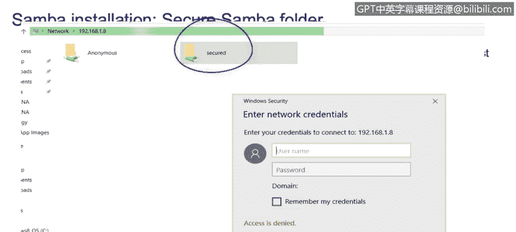

# 课程3：《网络安全合规框架与系统管理》：41：Samba安装和配置演示 🖥️➡️📁


在本节课程中，我们将学习如何在Linux系统上安装和配置Samba服务，以实现与Windows主机之间的文件共享。

## 什么是Samba？


Samba是一个开源的免费软件套件，它提供无缝的文件和打印服务。它使用安装在主机服务器上的SMB/CIFS协议。正确配置此软件后，它允许您与Microsoft Windows客户端或服务器进行交互，就像它是一个Windows文件或打印服务器一样。因此，它能够在Linux服务器和Windows主机之间建立通信。例如，如果您有一个Linux发行版，并希望在Windows主机和Linux服务器之间共享文件或信息，Samba就能实现这一目标。

## 安装与配置步骤

接下来，我们将逐步学习如何安装和配置Samba。假设我们已经拥有一台虚拟机，并且已经安装了Linux发行版（本演示使用的是Ubuntu，您也可以使用CentOS或其他Linux发行版）。

以下是安装和配置Samba的基本步骤：



1.  **安装Samba软件包**
    首先，我们需要在Linux发行版上运行以下命令来安装Samba：
    ```bash
    sudo apt-get update
    sudo apt-get install samba
    ```





2.  **备份配置文件**
    安装完成后，系统会在`/etc/samba/`目录下生成一个名为`smb.conf`的配置文件。在修改之前，我们需要先备份此文件。可以使用`cp`命令进行备份：
    ```bash
    sudo cp /etc/samba/smb.conf /etc/samba/smb.conf.backup
    ```
    备份文件的后缀`.backup`表示这是一个备份副本。

3.  **编辑配置文件**
    接下来，我们需要编辑`/etc/samba/smb.conf`文件。可以使用`nano`或`vi`等文本编辑器。在文件中添加以下配置行（顺序不重要，但需确保所有行都已添加）：
    ```
    [anonymous]
       path = /samba/anonymous
       browsable = yes
       writable = yes
       guest ok = yes
       read only = no
    ```

4.  **创建共享目录并设置权限**
    根据配置文件，我们需要创建对应的共享目录并设置适当的权限：
    ```bash
    sudo mkdir -p /samba/anonymous
    sudo chmod -R 0777 /samba/anonymous
    sudo chown -R nobody:nogroup /samba/anonymous
    ```


5.  **重启Samba服务**
    配置完成后，需要重启Samba服务以使更改生效。服务名称为`smbd`：
    ```bash
    sudo service smbd restart
    ```

## 从Windows主机访问共享

完成上述步骤后，我们就可以从Windows主机访问这个共享文件夹了。

1.  在Linux系统上使用`ifconfig`命令查看其IP地址。
2.  在Windows电脑上，打开“文件资源管理器”，在地址栏输入Linux主机的IP地址，格式为：`\\<Linux_IP_Address>`。
3.  您应该能看到名为“anonymous”的共享文件夹，并可以匿名访问。

## 创建需要密码的共享文件夹

如果您希望创建一个需要用户名和密码才能访问的安全共享文件夹，可以按照以下步骤操作：

1.  **编辑配置文件**
    再次编辑`/etc/samba/smb.conf`文件，添加一个新的共享配置节。例如，创建一个名为“secured”的共享：
    ```
    [secured]
       path = /samba/secured
       valid users = @smbgroup
       guest ok = no
       writable = yes
       browsable = yes
    ```

2.  **创建Linux用户组和用户**
    首先创建一个用户组（例如`smbgroup`），然后创建一个Samba用户并将其加入该组：
    ```bash
    sudo groupadd smbgroup
    sudo useradd sambauser
    sudo usermod -aG smbgroup sambauser
    ```

3.  **设置Samba用户密码**
    使用`smbpasswd`命令为刚创建的用户设置Samba专用密码：
    ```bash
    sudo smbpasswd -a sambauser
    ```

4.  **创建目录并设置权限**
    创建对应的共享目录，并将其所有者设置为刚创建的用户和组：
    ```bash
    sudo mkdir -p /samba/secured
    sudo chown -R sambauser:smbgroup /samba/secured
    ```



5.  **重启服务**
    再次重启Samba服务：
    ```bash
    sudo service smbd restart
    ```

现在，从Windows主机访问网络共享时，您将能看到“secured”文件夹。双击尝试访问时，系统会提示您输入用户名（`sambauser`）和之前设置的密码。

## 课程总结


本节课我们一起学习了Samba的基础知识及其配置。我们了解了Samba是一个实现Linux与Windows系统间文件共享的服务。通过演示，我们逐步完成了Samba的安装、匿名共享和安全共享的配置，并学会了如何从Windows主机访问这些共享资源。希望您能在自己的环境中尝试运行这些命令，多加练习，以巩固对Linux系统管理和网络共享的理解。