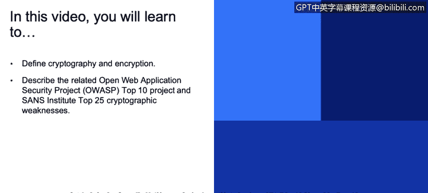
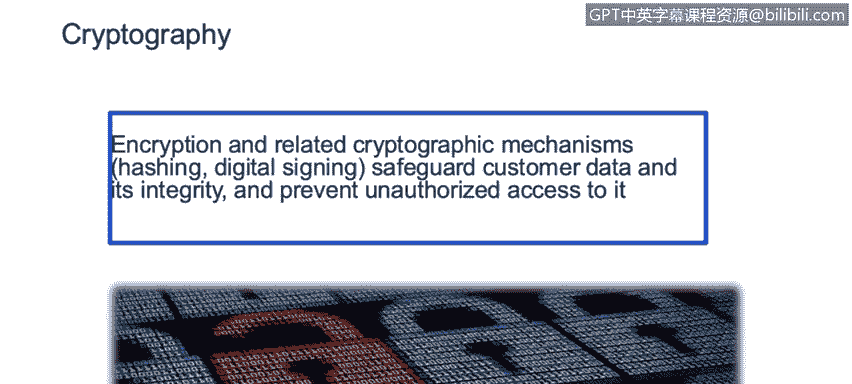
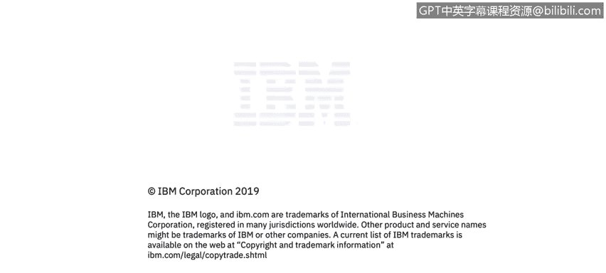

# 课程3：《网络安全合规框架与系统管理》：43：密码学简介 🔐

## 概述
在本节课程中，我们将学习密码学与加密的基本定义，并了解相关的行业安全项目，如开放Web应用安全项目（OWASP）和SANS研究所的Top 25软件错误列表。我们将探讨密码学在保护数据安全与完整性方面的重要性，以及常见的应用错误。

---

## 密码学与加密的定义
密码学是保护信息安全的科学与艺术。加密是密码学的一个核心过程，它将可读的明文数据转换为不可读的密文，以防止未经授权的访问。

**公式示例**：一个简单的加密过程可以表示为 `C = E(K, P)`，其中 `C` 是密文，`E` 是加密函数，`K` 是密钥，`P` 是明文。

---

## 相关安全项目介绍
上一节我们定义了密码学，本节中我们来看看两个重要的行业安全项目，它们列出了常见的安全漏洞和错误。

### 开放Web应用安全项目（OWASP）
OWASP是一个非营利组织，为保护Web应用安全提供大量建议。它发布了一份名为“Top 10”的常见漏洞列表。

以下是近年来该列表中与加密相关的一个关键趋势：
*   **敏感数据暴露**：由于未使用加密保护数据，此问题不仅位列前十，而且在过去几年中重要性持续上升。

### SANS研究所Top 25列表
SANS研究所的“Top 25最危险软件错误”列表同样至关重要。其中至少包含四种与密码学相关的错误类型，这凸显了正确应用密码学技术的重要性。

---

## 密码学应用中的常见错误
了解了行业标准后，我们来看看实践中常见的密码学应用错误。这些并非理论讨论，而是真实发生的安全事件。

以下是近期新闻中出现的密码学相关错误与漏洞示例：
*   **Twitter软件错误**：本应加密的密码以明文形式暴露。
*   **Kaland Health Systems数据泄露**：一台笔记本电脑被盗，导致44.3万名患者的私人商业数据和个人数据失控，原因是硬盘上的数据未加密。

这些案例表明，密码学应用错误是非常普遍的问题，并且在日常攻击中被频繁利用。

---

## 总结
本节课中，我们一起学习了密码学与加密的基本概念，认识了OWASP Top 10和SANS Top 25这两个重要的安全项目列表。我们了解到，未能正确应用加密技术来保护敏感数据是当前普遍且危险的安全漏洞。通过分析真实案例，我们看到了这些错误可能导致的严重后果。