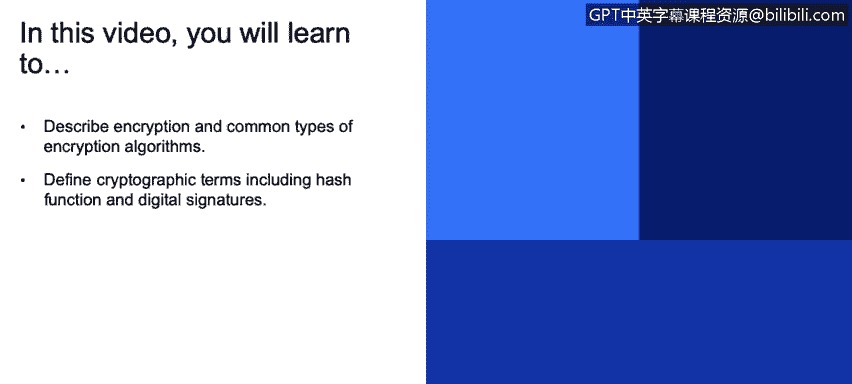
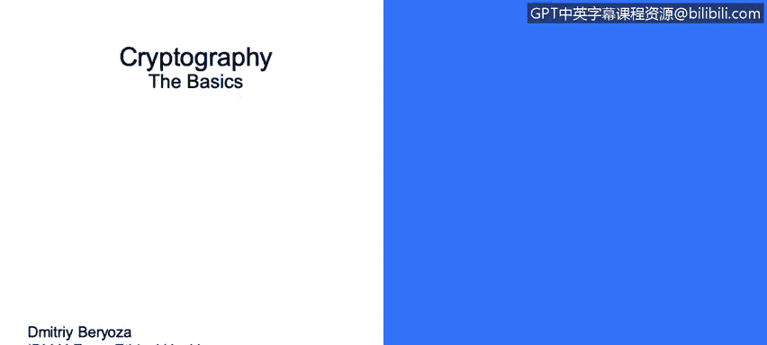
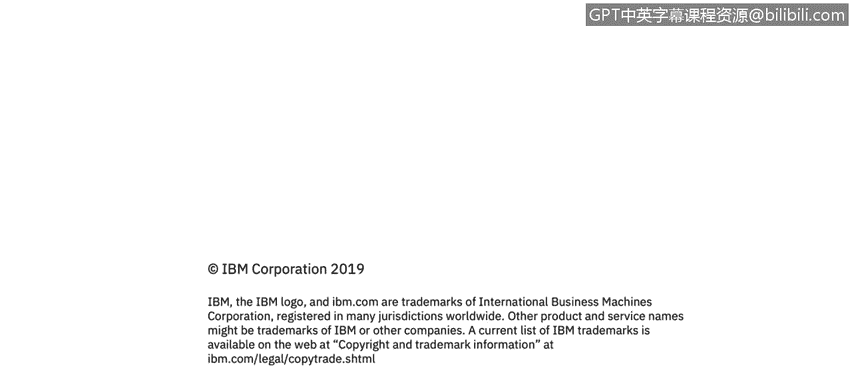

# 课程3：《网络安全合规框架与系统管理》：44：密码学基础 🔐

在本节课中，我们将要学习密码学的基础知识，包括加密、哈希函数和数字签名等核心概念。这些技术是保障数据机密性、完整性和真实性的基石。

---

## 加密基础

上一节我们介绍了课程概述，本节中我们来看看加密的基本定义。加密是一种对数据进行编码的过程，旨在防止未经授权的方访问数据。

需要强调的是，**加密仅提供机密性保证**。这意味着即使数据被加密，攻击者仍有可能修改加密后的数据。如果仅使用加密算法，你可能无法察觉数据已被篡改。我们稍后会讨论一种与此相关的特定攻击类型。因此，对所使用的加密数据应用完整性保护机制同样重要。

数据通常在三种场景下被加密：
*   **静态数据**：存储在文件、数据库、备份或移动设备中的任何数据。
*   **使用中的数据**：当应用程序运行时，数据被加载到计算机内存中。理想情况下，数据在真正被使用前应保持加密状态。
*   **传输中的数据**：数据通过网络发送时。

在当今时代，敏感的商业和个人数据在任何必要的地方都应始终处于加密状态。其重要性在过去几年急剧上升，原因如下：
*   在线收集、存储和访问的敏感信息量巨大。
*   安全漏洞数量急剧增加。
*   世界各国政府正在出台新法规来应对此类攻击，如果企业未对敏感数据进行加密，将追究其责任。

---

## 加密算法类型

上一节我们了解了加密的场景和重要性，本节中我们来看看主要的加密算法类型。最主要的两种是**对称密钥加密**和**公钥加密**。

从图示可以看出，**对称密钥加密**使用一个私钥。数据用该密钥加密后变得混乱，解密时使用相同的密钥来逆转过程以获取明文。这种算法速度很快。

但这种方法存在一个难题：**密钥共享**。通常，你不仅需要加密数据，还需要安全地发送加密数据以及密钥本身。这是一个公钥密码学试图解决的大问题。

以下是常见的对称加密算法：
*   AES
*   DES
*   3DES

**公钥加密**则使用一对数学上相关联的密钥：一个公钥和一个私钥。其工作原理是：假设我想向同事发送加密消息。我的同事生成一对密钥，私钥由他安全保管，公钥则公开分享。我可以使用他的公钥加密要发送给他的消息，而他只能使用他秘密保管的私钥来解密该消息。这使得任何人都可以向他发送消息，但无法看到其他人发送的消息，因为只有拥有私钥的人才能解密。

因此，它解决了预先共享密钥的问题。但这类算法通常比对称密钥加密算法慢。

以下是常见的公钥加密算法：
*   RSA
*   椭圆曲线
*   Diffie-Hellman

---

## 哈希函数

上一节我们讨论了两种主要的加密方式，本节中我们来探讨另一个重要概念：哈希函数。哈希函数将任意大小的数据映射为固定大小的数据，它充当一种校验和，提供**完整性保证**，但不提供机密性。因此，它需要与加密算法结合使用。

你可能在工作中见过或使用过这些哈希算法：
*   MD5
*   SHA-1
*   SHA-2
*   SHA-3

在这些场景中，从哈希值**故意地**很难重构原始数据。例如，你获取一个文件并生成其哈希值。如果该文件被恶意修改，然后你再次计算其哈希值，修改后文件的哈希值将与原始哈希值截然不同。这样，我们就可以通过一个小的校验和来验证大块数据的完整性。

哈希函数用于完整性检查，有时也用于敏感数据存储，例如密码。我们稍后会简要讨论这一点。

---

## 数字签名

上一节我们介绍了用于保证完整性的哈希函数，本节中我们来看看结合了加密和哈希的数字签名。数字签名是一种用于验证数字消息和文档真实性的数学方案。

它实际上结合了我们之前提到的两个概念：哈希和公钥加密。其工作方式如下：假设一条消息从一方发送到另一方。消息先被哈希处理，然后使用发送方的**私钥**对该哈希值进行签名。

接收方在收到消息或文件后，可以验证哈希值，并使用发送方的**公钥**来验证哈希值是否被篡改。因此，数字签名实际上确保了三件事：
1.  **认证**：你可以确信发送消息的一方确实是其所声称的一方，因为只有该方才应拥有用于签名的私钥。
2.  **不可否认性**：这意味着发送方不能否认他们发送过该消息，因为消息是用只有他们才拥有的私钥签名的。
3.  **完整性**：确保消息或文件在传输过程中未被修改。

---

## 总结

本节课中我们一起学习了密码学的基础知识。我们首先定义了加密及其三种应用场景（静态、使用中、传输中），并理解了其核心是提供机密性。接着，我们探讨了两种主要的加密算法：快速的对称加密和解决密钥分发问题的公钥加密。然后，我们介绍了提供完整性保证的哈希函数。最后，我们学习了结合哈希和公钥加密的数字签名，它能够同时确保认证、不可否认性和完整性。掌握这些基础概念对于理解和实施网络安全措施至关重要。