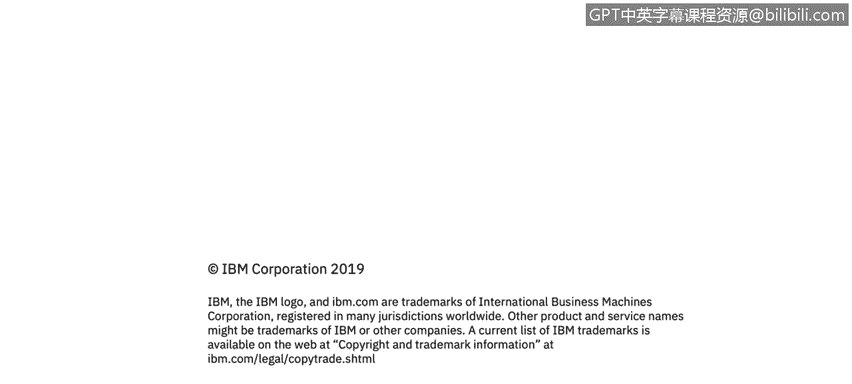

# 课程3：《网络安全合规框架与系统管理》：46：数据静态加密 🔐

在本节课中，我们将学习数据的数字状态，并重点探讨如何对静态数据进行加密。静态数据是指存储在硬盘、数据库或备份介质等非活动状态下的数据。保护这些数据对于防止数据泄露至关重要。

上一节我们介绍了数据加密的重要性，本节中我们来看看针对静态数据加密的具体类型和最佳实践。一个通用的经验法则是：对所有敏感数据、配置文件、数据库和备份等有价值的信息进行加密。对称密钥加密是其中最常用的方法。

以下是美国国家标准与技术研究院（NIST）推荐的加密算法选择指南：
*   当前批准的算法包括**AES（高级加密标准）**，特别是其**CBC（密码块链接）模式**。
*   **3DES（三重数据加密标准）** 也是被批准的算法之一。

然而，加密的实施存在多种错误方式，需要特别注意。

首先，一些算法已经过时，不再被视为安全，必须逐步淘汰。

例如：
*   DES（数据加密标准）
*   RC4

随着时间推移，加密算法可能因漏洞被发现或计算能力提升而变得不安全。攻击者可能利用足够的计算能力在合理时间内破解算法。因此，必须关注算法安全性，并迁移到更安全的现代算法。

正如之前提到的，使用硬编码、易猜测或随机性不足的密钥是一个严重问题。加密的安全性取决于所选密钥的强度及其保护措施。

因此，必须选择**密码学意义上安全的随机密钥**。同时，不要在不同安装实例中重复使用密钥。例如，如果两个客户使用了相同的嵌入密钥，一旦一个客户的密钥被泄露，另一个客户也会面临风险。

另一个常见问题是，将密钥以明文形式存储在其保护的数据附近，这好比“把钥匙藏在门垫下”。唯一正确的方式是将密钥存储在**密码学上安全的密钥库**中。

此外，一些加密算法需要**初始化向量**。每次应用算法时，都必须随机选择初始化向量。重复使用初始化向量是可能被利用的另一个弱点。

最后，在性能允许的范围内，应尽可能选择**最大的密钥长度**，以增强加密强度。

本节课中，我们一起学习了静态数据加密的核心概念。我们了解了应使用AES-CBC或3DES等经批准的算法，并强调了避免使用过时算法、安全生成与管理密钥、正确使用初始化向量以及选择足够长的密钥长度的重要性。正确实施这些措施是保护静态数据安全的关键。