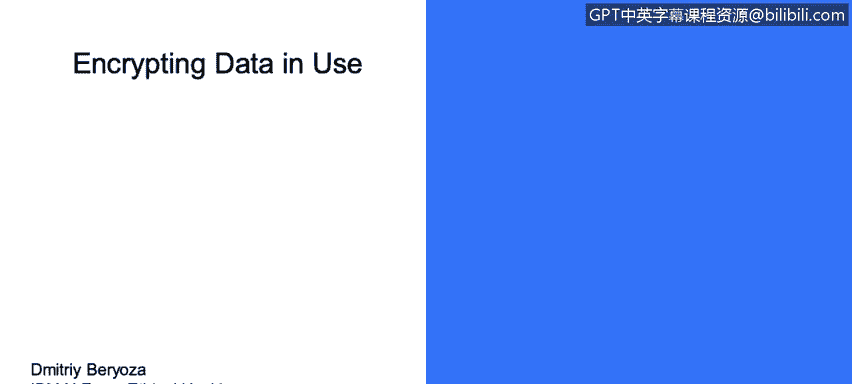
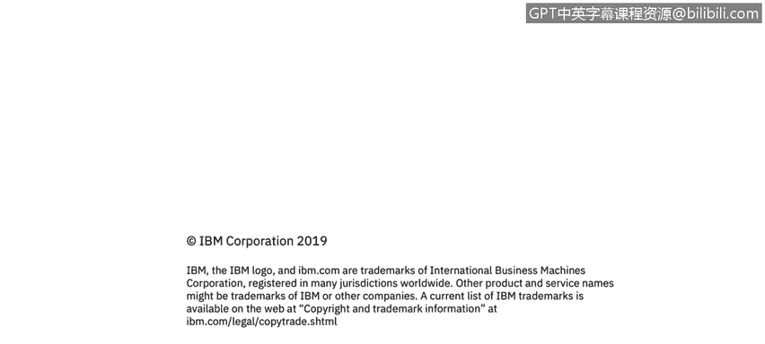

# 课程3：《网络安全合规框架与系统管理》：47：数据使用加密

在本节课中，我们将学习数据在“使用中”这一状态下的安全概念，并探讨如何通过加密技术来保护这一阶段的数据。

## 概述：数据的使用中状态

上一节我们讨论了数据在传输和存储时的加密。本节中，我们来看看数据在“使用中”状态下的安全挑战与解决方案。数据使用中指的是数据正被应用程序或系统处理，例如加载到内存中进行计算。

## 数据使用中加密的现状与挑战

遗憾的是，对使用中数据进行加密的做法并不常见。通常，产品从磁盘加载数据，解密后直接在内存中进行处理。

这种做法非常危险，因为某些类型的漏洞可能会暴露产品进程的部分内存。一个非常著名的例子是几年前出现的“心脏滴血”漏洞。该漏洞泄露了使用OpenSSL协议的进程内存，并将这些数据泄露到了互联网上。

## 核心安全理念与解决方案

核心安全理念是：**即使数据从磁盘加载到内存后，也应保持加密状态**。

理想的处理流程如下：
1.  数据从加密的存储中加载。
2.  仅在**实际需要时**解密极短的时间。
3.  使用完毕后立即从内存中**擦除**。

通过这种方式，数据被泄露的机会将大大减少。其核心优势可以用一个简单的逻辑来描述：**减少明文数据在内存中的驻留时间 = 降低泄露风险**。

## 进阶概念：同态加密

另一个需要考虑的概念是同态加密。这是一类允许**直接对加密数据进行操作**而无需先解密的算法。

虽然涉及非常复杂的数学原理，但某些算法支持这种操作。这意味着你可以始终让数据保持加密和安全状态，同时还能对其进行分析。请记住这个概念，或许你的产品未来可以利用它。其核心思想可以表示为：
`Encrypt(A) + Encrypt(B) = Encrypt(A+B)`
（对A的加密结果 与 对B的加密结果 进行特定运算，等于 对`A+B`的加密结果）

## 总结

本节课中，我们一起学习了保护“使用中”数据的重要性。我们了解到，常见的不加密内存数据的做法存在风险，并通过“心脏滴血”漏洞看到了潜在后果。保护此类数据的关键在于**最小化明文数据在内存中的存在**，并探索了**同态加密**这一允许在密文上直接计算的未来技术方向。