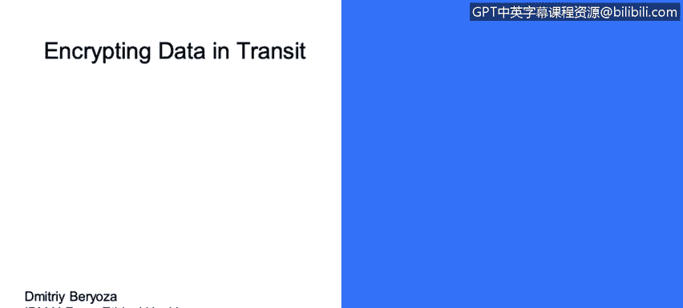

# 课程3：《网络安全合规框架与系统管理》：48：数据传输加密 🔐




在本节课中，我们将学习数据传输加密的核心概念、常见风险以及最佳实践。我们将了解数据在传输过程中的状态，为何必须加密，以及如何正确实施加密来保护通信安全。

---

## 描述数据的数字状态

数据在传输过程中，被称为“传输中的数据”。这意味着数据正在网络中移动，例如从你的浏览器发送到网站服务器，或在两个应用程序服务器之间传递。

## 数据传输加密

上一节我们介绍了数据的传输状态，本节中我们来看看如何保护这些数据。对传输中的数据进行加密是我们熟悉的概念。

在当今时代，以明文形式进行通信是绝对不可接受的，请不要这样做。业界对此已达成共识。最近，Firefox和Chrome浏览器开始将HTTP网站标记为不安全。使用加密进行通信的网站，其正确的前缀是HTTPS。那些以明文通信的网站，攻击者可以非常容易地窃听这些对话并发现敏感信息。

因此，所有通信都应加密。不仅仅是HTTP会以明文传输，有时远程过程调用、数据库连接等也会以明文形式在网络中传输，这同样不被推荐，请务必避免。请确保加密所有通信。

## TLS/SSL协议

TLS/SSL算法是最常用的加密协议。它们在内部使用了多种加密原语：使用**公钥密码学**进行身份验证和密钥交换，使用**对称密钥密码学**进行实际的数据加密。服务器会向客户端出示一个名为**数字证书**的东西，该证书引用了通信中要使用的公钥及其颁发机构，我们稍后会详细讨论。

有时，一些产品选择只使用对称密钥加密，如果安全地实施，这没有问题。但这样做的主要问题是如何在不同节点之间安全地共享密钥。假设你的应用程序中有两个不同的节点需要通信，你如何安全地共享私钥，以确保它在传输过程中不被泄露？

## 常见的陷阱与问题

以下是数据传输加密中常见的一些问题：

*   **自签名证书**：我们经常看到使用自签名证书。这基本上是你自己生成的证书。对于内部通信来说问题较小，但如果你的产品通过互联网通信，这就是一个更大的问题。正确的方式是使用由公认的证书颁发机构验证的证书，这样你才能确信该证书确实来自声称创建它的那一方。
*   **接受任意证书**：不幸的是，有些产品在不验证的情况下接受任意证书。如果你是一名Java开发者，查看下面的代码片段可能会认出它。不幸的是，我们时常在代码中看到这种模式。
    ```java
    // 不安全的示例：接受所有证书
    TrustManager[] trustAllCerts = new TrustManager[] {
        new X509TrustManager() {
            public java.security.cert.X509Certificate[] getAcceptedIssuers() { return null; }
            public void checkClientTrusted(X509Certificate[] certs, String authType) { }
            public void checkServerTrusted(X509Certificate[] certs, String authType) { }
        }
    };
    ```
    攻击者基本上可以颁发自己的证书，并坐在客户端和服务器之间的通信中间，这被称为**中间人攻击**。如果你的代码包含这种模式，你基本上会接受网络上传来的任何证书。攻击者可以给你他们自己的证书，代表你与服务器对话，并监听你所有的通信，捕获所有私人数据。因此，**不要接受未经验证的证书**。
*   **证书验证不足**：不幸的是，仅验证证书有时还不够，因为当今的攻击者实际上可以创建有效的证书。他们可以利用某些证书颁发机构获得有效的证书，并且在你验证时也能正确通过验证。应对这种情况的方法是使用**证书绑定**机制。在这种机制中，出示的证书会与你预期看到的一组证书进行比对。这样，你就不会接受任何任意的有效证书，而只接受你的产品中某个节点预期从另一个节点收到的特定证书。在这种情况下，实施中间人攻击的难度就大得多。
*   **使用过时的协议或不安全的加密套件**：有时产品会使用过时版本的协议或不安全的加密套件。旧版本的SSL和TLS存在漏洞，你可以查到许多针对它们的著名攻击，例如DROWN、POODLE、BEAST、CRIME、BREACH等。随着时间的推移，旧版SSL和TLS被发现不安全，存在各种问题。这些问题随后得到了修正。目前我们推荐使用**TLS 1.1及以上版本**（实际上1.1仍被认为是安全的），而**TLS 1.2是推荐版本**。如果你使用低于此版本的任何协议，可能会面临危险。因此，请审查你支持的TLS版本。有许多自动化工具可以帮助你，例如Nessus、Qualys SSL Server Test（仅适用于公开暴露的站点）、sslyze和sslscan（Linux工具）。使用这些工具来检查你是否安全。
*   **允许降级到不安全版本**：另一个问题是允许加密强度降级到不安全的版本，甚至降级到HTTP。为了解决这个问题，你必须锁定支持的TLS版本，不再支持其他版本，不允许降级。如前所述，使用HTTP已经不再是一个好主意。
*   **私钥保护不当**：当然，你必须保护好你的私钥。如果你失去了对私钥的控制，攻击者就能解密你的通信。

## 其他安全建议

除了上述要点，这里还有一些其他的安全建议：

*   **考虑实现前向保密**：一些加密套件可以保护过去的会话，即使未来的秘密密钥或密码遭到泄露。请研究并考虑实现它。
*   **注意TLS下的压缩使用**：在TLS下使用压缩（如HTTP压缩）曾出现过一些问题。如果通过安全通道传输压缩数据，攻击者有时可以推断出你的数据内容，因为数据被压缩了。实际上存在CRIME和BREACH等一系列攻击利用了这一点。建议是：如果你加密了某些内容，**不要压缩静态服务的页面**，并且尽量避免压缩**内容会变化的页面**。
*   **实施HSTS**：在你的所有通信中实施**HTTP严格传输安全头**。
*   **保持信息更新**：随时了解最新的安全动态。时不时会有特定协议中发现漏洞，你必须及时做出反应。

---


本节课中，我们一起学习了数据传输加密的重要性。我们明确了必须对所有通信进行加密，探讨了TLS/SSL协议的基本原理，并详细分析了使用自签名证书、不验证证书、使用过时协议等常见陷阱。最后，我们还了解了一系列最佳实践，如前向保密、谨慎使用压缩以及实施HSTS等，以构建更健壮的传输层安全防护。记住，保护传输中的数据是网络安全防御中至关重要的一环。