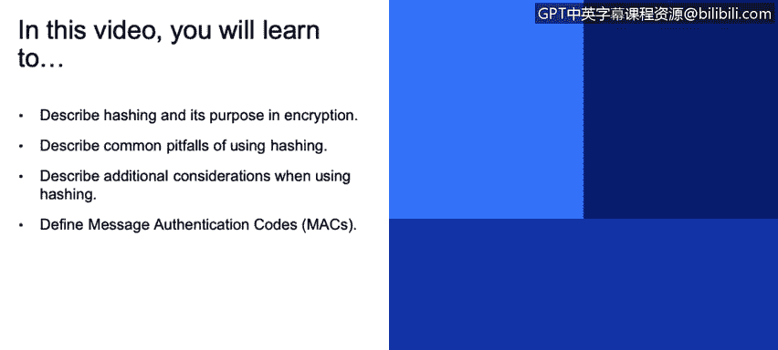
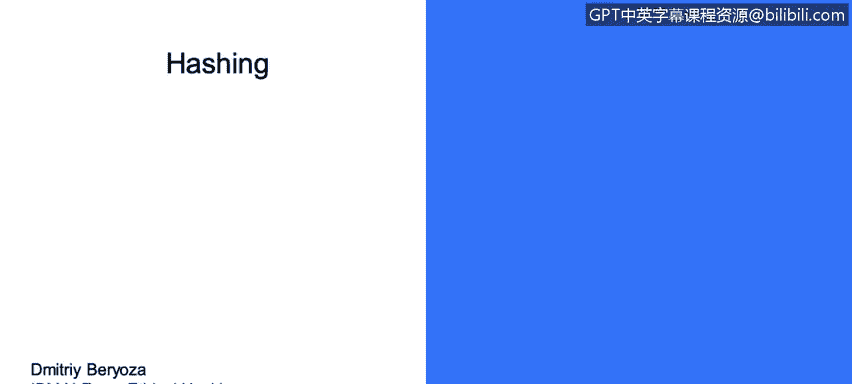
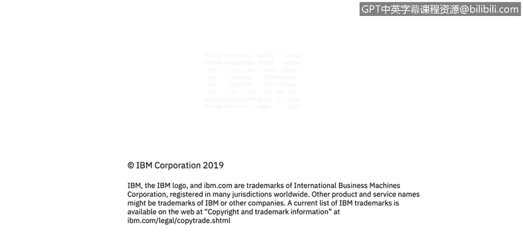

# 课程3：《网络安全合规框架与系统管理》：49：哈希






在本节课中，我们将要学习哈希的概念、用途、常见陷阱以及使用时的额外注意事项。我们还将介绍消息认证码。

## 什么是哈希？🔍

哈希是一种将任意长度的输入数据转换为固定长度字符串的加密技术。这个输出字符串被称为哈希值或摘要。哈希的主要目的是确保数据的完整性，即验证数据在传输或存储过程中未被篡改。

## 哈希的用途 📝

哈希在网络安全中有多种重要用途。以下是其主要应用场景：

*   **验证密码**：系统通常不存储用户的明文密码，而是存储其哈希值。当用户登录时，系统对输入的密码进行哈希运算，并与存储的哈希值进行比对。为了增强安全性，我们使用“盐值”技术，稍后会详细讨论。
*   **验证数据和代码的完整性**：通过比较文件的哈希值，可以确认文件在下载或传输后是否与原始文件一致。
*   **用于消息认证码**：HMAC 结合了哈希函数和密钥，用于验证消息的来源和完整性。
*   **用于密钥哈希**：在密钥派生过程中使用。
*   **用于数字证书**：验证数据和代码的完整性与真实性。

目前推荐的哈希函数是 **SHA-2**、**SHA-3** 和 **BLAKE2**。

## 使用哈希的常见陷阱 ⚠️

上一节我们介绍了哈希的用途，本节中我们来看看如果使用不当会带来哪些问题。

首先，存在许多过时且已被认为“被攻破”的哈希函数，应逐步淘汰它们。当一个哈希函数能够被实际地生成“碰撞”时，通常就被认为是不安全的。

**碰撞**是指两个或更多不同的输入数据，经过哈希函数计算后，得到了相同的哈希值。如果能够相对容易地找到这样的碰撞，那么该哈希函数就不再安全。

有两种非常常见但应被淘汰的哈希函数：
*   **MD5**：已被攻破超过10年，可以相对容易地生成碰撞。
*   **SHA-1**：最近已被证明不可靠，不再推荐使用。你可以访问一个名为 `shattered.io` 的网站，查看两个不同文件却拥有相同 SHA-1 哈希值的演示。

使用可预测的明文进行哈希也存在问题。这虽然不完全是密码学问题，但举例来说，如果你哈希一个密码，而这个密码因为属于常用密码列表而容易被猜到，攻击者通过暴力破解遍历所有可能组合，就能找到对应此密码的哈希值。

解决这个问题的方法是使用**加盐哈希**。

除了上述列表中的问题，另一个与哈希相关的问题是**彩虹表**。彩虹表是用于暴力破解的一种变体，本质上是他人预先计算好的、包含所有可能字符组合及其对应哈希值的巨型表格。当然，为整个问题空间生成彩虹表几乎不可能，但对于合理大小的输入（如短密码），生成彩虹表是可行的。有一个名为 `hashkiller` 的网站，你可以输入一些常见名称或小数字，它可能会给出对应的哈希值。

可以推测，一些国家有能力生成巨大的彩虹表，以此方式破解哈希。防止这种情况的方法就是使用**盐值**。盐值是一个随机的字节序列（建议至少8字节），在计算哈希之前将其添加到明文中，并且这个盐值通常是公开的。这样，即使密码相同，使用不同的盐值也会产生完全不同的哈希值。

如下图所示，两个用户的密码相同，但由于使用了不同的盐值（蓝色部分），其哈希值完全不同。使用盐值后，彩虹表攻击就变得不切实际了。


## 使用哈希的额外注意事项 💡

了解了常见陷阱后，我们还需要关注一些增强哈希安全性的额外措施。

*   **使用密钥延伸函数**：结合哈希使用密钥延伸函数（如 PBKDF2），并进行大量迭代。这些函数被故意设计得很慢（通过迭代次数控制），使得在线和离线的暴力破解攻击变得不切实际。通常，目标是让一次操作耗时约750毫秒，这会大大减慢哈希计算速度。如果你试图对大量密码列表进行暴力破解，这将变得极其耗时。以下是一个使用 PBKDF2 的代码示例：
    ```python
    # 伪代码示例：使用PBKDF2进行密钥延伸
    hashed_password = PBKDF2(password, salt, iterations=100000, hash_function=SHA256)
    ```
*   **为哈希值预留升级空间**：在存储哈希值时，包含算法标识符。这样，如果将来发现当前算法不安全，你可以做出反应，切换到不同的算法，只需在存储时更改算法标识符即可。
*   **保护加密数据**：即使是加密数据，也应使用 HMAC 进行保护，以防止一种称为“位翻转攻击”的手段。攻击者可以在不知道内容的情况下，玩弄加密消息中的比特位，足以改变其含义。例如，他们可能将转账金额从100美元改为100万美元，而无需解密数据。HMAC 可以防止此类位翻转攻击。

## 消息认证码简介 🔐

与哈希密切相关的一个概念是**消息认证码**。MAC 用于确认数据块来自预期的发送方且未被更改。

基于哈希的 MAC，即 **HMAC**，基于 SHA-256、SHA-3 等加密哈希函数。它使用一个密钥来生成待传输消息的哈希值。

如果攻击者不知道密钥，他们就无法在修改消息后生成一个与之匹配的新哈希。如果只是发送消息附带一个普通哈希，攻击者可以修改消息，重新计算哈希，然后发送出去。而使用 HMAC，由于哈希是使用密钥生成的，攻击者无法生成对应的哈希。

因此，HMAC 在数据可能被恶意篡改的场景下非常有用，例如在客户端浏览器中存储 cookies，或传输敏感消息时。



## 总结 📚


本节课中我们一起学习了哈希的核心概念。我们了解到哈希是一种用于确保数据完整性的加密技术，广泛应用于密码验证、文件完整性检查等领域。我们探讨了使用过时哈希函数（如 MD5 和 SHA-1）的风险，以及如何通过加盐和密钥延伸技术来抵御彩虹表和暴力破解攻击。最后，我们介绍了消息认证码，特别是 HMAC，它通过结合密钥来提供消息来源和完整性的强验证。正确应用这些知识，是构建安全系统的重要基础。