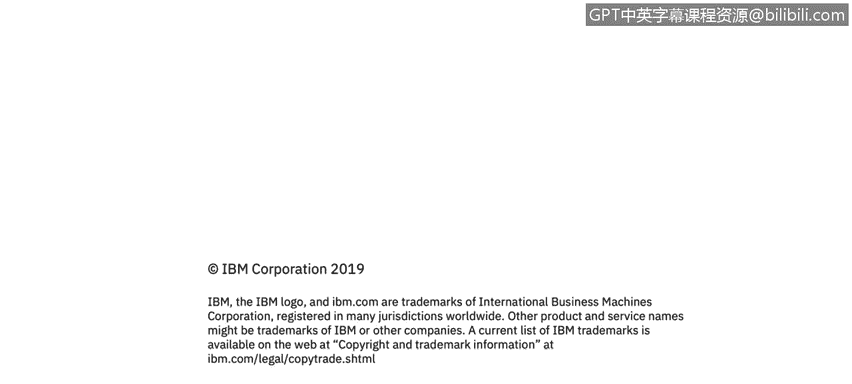

# 课程3：《网络安全合规框架与系统管理》：51：加密密钥保护 🔑

在本节课程中，我们将学习如何保护加密密钥，特别是如何保护用于加密其他密钥的密钥加密密钥。理解并实施这些保护措施，是确保整个加密体系安全的基础。

## 概述

加密是保护数据安全的核心技术，而加密密钥则是这项技术的命脉。如果密钥本身得不到妥善保护，那么整个加密方案将形同虚设。本节我们将探讨保护加密密钥的最佳实践，并重点介绍如何安全地管理那个保护所有其他密钥的“密钥加密密钥”。

## 保护加密密钥的重要性

正如之前提到的，保护加密密钥至关重要。你的加密解决方案的安全性，完全取决于你的密钥的安全性。

因此，绝对**不要**以明文形式将密钥存储在源代码、配置文件或数据库中。遗憾的是，我们时常会看到此类不安全的做法。

## 正确的密钥存储方式

正确的存储方式是使用安全的加密存储，即**密钥库**。例如，使用Java的开发者可能熟悉Java密钥库，其他编程语言也有对应的密钥库实现。

然而，这里引出了一个更深层次的问题：我们如何保护这个存储了所有密钥的加密存储库本身？因为它也需要用一个密钥来保护，这个密钥被称为**密钥加密密钥**。

## 保护密钥加密密钥的方法

这确实是一个棘手的问题，许多产品都在为此努力。如何保护这个保护所有其他密钥的密钥呢？我们有以下几种推荐方案：

以下是几种保护密钥加密密钥的推荐方法：

1.  **硬件安全模块**：这是一种客户可以购买并安装在机器中的硬件设备，它能安全地保管所有加密密钥和数字证书。
2.  **虚拟HSM**：这是一种软件解决方案，能提供与硬件安全模块类似的保障。
3.  **从用户密码派生**：如果适用，可以从用户输入的密码派生出密钥加密密钥。例如，许多全盘加密软件在用户登录笔记本电脑时，就用输入的密码作为密钥加密密钥，进而解密硬盘内容。
4.  **从机器唯一数据派生**：另一种推荐方法是，从运行该产品的机器上某种对攻击者而言难以获取的唯一数据派生出密钥。例如，可以利用文件系统元数据，如随机生成的文件名或文件时间戳。攻击者可能窃取特定文件，但要找到一个未知名称的文件或获取其精确时间戳则困难得多。

## 总结

本节课我们一起学习了加密密钥保护的核心要点。我们明确了绝不能以明文存储密钥，而应使用密钥库。更重要的是，我们深入探讨了保护“密钥加密密钥”的多种策略，包括使用硬件/虚拟HSM、从用户密码派生以及利用机器唯一数据派生等方法。牢记并应用这些原则，是构建坚实加密防御体系的关键一步。