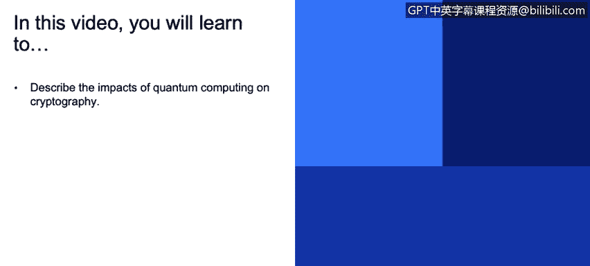
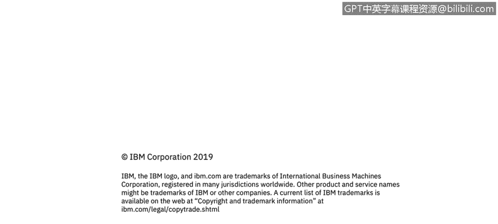

# 课程3：《网络安全合规框架与系统管理》：52：量子计算的影响 🔬

在本节课中，我们将要学习量子计算对密码学领域可能产生的影响。量子计算是一种利用量子力学现象进行计算的新兴技术，它预示着计算能力的巨大飞跃，同时也对当前广泛使用的加密技术构成了潜在威胁。

## 量子计算简介

上一节我们介绍了课程的整体背景，本节中我们来看看什么是量子计算。量子计算是使用量子力学现象进行计算的技术。你可能已经听说过它，并且了解到它可能对我们今天使用的密码学技术产生负面影响。

## 量子计算对密码学的影响

幸运的是，量子计算的实用化可能还需要10到15年的时间。但这并不妨碍我们现在就开始思考其影响。其核心影响在于，对称加密算法将会被削弱。

以下是具体影响：

*   **对称加密**：例如，如果你使用**AES算法**配合**128位密钥**来保证安全，当量子密码学可用时，你将需要升级到**256位密钥**。这应该不是一个太大的问题。
*   **非对称加密**：不幸的是，公钥密码学将受到严重影响，基本上会被破解。因此，像**TLS**、**区块链**和**数字签名**等技术都将变得不安全。现在就开始思考如何保护你的客户是值得的。

## 应对策略与未来算法

鉴于上述风险，我们现在就需要决定如何保护客户。全同态加密是其中一个研究方向。此外，还有一类抗量子算法，例如基于格的密码学等。

以下是当前的一些考量与建议：

*   相关的建议和标准尚未完全成熟。
*   但为了确保客户安全，最好尽早开始准备。
*   其中一个问题是，如果你所保护数据的生命周期相当长，攻击者现在就可以截获加密通信，等到量子计算实用化时再进行解密。如果存在这种危险，你可能需要立即开始考虑对策。

## 密码学最佳实践：可替换性

在这方面，一个通用的良好实践是让你的加密算法具备“可替换性”。因为随着时间的推移，情况会发生变化，有些东西会变得不安全，有些算法会被破解。

如果你在产品中（例如通过修复包或服务包）拥有一个健壮的机制，能够将当前的加密算法替换为另一种，那么你的客户将会赞赏这一点。并且，当出现某种算法变得不安全的新闻时，如果你能迅速在产品中做出反应，无需进行太多更改就能替换算法，这将是一个优势，并可能让你在竞争中领先。

## 进一步探索

你可以进一步探索与密码学相关的资源。

---

本节课中，我们一起学习了量子计算的基本概念及其对对称与非对称加密技术的潜在影响。我们认识到，尽管量子计算的威胁尚未迫在眉睫，但提前规划、采用可替换的加密架构并关注抗量子算法的发展，对于构建面向未来的安全系统至关重要。