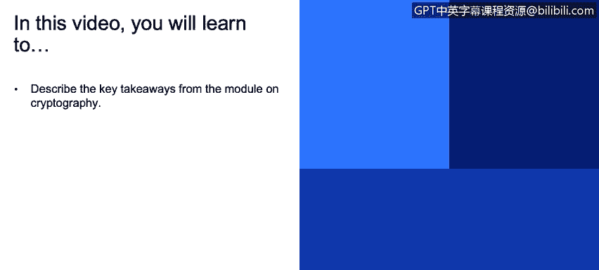
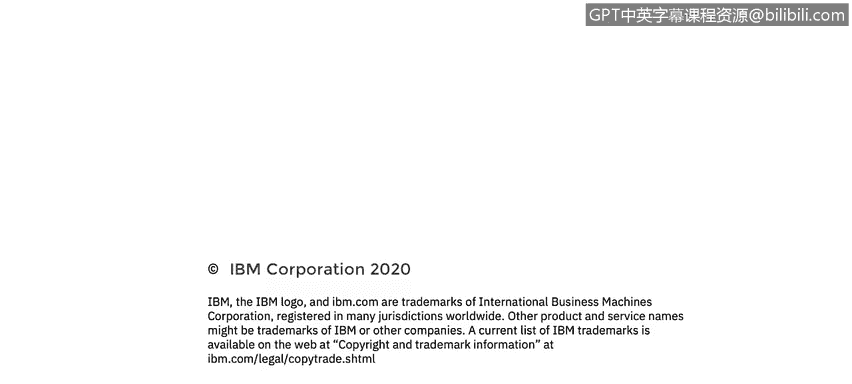

# 课程3：《网络安全合规框架与系统管理》：53：密码学和加密要点 🔐

在本节课程中，我们将总结密码学模块的核心要点。我们将回顾加密数据、选择算法、管理密钥以及保持安全意识的关键原则。

上一节我们介绍了密码学的具体应用，本节中我们来看看如何将这些知识转化为实际的安全实践。

## 核心要点总结

以下是本模块中需要牢记的关键行动指南：

*   **加密所有敏感数据**：无论数据是静态存储（at rest）、正在使用（in use）还是在传输中（in transit），都应进行加密。
*   **依赖并正确使用成熟的算法**：选择经过广泛验证的加密算法（如AES、RSA），并严格按照规范使用。一个微小的配置错误就可能导致整个加密方案失效。
*   **切勿自行编写或依赖“隐蔽式”算法**：不要尝试创建自己的加密算法，也不要相信“算法保密就能保证安全”的观念。**“通过隐匿实现安全”根本不是安全**。
*   **使用强密钥并安全存储**：生成足够复杂、难以猜测的加密密钥，并确保密钥本身通过安全的方式存储和管理。
*   **持续关注安全动态**：密码学领域不断发展，新的漏洞和攻击方式可能出现。需要关注安全新闻，以便在所使用的算法或产品出现安全问题时能够及时响应。

本节课中我们一起学习了密码学实践的核心原则。记住，加密是保护数据机密性和完整性的基石，但只有正确、全面地应用这些原则，才能构建起有效的安全防线。