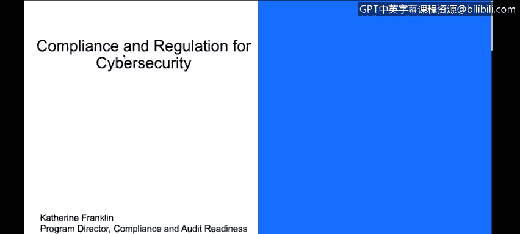
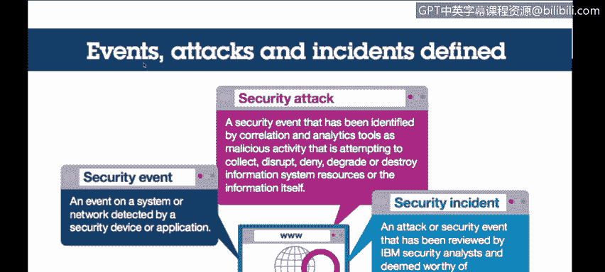
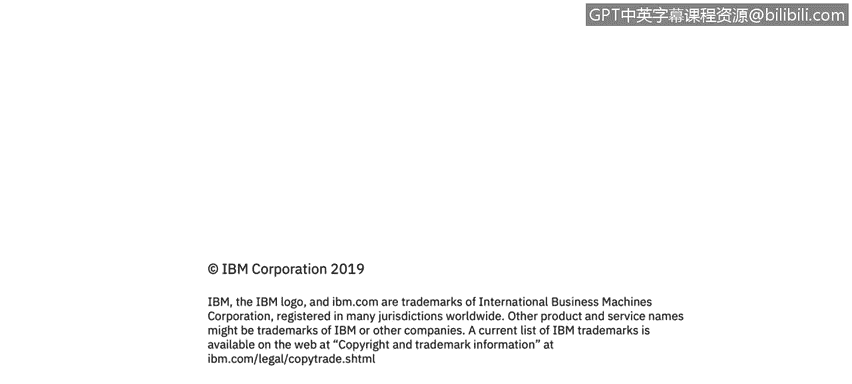

# 课程3：《网络安全合规框架与系统管理》：57：2_02 组织面临哪些网络安全挑战？🔍

在本节课中，我们将学习组织在网络安全领域面临的主要挑战，这些挑战正是催生合规与监管要求的原因。我们将厘清安全事件、攻击和事件等核心概念，并探讨如何针对不同类型的威胁源实施相应的安全控制措施。

---

上一节我们明确了课程目标，本节中我们首先来定义几个关键的安全术语。这些术语密切相关，但含义不同。

以下是三种主要的安全定义：

*   **安全事件**：指由安全设备或应用程序检测到的任何系统或网络活动。例如，输入密码或防火墙规则检查都属于安全事件。
*   **攻击**：这是安全事件的一个子集，指任何实体、工具或个人试图对系统进行恶意或不当行为的尝试。例如，试图窃取数据、破坏系统或发起拒绝服务攻击。
*   **安全事件**：当组织（如IBM）认为发生了值得深入调查的不良情况时，就构成了安全事件。这意味着攻击可能已经成功，我们需要查明发生了什么并决定如何应对。

---

了解了基本概念后，我们来看看安全团队面临的实际挑战：事件数量极其庞大。

根据IBM 2015年的安全报告，在云环境中，单个系统一年内可能产生约**8200万**个安全事件，其中仅有约**1.7万**个属于攻击，最终确认为安全事件的只有约**100**个。一个常见的误解是，系统没有异常就代表安全。实际上，这可能是因为防火墙等安全控制措施已经拦截了大量攻击。安全工作的核心目标，正是建立必要的安全控制措施，以处理海量事件，从而发现、预防并抵御攻击和安全事件。

---

由于攻击手段多种多样，我们需要多层面、多角度的防护策略。

根据同一份2014年的研究报告，攻击类型主要分为以下几类：

*   未授权访问
*   恶意代码
*   持续探测与扫描
*   凭据窃取
*   拒绝服务攻击

攻击者来源也可分为两大类：

*   **外部攻击者**：约占45%。他们不属于组织内部，可能是黑客、个人或犯罪组织，试图从外部侵入系统。
*   **内部人员**：约占55%。这包括组织内的员工。他们又可分为两类：
    *   **恶意内部人员**：因不满或其他原因故意实施破坏。
    *   **无意造成问题的内部人员**：因疏忽或错误操作导致安全事件。

---

面对不同来源的威胁，我们需要采取针对性的安全措施。

以下是针对不同威胁源的防护重点：

*   **应对外部攻击者**：他们旨在窃取数据、计算资源或破坏服务。防护措施应侧重于**加密**、**防火墙**，并通过威胁建模、渗透测试等方式进行验证。
*   **应对无意的内部人员**：他们是会犯错的普通人。防护重点在于通过流程和系统减少人为错误，例如增加操作确认提示、利用**自动化**减少人工输入错误、并生成相关报告。
*   **应对恶意的内部人员**：他们是故意实施破坏的内部人员。防护核心在于**职责分离**、限制使用**高权限账户**、将关键系统和数据的访问权限限制在最小范围，并确保**个人问责制**（禁用共享账户），同时记录和监控这些受限账户的活动并定期审计。

---

本节课中，我们一起学习了网络安全的基本概念（事件、攻击、事件），认识了组织面临的海量安全事件挑战，并分析了攻击的不同类型与来源（外部攻击者、无意内部人员、恶意内部人员）。最重要的是，我们了解到没有单一的解决方案，必须根据威胁来源的不同，综合运用加密、访问控制、自动化、审计等多种安全控制措施，构建起纵深防御体系，以应对复杂的网络安全挑战。