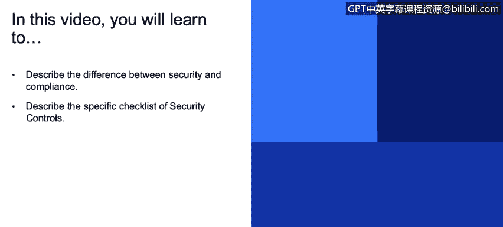
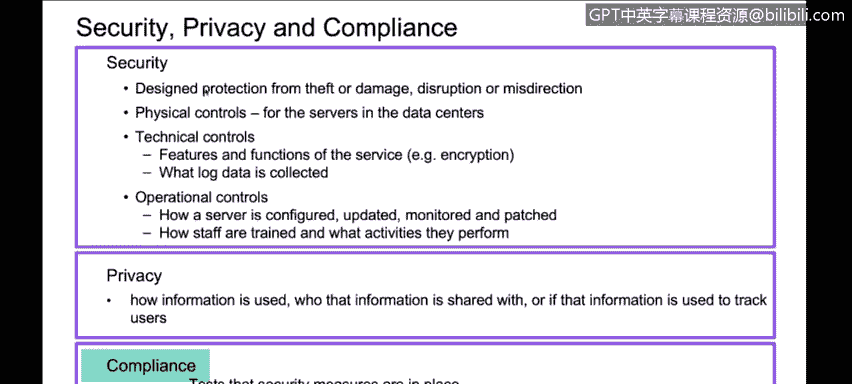
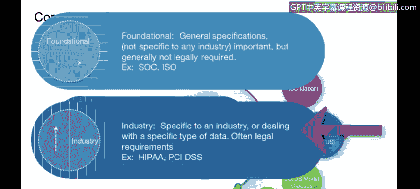
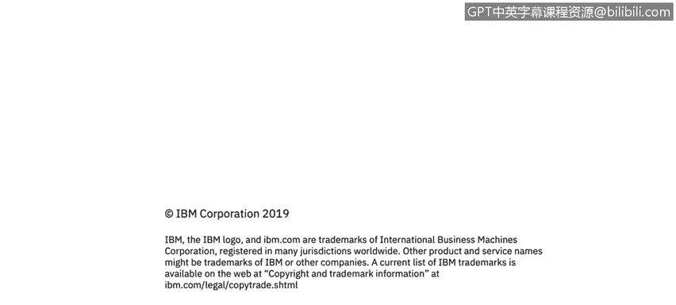
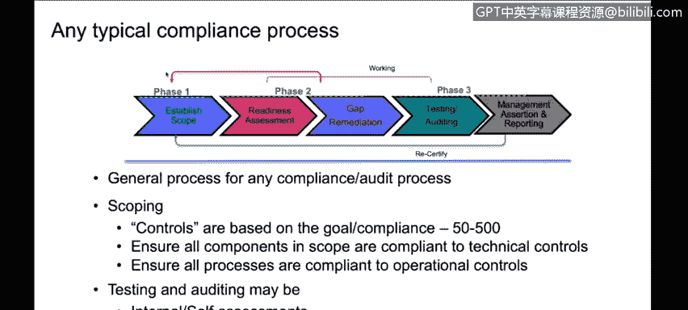
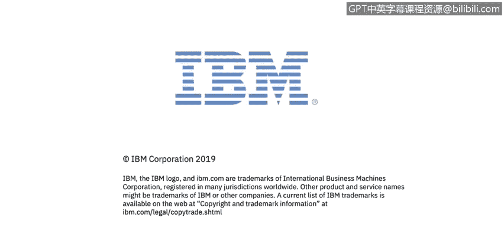

# 课程3：《网络安全合规框架与系统管理》：58：3_03_合规基础

在本节课程中，我们将学习合规的基础知识。具体来说，我们将了解安全与合规之间的区别，并描述一份特定的安全控制检查清单。

我们将介绍一些合规基础知识。之前的课程主要关注安全，现在我们将重点转向合规。这里的关键是理解安全、隐私和合规之间的差异，以及这些差异在我们审视不同合规标准和法规时是如何体现的。

安全、隐私和合规三者相互关联，但并非同一回事。

**安全** 旨在保护您的环境、系统免受盗窃、破坏、中断或信息泄露。它主要分为三类控制措施：

以下是三类主要的安全控制措施：
*   **物理控制**：指如何从物理层面保护运行应用程序的系统。例如，保护服务器、数据中心或云中硬件的物理安全。
*   **技术控制**：指用于限制或控制数据或流程安全性的工具、软件或功能。例如，**加密**、日志记录、密码管理软件。
*   **操作控制**：指程序性的措施。例如，服务器的配置方式、系统补丁更新的频率规则、负责监控和审查日志的人员、员工的培训方式及其执行的活动。

系统的安全不能仅靠一种防御措施解决，通常需要结合上述三类中的多种措施。

**隐私** 则有所不同。隐私更侧重于数据本身。它关注信息如何被使用、谁有权访问、如何存储和传输，以及信息可能被用于追踪个人或事物的方式。例如，关于您个人的信息如何使用就属于隐私范畴。

**合规** 侧重于测试已实施的安全措施或隐私措施是否到位。合规通常会根据特定目标，从所有控制措施中识别出一个特定的子集。其核心思想是，您需要根据标准来验证这些特定的控制措施。

合规还可能涵盖许多通常不被视为安全范畴的非安全事项。例如，商业实践、供应商协议。您可能不认为供应商协议与安全直接相关，但如果您并非完全自主构建和运行产品，而是有供应商参与，那么您需要确保他们提供您所期望的安全和隐私控制。因此，合规与安全相关，但从某些人的角度来看，这种关联可能是间接的。

当您考虑合规时，根据您如何阐述安全要求或特定要求，保护您的环境、系统、产品或应用程序可能涉及**50到500项**不等的控制措施。

因此，根据您追求的合规类型，您可能从这500项中选择一个特定的子集。一旦确定了这个子集，您就需要进行验证。

验证通常按计划进行，可以由外部审计师或公司内部的评估员执行。在IBM，我们有内部评估员执行此职能。验证的目的是证明这些控制措施得到遵守并已落实。

有时，根据特定合规的性质，考虑聘请专门从事该合规领域的外部供应商是值得的。他们可以进行评估、审计。具体是称为评估、审计、报告还是认证，取决于各个标准的规定，这些术语因具体的合规要求而异。我们稍后会介绍其中一些。

合规主要分为两大类。

您会发现，有些合规标准是**基础性、通用型**的。它们不针对任何特定行业，适用范围广泛，涵盖物理、技术或操作等多个不同主题。例如 **ISO 27001** 和 **SOC**（我们稍后会讨论）。

另一类则更具**行业特定性**，甚至是政府性的，它们针对特定的主题领域。例如，我们今天稍后会看到的 **HIPAA**（专注于美国医疗保健领域）和 **PCI DSS**（专注于支付卡信息，即信用卡数据存储）。

此外还有欧洲标准。许多司法管辖区都有特定标准，例如美国联邦政府就有多项标准。作为网络安全专家，我们需要了解这些标准各自在何时、如何适用，以及哪些适合您的业务。因为您需要选择最合适的标准。其中一些认证成本非常高昂，您必须选择最适合您行业和业务需求的，并专注于那些能为您带来最大商业价值的认证。

首次获得认证或合规的典型流程如下：

首先，**确立范围**。例如，如果我们想获得ISO认证，我需要明确是针对哪一组特定系统、特定应用程序或特定环境。您需要为合规范围设定清晰的边界，明确哪些在范围内，哪些不在。

接下来是**准备状态评估**。您需要仔细研究该特定标准的所有合规要求，查看控制措施，从50到500项中识别出相关的子集，并理解每一项控制措施如何应用于您已确定范围的环境。

然后，**评估执行情况**。您需要评估自己执行这些功能的效果：是执行得很好、完全没执行，还是执行得一般。在此过程中，您会识别出差距。

作为准备状态评估的一部分，一旦识别出差距清单，您就需要进行整改。您需要解决这些差距，纠正所有发现的问题。例如，如果根据标准要求，您需要在某些地方加密但尚未实施，那么您就需要去添加加密。如果您的用户ID管理或最小权限原则执行不到位，您可能需要审查系统访问权限并进行调整。这就是差距补救阶段。

之后，您将进入**测试期**。如果是通过自我评估或内部评估进行测试，您需要与该领域的专家合作。如果合适，您也可能聘请外部审计师。测试完成后，通常会经过一段时间来最终完成报告和测试，然后获得相应的认证、声明或报告。

最后是**重新认证**。根据认证的性质，重新认证的频率可能是每季度、每年或每两年一次，这完全取决于您所追求的特定认证条款。但所有认证大体都遵循这个模式。如果您在测试过程中发现差距补救得不够充分，可能需要回到起点，重新确立范围并再次进行差距补救。

基本上，只要您打算持续支持该特定合规要求，您就会在这个循环中持续运作。

**总结**

在本节课中，我们一起学习了合规的基础知识。我们明确了安全、隐私与合规三者的区别与联系，了解了安全控制的三大类别（物理、技术、操作）。我们认识到合规是从众多安全控制中选取特定子集进行验证的过程，并区分了通用型合规标准（如ISO 27001）与行业特定型标准（如HIPAA, PCI DSS）。最后，我们掌握了实现合规的典型流程：确立范围、准备状态评估、差距补救、测试与认证，以及持续的重新认证循环。理解这些基础概念是有效管理和实施合规框架的关键第一步。