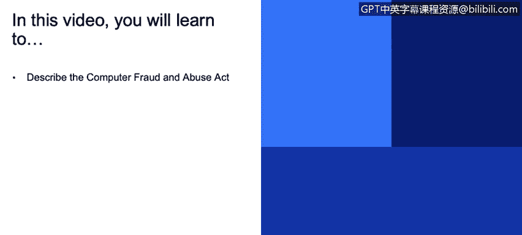

# 课程3：《网络安全合规框架与系统管理》：59：4_04 美国网络安全联邦法律概述 🔍

## 概述
在本节课程中，我们将学习美国联邦法律中与网络安全相关的几个具体主题，特别是《计算机欺诈与滥用法案》，并了解其他联邦法律框架如FISA和FedRAMP的基本概念。

---

## 美国联邦法律与合规主题

上一节我们介绍了合规框架的宏观背景，本节中我们来看看美国联邦法律中的几个具体领域。

我们将探讨一些具体案例并进行分析。首先要讨论的是美国联邦法律领域的《计算机欺诈与滥用法案》。

---

## 《计算机欺诈与滥用法案》💻⚖️

《计算机欺诈与滥用法案》自1984年起生效。

该法案的核心作用是**将网络犯罪定义为刑事犯罪**。

该法律规定，**未经授权或超越授权范围访问计算机系统是违法行为**。

以下是该法案涵盖的主要违法行为：
*   干扰计算机系统是违法的。
*   非法获取计算机信息是违法的。
*   破坏计算机系统是违法的。

这些行为都将受到法律惩处。在1984年之前，计算机虽然已被使用，但其相关犯罪主要适用标准的邮件和电信欺诈法规。自1984年起，它已成为一项独立的法律。

---

## 其他美国联邦法律框架

除了《计算机欺诈与滥用法案》，还有其他重要的美国联邦法律。

**FISA（《外国情报监视法》）**和**FedRAMP（联邦风险与授权管理计划）**旨在为联邦机构分配特定职责。

如果您与美国联邦政府有业务往来，您必须满足非常严格的物理安全要求和技术要求。

美国联邦政府内的每个机构可能需要满足一套不同的标准子集。因此，整个体系变得非常复杂。

我的建议是，如果您要深入研究美国联邦法律领域，这本身将是一个需要投入大量精力的专题，无论是从教育角度还是实际获取资质的角度，都可能是一个完整的研究项目。

所有这些美国联邦法律的要求子集，都基于一个名为**NIST（美国国家标准与技术研究院）**的机构制定的标准。

---

## 总结
本节课中，我们一起学习了美国网络安全领域的两项关键联邦法律。我们首先了解了将网络犯罪定罪核心的《计算机欺诈与滥用法案》，然后简要介绍了FISA和FedRAMP等其他法律框架，并认识到它们通常以NIST标准为基础。理解这些法律是构建有效合规体系的重要一步。