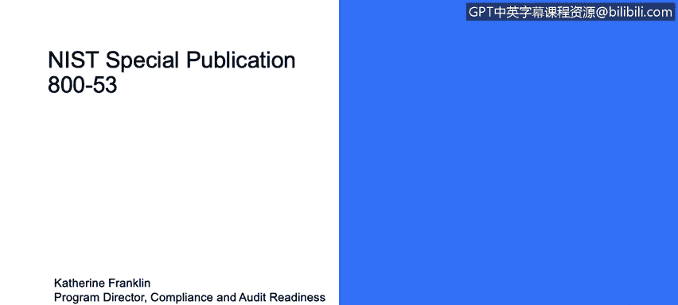

# 课程3：《网络安全合规框架与系统管理》：60：5_05 美国国家标准与技术研究院概述 🔍

在本节课程中，我们将学习美国国家标准与技术研究院的重要性及其在网络安全领域的作用。

---

## 概述

美国国家标准与技术研究院专注于网络安全与隐私领域。该机构制定了数百项与安全相关的具体标准，涵盖了密码管理、加密技术、网络通信以及如何确保安全与隐私等方方面面的详细内容。

上一节我们介绍了合规框架的基本概念，本节中我们来看看一个具体的、极具影响力的标准制定机构。

---

## NIST 的核心作用

NIST 会详细列出数百项独立的标准。这些标准文档内容详尽，例如：

*   关于密码的详细规定。
*   关于加密技术的实施指南。
*   关于网络通信的安全要求。
*   关于如何确保安全与隐私的具体措施。

通常，并不要求企业实施所有这些数以百计的标准。相反，企业需要根据自身业务情况，建立一套内部实践流程，尽可能多地采用那些对自身业务有意义的准则。

正如之前提到的，根据您所打交道的具体机构（例如政府监管部门或行业合作伙伴），它们会重点关注NIST标准中某些特定的子集。

---

## 总结

本节课中，我们一起学习了美国国家标准与技术研究院在网络安全标准制定中的核心地位。我们了解到，NIST 提供了一套庞大而详细的安全与隐私标准框架，企业应根据自身实际情况和合规要求，有选择地采纳和实施其中的相关部分，以构建有效的安全实践。