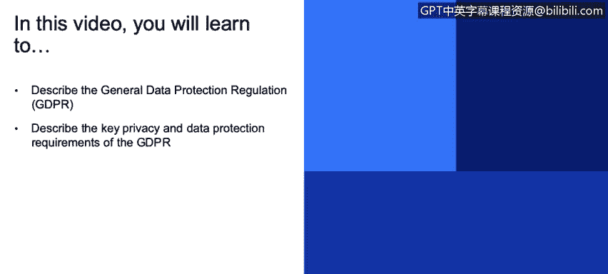
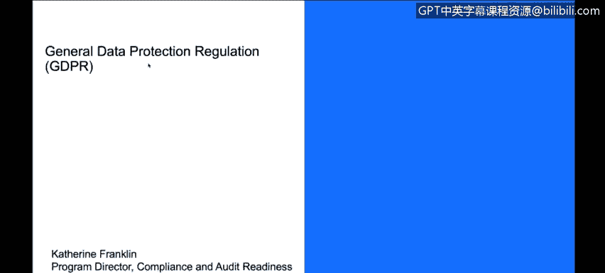
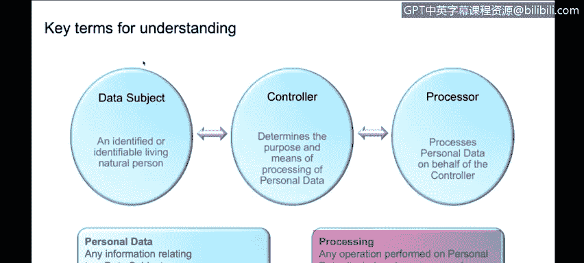
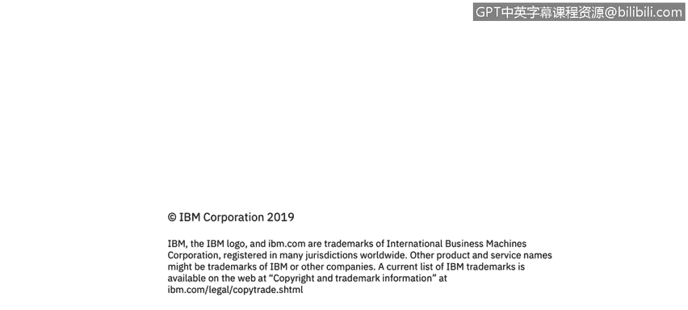

# 课程3：《网络安全合规框架与系统管理》：6.07：通用数据保护条例概述 📜

在本节课程中，我们将学习通用数据保护条例的基本概念、核心要求及其重要性。GDPR是近年来影响深远的数据隐私法规，理解其框架对于任何处理欧盟居民数据的组织都至关重要。

## GDPR简介

通用数据保护条例是一项欧洲标准法规，近期出台。该法律旨在管理欧洲数据的隐私，重点关注合规性、数据保护以及欧盟居民的个人数据。

具体而言，如果您的业务将托管欧盟居民数据或与欧盟进行业务往来，那么理解这项法规就非常重要。

## 合规视角与核心要求

从合规的角度看，GDPR旨在规范您如何管理与个人相关的数据，确保您制定了适当的政策和流程。它特别关注数据加密、数据安全、数据访问与监控，以及在隐私领域大量涉及的个人数据，并确保数据处理的合法性。

您还会看到关于“被遗忘权”的法律规定。该法规自2018年起生效，如前所述，只要您处理的数据属于欧洲数据，无论您身处世界何处，该法律都适用于您。GDPR还伴随着极其严厉的处罚。

以下是GDPR的五个关键原则：
*   **数据主体的权利**：保障欧盟数据主体的权利。
*   **个人数据安全**：确保个人数据的安全。
*   **获取数据所有者同意**：要求获得数据所有者的同意。
*   **问责制**：明确数据处理各方的责任。
*   **数据保护**：核心目标是保护数据。

## 关键术语解析

为了深入理解GDPR，我们需要明确几个核心术语的定义：

*   **数据主体**：指已识别或可识别的在世自然人，即欧盟居民。
*   **控制者**：指负责处理该数据的个人或实体。
*   **处理者**：指代表控制者处理数据的执行方。
*   **个人数据**：指与数据主体相关的任何信息。这一点常被误解。即使信息以某种方式与识别个人的信息分离，它仍然属于个人数据。
*   **处理**：指对数据执行的任何操作，包括存储、访问、传输等。如前所述，GDPR具有全球适用性，法律管辖的是数据本身，而非数据物理存储的地点。

## 处罚与影响

GDPR的罚款额度可能非常巨大，最高可达公司全球年营业额的**4%** 或**2000万欧元**（以较高者为准）。您可以搜索“GDPR罚款案例”，会发现已有多起数额巨大的罚单，有些甚至超过1亿欧元。

## 总结

本节课我们一起学习了通用数据保护条例的概述。我们了解到GDPR是一项保护欧盟居民个人数据的核心法规，其核心在于规范数据处理活动、保障数据主体权利，并规定了控制者与处理者的责任。理解GDPR的关键术语和严厉的处罚机制，对于在全球范围内开展业务、尤其涉及欧盟数据的组织来说，是构建合规框架的基础。