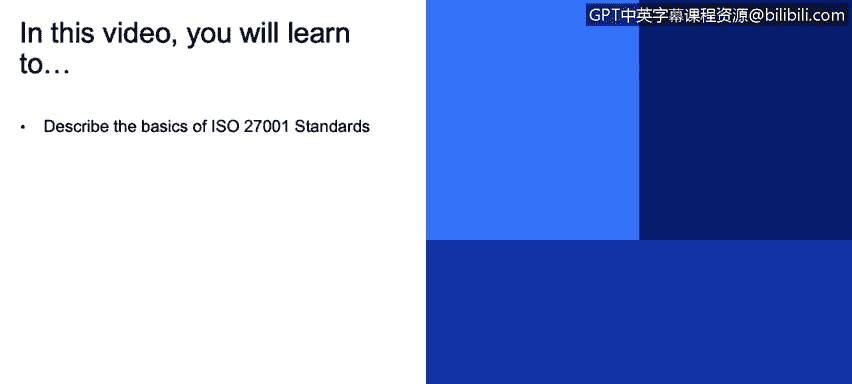
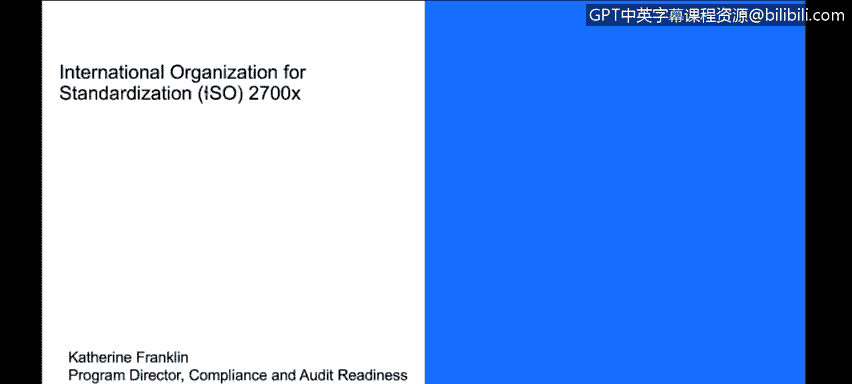
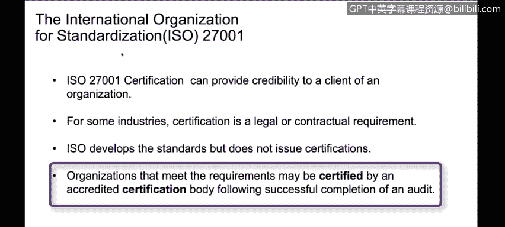
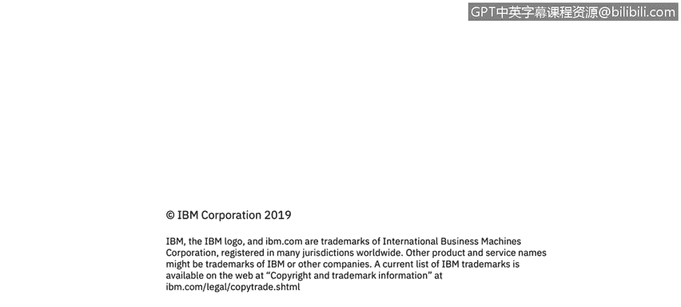

# 课程3：《网络安全合规框架与系统管理》：62：国际标准化组织ISO 2700x标准

## 概述
在本节课程中，我们将学习国际标准化组织（ISO）的ISO 2700x系列标准。我们将重点了解ISO 27001标准的基础知识，以及该系列中其他相关标准的作用和重要性。

## ISO 2700x系列标准简介
ISO制定了许多不同的标准，而我们在此特别关注的是适用于网络安全领域的标准。ISO 2700x系列标准正是为此而生。

## 核心标准：ISO 27001
ISO 27001是最常见的信息安全管理标准。它关注于建立、实施、维护和改进信息安全管理体系的要求。

该标准基于风险，会评估组织的风险水平和成熟度。例如，它不仅要看你是否有密码保护，还要评估密码保护的复杂度。随着你实施的安全措施复杂度提升，你的成熟度等级也会相应提高。

## 系列中的其他相关标准
ISO 2700x家族包含许多标准。对于今天的讨论，我们主要关注另外两个：
*   **ISO 27018**：专注于隐私保护。
*   **ISO 27017**：专注于云安全。

## 标准的应用与认证价值
在云安全领域，我们通常会结合使用上述三个标准，以确保能够满足像GDPR这类法规的要求。

我们会聘请外部审计师来进行评估，并为我们提供该领域的认证。这个认证过程向客户证明了我们达到了预期的标准。

外部审计师进行评估的优势在于，我们可以提供审计报告。这样，客户就不需要各自进行单独的评估。他们可以查看报告、了解执行方，并认可其有效性。这能极大地帮助你，因为你可以向众多客户提供这一份标准认证，而无需每个客户都进行单独评估。

## 认证的法律与商业必要性
在某些行业、司法管辖区或情况下，获得ISO认证可能是一项法律或合同要求。如果你想在特定地区开展业务，要么必须进行独立审计，要么必须能够提供此类认证。

## 如何获得认证
ISO负责制定标准，但本身不颁发认证。你需要找到一家经授权、合格、认可的认证机构或审计师，代表你进行评估。

评估通过后，你通常会获得一份证书。这份证书值得放在你的网站上并大力宣传，因为它体现了大量的辛勤工作，并向客户展示了你所达到的、具有吸引力的标准。

## 总结
本节课我们一起学习了ISO 2700x系列标准。我们了解了核心标准ISO 27001的风险管理与成熟度模型，认识了专注于隐私和云安全的ISO 27018与ISO 27017标准，并探讨了通过外部审计获得认证的商业价值与必要性。这些标准为组织建立可信的信息安全体系提供了国际公认的框架。