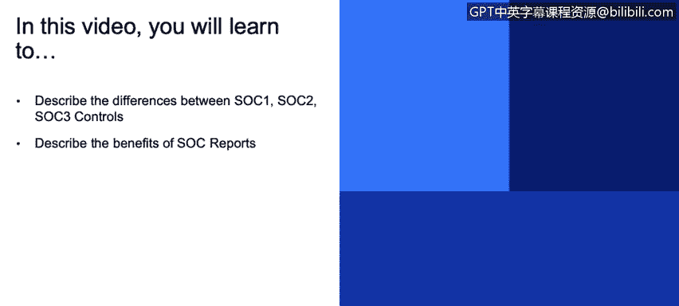
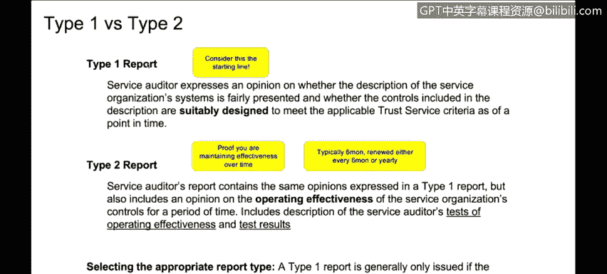

# 课程3：《网络安全合规框架与系统管理》：63：SOC报告详解

在本节课中，我们将要学习SOC报告。我们将了解SOC 1、SOC 2和SOC 3报告之间的区别，并探讨SOC报告能为组织带来的益处。

## SOC报告概述

SOC报告，即系统和组织控制报告，是某些行业或司法管辖区要求的重要合规性文件。如果组织没有SOC报告，则可能需要接受本地合规性审计。许多熟悉合规性的组织实际上更倾向于SOC 2报告，而非ISO认证。这是因为ISO认证是**时点测试**，而SOC 2报告是**持续监控测试**，覆盖一段时间内的表现。此外，一些行业或客户会接受SOC 2报告，以替代其自身的审计权利。

上一节我们介绍了SOC报告的基本概念，本节中我们来看看SOC报告与ISO认证的对比。

## SOC 2与ISO 27001对比

为了更清晰地理解SOC报告，我们可以将其与ISO 27001标准进行对比。

以下是两者之间的主要区别：

*   **关注焦点**：SOC 2报告主要关注**逻辑安全**，即组织是否“说到做到”，执行其声明的策略。而ISO 27001则更侧重于**风险管理**。
*   **认可范围**：ISO 27001是国际公认的标准。SOC 2传统上在北美更流行，但正逐渐获得国际认可。
*   **测试目的**：SOC 2的测试旨在验证组织是否达到控制标准，并执行其自身制定的策略。ISO 27001则更侧重于验证是否遵循了行业**最佳实践**。
*   **管理机构**：ISO 27001由ISO认可的机构进行咨询和认证。SOC 2报告几乎总是由**注册会计师**执行，因为它受美国注册会计师协会的管辖。
*   **范围与性质**：如前所述，ISO 27001关注**设计有效性**（时点测试）。SOC 2（特别是Type 2）还会评估**运行有效性**，即在一段时间（通常是6到12个月）内控制措施的执行效果。
*   **报告形式**：ISO 27001认证通常提供一页纸的证书，详细的审计报告被视为机密文件。SOC 2报告则非常详细，可能长达数十页，描述了控制措施、测试方法及结果，能为客户提供更深入的洞察和信心。

从个人观点来看，由于SOC 2包含运行有效性评估，其认证难度通常被认为高于ISO 27001。

了解了SOC 2与ISO的区别后，接下来我们深入探讨SOC报告家族的不同成员。

## SOC报告的类型：SOC 1、2、3

SOC报告并非只有一种，实际上存在三种主要类型：SOC 1、SOC 2和SOC 3。它们基于相同的核心控制集，但侧重点和报告形式不同。

以下是三种SOC报告的简要说明：

*   **SOC 1报告**：此报告使用一个控制子集，专门关注系统用于**财务报告**的场景。例如，如果你的系统用于存储销售分类账数据，并以此生成财务报表或SEC申报文件，SOC 1报告将侧重于与此财务报告目的相关的控制。
*   **SOC 2报告**：此报告更为通用，审查的控制范围比SOC 1更广。它适用于一般用途。由于其报告内容包含系统、安全、流程和方法的详细细节，属于**限制性使用报告**。组织获得此报告后，通常只会在签订保密协议的前提下，提供给现有或潜在客户，以防详细信息落入恶意攻击者手中。
*   **SOC 3报告**：此报告可被视为SOC 2报告的**执行摘要**。它提供审计意见和系统描述，但不涉及具体的安全实践细节、测试方法或结果。因此，它是一份高级别的公开报告，可以像ISO证书一样放在公司网页上展示。

通常，组织至少会进行SOC 2审计。如果有财务报告相关的需求，也会同时进行SOC 1审计。当进行Type 2审计时，SOC 3报告通常也会一并生成。这意味着通过一次审计，可以同时获得三种认证，但需要提前与审计师规划好。

在区分了SOC 1、2、3之后，我们还需要理解每种报告下的不同审计类型。

## 报告类型：Type 1 与 Type 2

SOC 1和SOC 2报告都分为Type 1和Type 2两种类型。

以下是两种类型的核心区别：

*   **Type 1报告**：可视为**起点线**，最接近ISO认证。它测试控制措施的**设计有效性**，并验证组织至少执行过一次这些控制。这通常用于新产品或首次获取SOC认证时，一般只做一次，不会重复。
*   **Type 2报告**：在Type 1之后进行，关注控制措施在一段时间（通常是6或12个月）内的**运行有效性**。审计师会在此期间内分阶段进行测试（例如，在3个月和6个月时），以验证控制措施在持续时间内是否有效运行。这要求组织能够提供持续有效的证据。通常，Type 2报告会每6个月或每年更新一次，例如采用滚动12个月报告的形式，为客户提供其使用产品期间的连续性保障。

最后，让我们了解一下SOC 2报告内部更细致的分类。

## SOC 2的原则（章节）

除了Type 1和Type 2的复杂性，SOC 2报告内部还包含不同的**原则**或**章节**，每个章节都对应一系列控制要求。

以下是SOC 2的主要原则：

*   **安全性**：这是最典型、最基础的原则，每个人都会涉及。它关注组织如何保护其物理和逻辑访问及系统，包括用户配置、变更管理、库存管理等控制。
*   **可用性**：关注系统的可访问性和正常运行。
*   **机密性**：关注对机密信息的保护。
*   **处理完整性**：关注系统处理的准确性和完整性。
*   **隐私性**：关注对个人身份信息的收集、使用、保留和披露。

目前，除了基础的安全性，可用性和机密性原则也越来越常见。随着对数据保护要求的提高，处理完整性和隐私性原则也受到更多关注。特别是机密性和隐私性原则，对于需要向欧洲客户证明符合**GDPR**的组织非常有用。

## 总结

本节课中，我们一起学习了SOC报告。我们明确了SOC 1、SOC 2和SOC 3报告在目的、内容和受众上的区别，并对比了SOC 2与ISO 27001认证的异同。我们还了解了Type 1（设计有效性）和Type 2（运行有效性）审计类型的差异，以及SOC 2报告内部的安全性、可用性、机密性、处理完整性和隐私性五大原则。掌握这些知识，有助于你理解不同合规框架的适用场景及其对组织安全管理的价值。