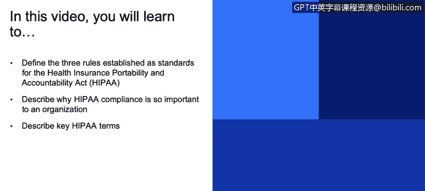
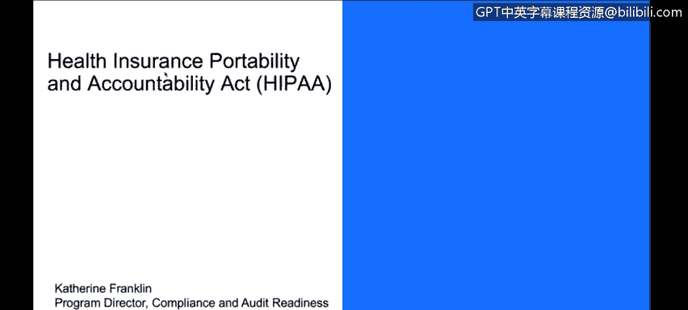
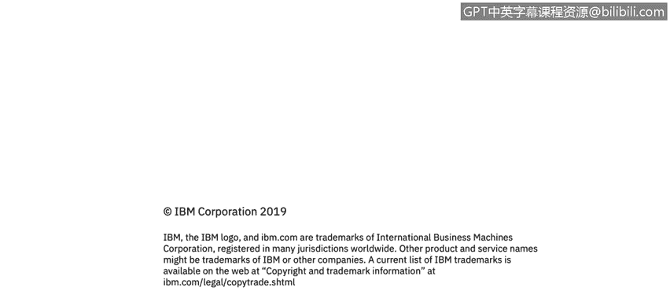

# 课程3：《网络安全合规框架与系统管理》：65：10_01：《健康保险携带和责任法案》（HIPAA）概述

在本节课中，我们将学习如何定义《健康保险携带和责任法案》（HIPAA）确立的三项核心规则，并阐述HIPAA合规性对组织的重要性。

接下来，我们将描述HIPAA的关键组成部分。现在，我将重点介绍一些更具行业特定性的审计类型。

HIPAA，即《健康保险携带和责任法案》，是美国一项针对医疗保健信息的联邦法案。

请注意，HIPAA的正确拼写是“H-I-P-A-A”。如果有人拼成“H-I-P-P-A”，那通常表明他们是这个领域的新手。

目前，医疗保健组织正在使用云服务来实现成本节约和可扩展性。然而，将敏感数据置于云端引发了诸多担忧。

这是否存在风险？正因如此，理解安全性、了解您合作的云服务提供商，并确保他们认识到保障数据完整性和安全的重要性，就显得尤为关键。当然，我们的客户比以往任何时候都更关注云服务，以提升资源利用率、降低成本和缩短响应时间。

HIPAA是美国联邦法律，旨在管控个人医疗保健信息，即PHI。

PHI代表个人医疗保健信息。HIPAA也与此领域的另一项法律HITECH相关。

与HIPAA相关的隐私规则明确了个人对其医疗记录和健康信息的权利，并严格限制只有“需要知道”的人员才能访问这些信息。

该法案适用于健康保险公司、医疗保健提供者以及任何可能访问或需要共享医疗记录的个人或实体。

安全规则则建立了一套保护这些数据的标准。这些标准必须同时适用于“被覆盖实体”和“业务伙伴”。

这两个概念与我们之前讨论的类似，也与我们在GDPR中看到的角色相似。

HIPAA由美国卫生与公众服务部下属的民权办公室定义、管理和监督。该法案明确了此领域的两类主要角色：

*   **被覆盖实体**：指为顾客管理医疗保健数据的公司，例如医院、保险公司或医生诊所。
*   **业务伙伴**：指支持被覆盖实体的任何供应商。例如，如果您为医院提供应用程序或云环境，那么您就是该被覆盖实体的业务伙伴。

受保护的健康信息是指关于个人健康状况的任何信息。被覆盖实体或其业务伙伴有责任确保这些信息的安全性和机密性。

在GDPR的讨论中，我们提到了高额罚款。违反HIPAA同样会面临高额罚款，此外还有一个“耻辱墙”网站会公布违规信息。

那么，为什么HIPAA合规性至关重要？

首先，这是美国联邦法律，具有法律效力。HHS可能会对业务伙伴或被覆盖实体进行突击审计，任何一方都可能面临审计。

其次，罚款可能高达数百万美元，甚至可能面临刑事起诉，后果非常严重。

尽管HIPAA是美国法规，但需要注意的是，许多其他国家也有类似的法律。我们讨论过GDPR，在加拿大有《个人信息保护和电子文件法》。几乎每个地区都有类似的法律或法规。

此外，美国许多州在联邦HIPAA法律之上，还制定了更严格或额外的要求。因此，在选择业务管辖区域和确定合规标准时，需要意识到这一点。

一些国际公司也可能要求遵守HIPAA，无论他们是否与美国数据、美国客户有业务往来，或者仅仅是将HIPAA视为一个有价值的、值得信赖的标准。因此，您也会在国际上看到对HIPAA的要求。

HIPAA安全规则涵盖物理实体、技术控制和行政保障措施，所有措施都聚焦于保护健康信息。它关注**机密性、完整性和可用性**，并希望确保我们已采取所有合理的步骤和行动来预见到对信息安全和完整性的威胁，防止未经授权的使用和意外披露，并确保所有员工都遵守规定。

以下是HIPAA安全规则的主要组成部分：

**行政保障措施**：这些是非技术性或操作性的控制措施，关注您的管理流程和人事流程。例如，招聘实践、员工培训、背景调查等，旨在确保人员和流程的完整性。

**技术保障措施**：顾名思义，这些是技术层面的控制措施。包括访问控制、审计控制、完整性控制、传输安全，以及对静态数据、传输中数据和使用中数据的加密。这些措施确保软件按预期运行。

**物理保障措施**：涉及设施和设备访问控制。例如，数据存储在磁盘上，这些磁盘存放在哪里？是否处于适当的访问控制之下并确保安全？同时，也关注工作站和设备等访问点的安全。例如，在医院里，所有放在公共区域办公桌上的电脑，都需要有工作站设备安全措施，如设置超时锁定，以确保当您离开工作站一段时间后，他人无法直接使用。

**总结**

本节课我们一起学习了《健康保险携带和责任法案》（HIPAA）。我们定义了HIPAA确立的隐私规则、安全规则等核心标准，并解释了HIPAA合规对组织至关重要的原因，包括法律强制性、高额罚款和审计风险。我们还详细介绍了HIPAA中的关键角色（被覆盖实体与业务伙伴）、核心保护对象（PHI），以及为实现合规所需实施的行政、技术和物理三大保障措施。理解HIPAA是从事医疗保健领域网络安全工作的基础。