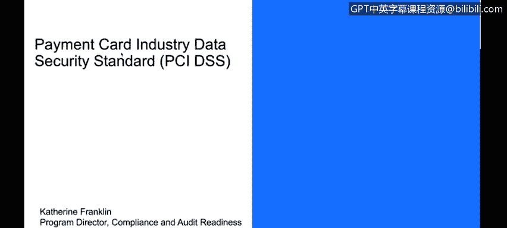
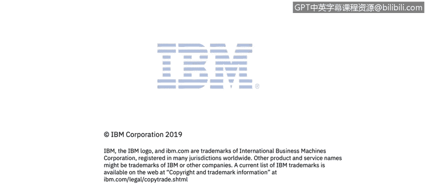

# 课程3：《网络安全合规框架与系统管理》：66：支付卡行业数据安全标准（PCI DSS）🔒

在本节课程中，我们将学习支付卡行业数据安全标准（PCI DSS）。我们将描述该标准本身、其目标与要求，并探讨其关于人员、流程和技术的适用范围。最后，我们将重点介绍PCI DSS的一些新增及关键要求。

---

支付卡行业数据安全标准（PCI DSS）是公共领域中非常常见的一项标准。回顾过往的数据泄露事件，攻击者常常以获取他人信用卡信息为目标，因为这些数据具有极高的价值。早在2004年，几家主要的信用卡公司——美国运通、发现卡、万事达卡和维萨卡——联合制定了一套数据安全标准。随着新技术和新标准的出现，该安全标准会定期进行修订。

这些公司要求，任何涉及信用卡数据存储或传输的业务，都必须按照此标准来保护数据安全。

**PCI DSS的适用范围**是任何存储、处理或传输持卡人数据（如信用卡号等）的系统。它涵盖了技术和运营实践，即包括管理控制措施和技术控制措施。

该标准总共包含**12个不同类别下的264项具体要求**。因此，在进行PCI审计时，首要任务之一就是确定审计范围，即明确这264项要求中有多少适用于你的环境。

以下是12个要求类别的概述：

*   **建立并维护安全的网络和系统**
*   **保护持卡人数据**
*   **维护漏洞管理计划**
*   **实施严格的访问控制措施**
*   **定期监控和测试网络**
*   **维护信息安全策略**

你需要逐一评估这些类别，进行全面的准备状态评估，以确定哪些要求适用于你的环境。

所有这些评估都基于一个核心认识：所面临风险和保护的对象是**持卡人数据**。

**持卡人数据环境**是指存储、处理或传输这些数据的人员、流程和技术，尤其关注主账号（PAN）数据，也可能包括持卡人姓名、有效期和服务代码。标准还关注**敏感验证数据**，例如用于验证信用卡交易的PIN码和PIN码块。

标准旨在确保任何处理、传输或存储此类数据的实体都被纳入考量范围。因此，其审查范围非常广泛，从人力资源方面到网络设备管理、网络分段、审计日志记录等多个主题。我们之前讨论过的许多要求都有相似和重叠之处，但各自可能有独特的侧重点。

PCI DSS有一些独特之处。其中之一是**经批准的扫描供应商**概念，他们通常每个季度进行一次外部扫描。这类似于但不等同于漏洞扫描或渗透测试，它是一种非常具体且经批准的操作。

相对于其他要求，另一个独特之处是关于**Nessus漏洞扫描**和**文件完整性监控**的详细配置要求。文件完整性监控旨在确保系统上运行的所有文件都是预期的文件，没有被同名但不同的可执行文件替换（例如用于检查是否存在盗刷设备）。

**防火墙规则审查频率**提高到了每六个月一次，而其他一些认证可能只要求每年一次。我们的经验是，如果想确保至少每六个月完成一次，不妨每三个月就做一次，这样更保险。

**空闲会话自动注销**时间设置为15分钟。相比之下，HIPAA标准是30分钟。这里可以看到不同标准之间的差异。

PCI DSS会生成一份**责任矩阵**文档，这是一份非常值得审阅的文件，因为它明确了PCI支持服务提供商和消费者各自的责任。例如，一家使用网络门户进行信用卡交易并存储信用卡信息的银行或企业，其责任矩阵就明确了企业和消费者各自需要承担的责任。

---

**总结**

本节课我们一起学习了支付卡行业数据安全标准（PCI DSS）。我们了解了该标准是由主要信用卡公司联合制定的，旨在保护持卡人数据。其核心在于**12个类别下的264项具体要求**，涵盖了从安全网络构建到策略维护的各个方面。我们明确了其审查范围聚焦于**持卡人数据环境**，即涉及相关数据的人员、流程和技术。最后，我们还探讨了PCI DSS的一些独特要求，如经批准的扫描供应商、文件完整性监控以及更频繁的防火墙规则审查。理解这些内容对于从事涉及信用卡数据处理业务的网络安全工作至关重要。