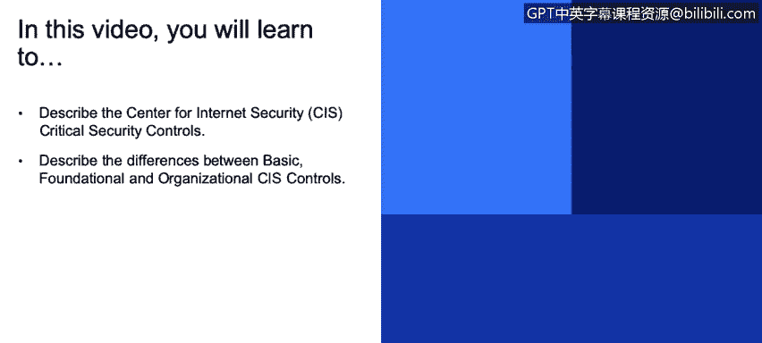
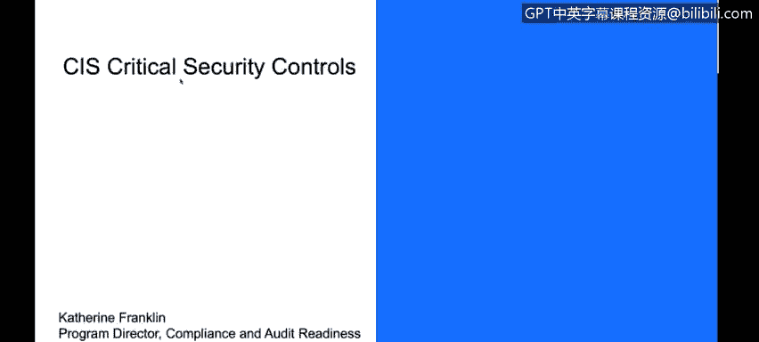
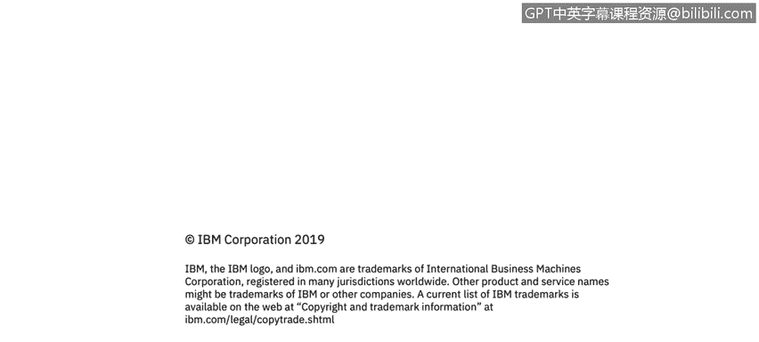

# 课程3：《网络安全合规框架与系统管理》：67：互联网安全中心关键安全控制措施

## 概述
在本节课程中，我们将学习互联网安全中心及其制定的关键安全控制措施。我们将了解这些控制措施的目的、分类方式，以及它们如何帮助组织构建有效的安全态势。

---

互联网安全中心制定了一套安全控制措施。关键安全控制措施是互联网安全中心认为能够有效缓解系统和网络常见攻击的一套深度最佳实践集合。我们主要从配置的角度来审视这些控制措施，即如何最佳地配置位于公共互联网上的系统。

上一节我们介绍了不同组织制定的安全标准，本节中我们来看看互联网安全中心的具体控制措施。

## CIS控制措施的分类
CIS将其控制措施分为三个实施组。分组依据是控制措施的成熟度或重要性，以及使用组织的规模。成熟的大型企业可能关注第3组，而小型单店企业可能更适合第1组。

以下是CIS控制措施的三个实施组：
*   **实施组1**：适用于基础安全防护，面向资源有限的组织。
*   **实施组2**：适用于更成熟的安全实践，面向拥有专门安全团队的组织。
*   **实施组3**：适用于高级、深度防御，面向大型、成熟的企业组织。

## 控制措施示例：密码配置
一个由CIS管理的控制措施示例是密码策略。初次设置计算机时，可以选择是否启用密码。但密码的复杂性要求可以不同。例如：
*   密码是否需要8个字符或15个字符？
*   是否需要包含大写字母、小写字母、数字和标点符号？

**`密码复杂性规则示例：minimum_length=8, require_uppercase=True, require_lowercase=True, require_digits=True`**

这些都属于安全配置的范畴。每个企业需要决定采用何种适当的配置。CIS提供了一套配置基准，其中就包括对密码复杂性的管理。

## 控制措施涵盖的广泛主题
CIS控制措施涵盖了许多不同的安全主题。除了密码管理，还包括漏洞管理、边界防御、应用安全等。之前未深入讨论的一个重要主题是事件响应与管理。

仅仅部署控制措施和实践是不够的。我们之前讨论过安全事件，总会有事情出错或被认为出错的时候。这时，需要明确：应该联系谁？如何处理？是否为客户和员工提供了报告可疑事件的渠道？

因此，在组织内部建立事件管理协议，是大多数安全态势的重要组成部分。

## 控制措施的文档与实施
每个CIS控制措施都有详细的文档，说明了实施该控制的原因、不同组成部分、所需的工具和程序，以及如何组织的示例。这为组织实施提供了清晰的指导。

## 总结
本节课中，我们一起学习了互联网安全中心的关键安全控制措施。我们了解到CIS控制措施是一套旨在缓解常见网络攻击的最佳实践，主要关注系统安全配置。它们根据组织规模和成熟度分为三个实施组，并涵盖了从密码策略到事件响应等多个安全领域。通过遵循这些有据可查的控制措施，组织可以更系统化地提升其安全防护能力。

祝您在所有的安全与合规活动中一切顺利。谢谢。