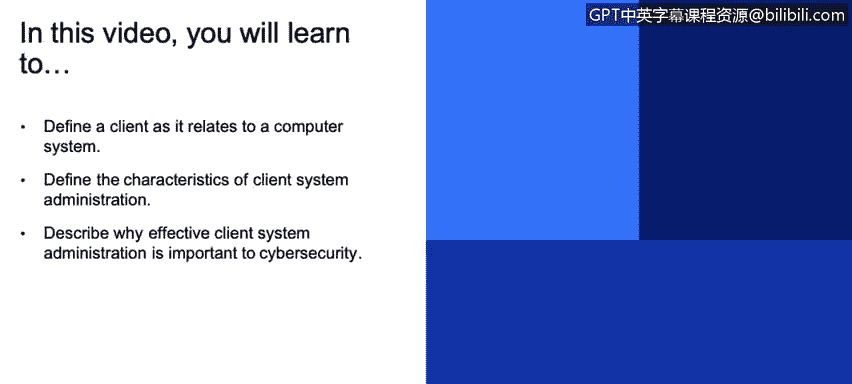
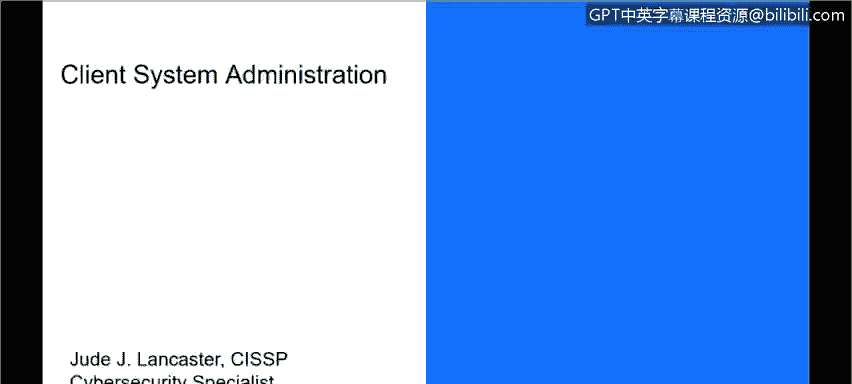
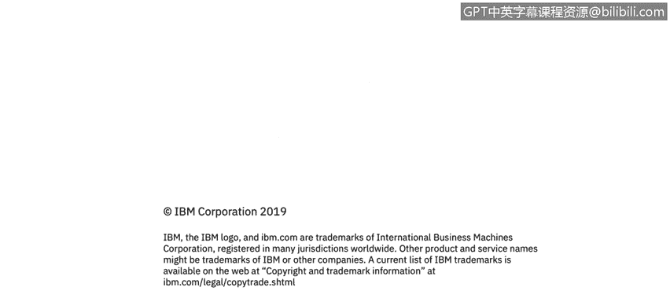

# 课程3：《网络安全合规框架与系统管理》：69：客户端系统管理

在本节课中，我们将学习客户端系统管理的基础知识。我们将定义计算机系统中的客户端，阐述客户端系统管理的特性，并解释有效的客户端系统管理为何对网络安全至关重要。

## 什么是客户端？

在计算机系统的语境中，客户端指的是访问服务器资源的任何设备或系统。这种关系通常被称为**客户端-服务器模型**。

具体来说，客户端是任何用于访问位于服务器上的资源的设备。常见的客户端包括台式电脑、笔记本电脑、平板电脑和智能手机。这些设备通过访问网络服务器、邮件服务器或文件服务器等服务器应用程序来获取服务。

一个服务器可以同时被许多客户端访问，这是一种**多对一**的关系。同时，一个客户端也可以访问多个具有不同功能的服务器。

## 客户端系统管理与网络安全

在网络安全领域，客户端系统管理尤为重要。随着云计算和移动计算的普及，我们通过智能手机应用访问服务，这些应用大多遵循客户端-服务器模式，从云端（如AWS、Azure、IBM云等）的服务器获取资源。

组织内部不断引入新的设备、应用和服务，这带来了按需服务的便利，也引入了潜在威胁。端点设备（即客户端）通常是攻击的前线。大多数恶意行为者或黑客试图通过入侵端点或客户端来进入组织内部，并以此为跳板进行扩散。

恶意软件可能通过用户访问的网站、网络钓鱼攻击、鱼叉式网络钓鱼或勒索软件等方式安装。这些攻击都可能给组织带来严重问题。

## 常见的端点攻击类型

以下是几种常见的针对客户端的攻击类型。了解这些有助于我们更好地进行防御。

*   **网络钓鱼**：一种通过大量发送欺诈性电子邮件，诱骗收件人点击恶意链接或提供敏感信息的攻击方式。
*   **鱼叉式网络钓鱼**：这是网络钓鱼的一种针对性变体。攻击者模仿可信来源，针对组织内的特定个人或部门进行攻击。它就像一支精准的“鱼叉”。
*   **水坑攻击**：攻击者在目标员工或群体经常访问的网站上植入恶意软件。当用户访问该网站并点击恶意链接时，恶意软件便会感染其端点设备。
*   **广告网络攻击**：攻击者通过在线广告网络传播恶意软件。用户点击网站上被篡改的广告后，恶意软件便会下载到其设备上。
*   **勒索软件**：这种恶意软件会加密受害者的文件，并要求支付赎金以换取解密密钥。近年来，针对公共部门（如城市政府）的勒索软件攻击变得日益频繁和严重。
*   **岛屿跳跃**：这是一种供应链渗透攻击。攻击者不直接攻击目标组织，而是先入侵其供应链中的某个薄弱环节（如供应商），再以此为跳板攻击最终目标，以破坏其业务运营或窃取信息。

需要明确的是，现代网络攻击的主要目的是牟利。无论是通过破坏竞争对手的业务，还是直接勒索公司以换取解密密钥或保密信息，其核心驱动力都是经济利益。这与早期黑客以技术挑战或炫耀为目的的攻击有显著不同。

## 总结

本节课我们一起学习了客户端系统管理的基础知识。我们明确了客户端在计算机系统中的定义，即访问服务器资源的设备。我们探讨了客户端系统管理在当今云与移动环境下的重要性，并指出端点设备是网络防御的前线。最后，我们介绍了几种常见的端点攻击类型，如网络钓鱼、勒索软件等，并理解了这些攻击背后的经济动机。掌握这些知识是构建有效网络安全防御体系的第一步。