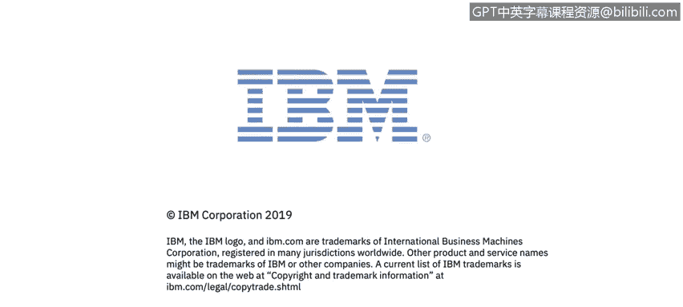

# 课程3：《网络安全合规框架与系统管理》：70：端点保护

在本节课程中，我们将学习端点保护的定义及其基础知识。我们将探讨如何保护网络免受攻击，并了解实现端点保护的关键技术与策略。

## 定义端点保护

端点保护是一种基于策略的网络安全方法。其核心目标是保护网络，以防止端点设备遭受攻击，或最大限度地减少针对端点的攻击数量。我们主要通过实施网络保护措施来实现这一目标。

## 端点保护的基础

上一节我们定义了端点保护，本节中我们来看看其具体实施基础。

基于策略的网络安全要求端点设备在获得网络资源访问权限之前，必须符合特定的标准。这些标准通常包括：

*   端点设备需达到特定的补丁级别。
*   端点设备需安装特定软件，例如**防病毒软件**和**端点检测与响应（EDR）** 软件。

每个组织对于端点设备必须安装哪些软件才能访问网络资源的要求各不相同。但这本质上是一种基于策略的方法，通常由公司或公共实体内部的安全组织制定这些策略，以最好地保护网络，从而防止端点被渗透。

## 端点安全管理系统

了解了策略要求后，我们来看看执行这些策略的工具。

端点安全管理系统通常是一种软件或专用设备。它们用于发现、管理和控制那些请求访问公司网络的计算设备。

通俗地说，安全管理系统是帮助大规模保护端点的工具。例如：

*   **防病毒软件**
*   **补丁管理解决方案**：用于大规模为端点打补丁，将其提升至当前水平以减少漏洞。

任何由公司IT组织管理的、用于保护端点的工具都属于此类。

端点安全系统通常采用**客户端-服务器模型**运行。这意味着会有一个集中管理的服务器或设备，向组织内受保护的端点提供策略。正如之前提到的，这可以是防病毒软件或EDR解决方案。所有这些解决方案通常都会在端点上安装一个应用程序或代理，然后通过某种网站或控制台应用程序进行集中管理。这样，管理员就能在一个中心位置查看和管理环境中的所有端点，为其提供保护，以最大限度地减少黑客攻击和系统渗透，阻止恶意行为者。

## 统一端点管理

随着我们访问网络资源的方式不断扩展（如智能手机、平板电脑、笔记本电脑和台式机），一个近年来备受关注的概念是统一端点管理。

我们希望有一个统一的视图来管理所有设备。这正是统一端点管理的核心。它是一个平台，旨在融合传统的客户端管理技术（如BigFix或SCCM等市场解决方案）与所谓的**MDM（移动设备管理）** 应用程序。

MDM代表移动设备管理。通常，移动设备制造商（如苹果和安卓）会提供**API（应用程序编程接口）** 接入操作系统，以便进行保护。统一端点管理解决方案将传统的客户端-服务器管理技术与这些MDM API相结合，从而管理整个环境。

移动设备管理或企业移动管理这两个术语都主要围绕移动设备提供解决方案，对传统的客户端-服务器设备管理则不那么侧重。然而，较新的操作系统（如macOS和Windows 10）内置了一些MDM API。因此，许多MDM提供商（如IBM的MaaS360、AirWatch和MobileIron）都具备管理传统MDM应用程序（即管理苹果和安卓等典型移动设备）以及管理Windows 10和Mac设备的能力。

但一个真正的统一端点管理平台应能管理统一环境中的所有资源，不仅包括移动设备，还包括台式机、笔记本电脑、服务器、Unix设备和Linux设备等端点。当我们谈论UEM时，指的就是将所有管理平台融合到一个统一的视图中。

## 总结

本节课中，我们一起学习了端点保护的核心概念。我们了解到端点保护是一种基于策略的网络安全方法，要求设备符合特定标准才能接入网络。我们探讨了用于执行这些策略的端点安全管理系统，它们通常采用客户端-服务器模型。最后，我们介绍了统一端点管理的概念，它旨在通过一个平台集中管理所有类型的设备，从而简化安全运维。掌握这些基础知识是构建有效端点安全防护体系的第一步。