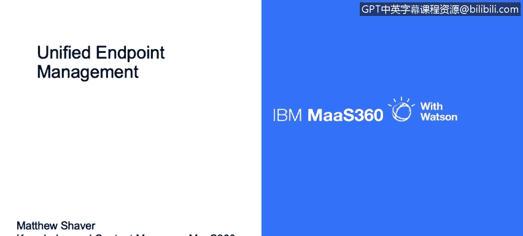
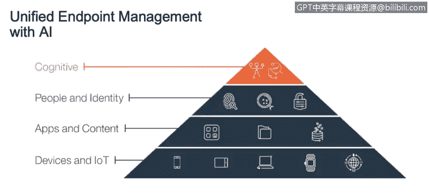
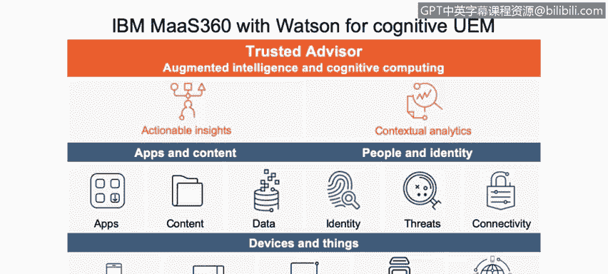
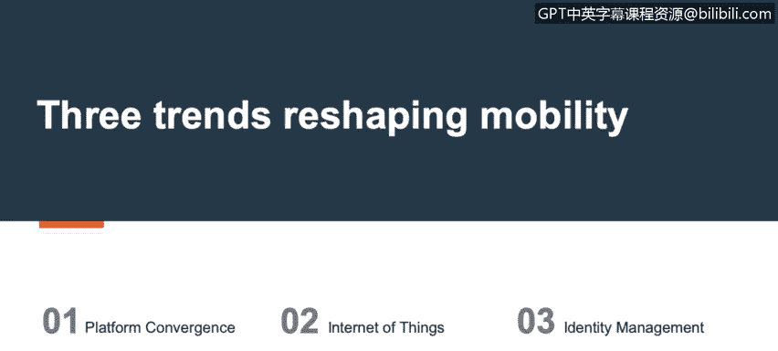
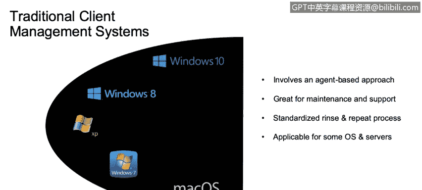
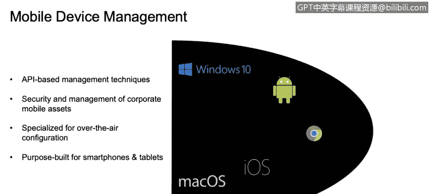
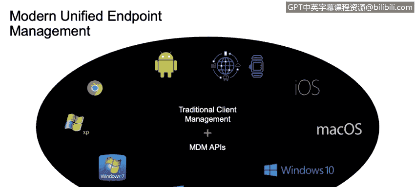
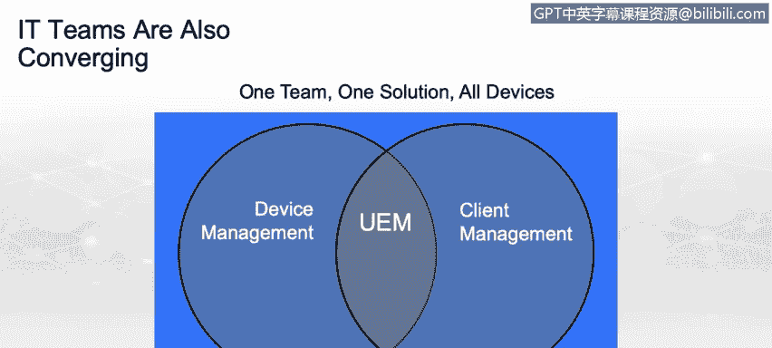
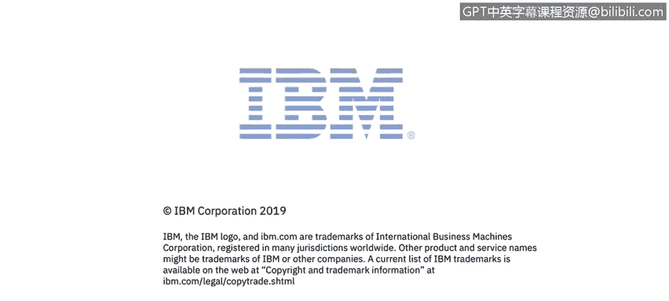

# 课程3：《网络安全合规框架与系统管理》：72：统一端点管理（UEM）简介

在本节课中，我们将要学习统一端点管理（Unified Endpoint Management, UEM）的基本概念。我们将了解UEM是什么，它如何融入现代企业生态系统，以及它如何整合传统的设备管理方法，为各种类型的设备提供统一的安全与管理平台。

我是Matthew Shaver，IBM的知识与内容经理。今天我将简要介绍统一端点管理，即UEM，包括它的定义及其在现代企业生态系统中的定位。

## UEM的演变与核心构成

设备管理并非新概念，但在过去十年左右的时间里，它已经发展到我们目前所称的统一端点管理阶段。

传统的移动设备管理解决方案是为一个更简单的时代构建的。当智能手机进入市场时，情况相对直接。当时存在一套非常松散的API，它们对设备的影响可能很关键，但数量相对较少。例如，擦除设备是一个相当标准的操作。如果组织认为存在安全漏洞，他们可以通过MDM解决方案，甚至通过邮件服务器的ActiveSync命令来执行此操作。

黑莓在翻盖手机时代出现，并带来了专门针对移动设备（特别是手机）的企业管理理念。它包含一个部署在环境中的本地解决方案，可以直接与黑莓设备通信。

然而，随着市场上出现越来越多的设备类型，特别是iOS和Android，就需要一种能够处理所有设备的集中管理解决方案。这时，MDM解决方案开始涌现，例如MaaS360。它们可以通过嵌入在实际操作系统中的API来处理这些设备。

随着时间的推移，人们越来越希望能够在一个统一的框架下管理所有设备，无论它们是台式机、笔记本电脑、智能手机还是平板电脑。

因此，统一端点管理真正的基础在于设备本身，以及现在的物联网设备。这包括智能手机和平板电脑、PC台式机和笔记本电脑及服务器、智能连接设备。

然而，需要保护的不仅仅是设备本身。还有很多内容在设备上或周围流动。保护现有的企业内容固然重要，但能够将其与个人数据分离，并在必要时将其移除，同时不影响用户的任何个人信息，也同样重要。

下一层是人员和身份。这包括操作设备的人员，以及他们用于在这些移动设备支持的各种系统中进行身份验证的凭据。

所有这些层面共同构成了统一端点管理。

## UEM的实际应用流程

那么，这个流程是怎样的呢？我们有设备、物联网设备、应用程序和内容、人员和身份。

假设我加入一个新组织，并随身携带我的个人智能手机。当我开始工作时，公司会发给我一台公司拥有的笔记本电脑。

通过这些系统，我的设备被注册。一台被特别标记为“自带设备”（BYOD），另一台被标记为公司资产。因此，不同的合规规则适用于这些设备，不同的监控设置也会生效。如果我违反了企业准则，将采取不同的处理措施。

不仅如此，现在我可以在我的个人移动设备上接收公司应用程序和内容，并且公司保留仅删除这些应用程序和内容的能力，而不会影响我的任何个人功能。

为了注册所有这些服务，公司会提供一套在这些平台间同步的凭据。因此，我只需在我的移动设备上输入一次凭据，这不仅会在MaaS360解决方案中注册设备，还会自动推送我所有的电子邮件配置、公司文档访问权限和内部网资源，而无需我后续再次进行身份验证。

当然，管理对所有这一切都至关重要，但洞察力也同样重要——能够查看我的环境，了解其中有什么，理解威胁可能存在于何处，发生了什么，可能发生什么，以及当事情发生时应该做什么。因此，策略引擎、合规引擎和设备监控（如恶意软件和防病毒软件）都被封装在这个环境背景下的统一端点管理中。

## 从被动到主动：认知与自动化

采取新方法，从随机搜索旧新闻文章、博客和Twitter以找出最新威胁，转变为主动接收这些信息的警报、提出问题并获得答案，正变得越来越重要。

因此，统一端点管理不仅仅是提供一个管理设备的平台，还在于教育您了解市场上的情况，将知识直接传递给每天管理这些设备的管理员以及最终用户。

需要理解的是，最佳实践可能因行业垂直领域、甚至您部署的具体设备以及公司规模而异。因此，并不存在一套适用于所有人的通用最佳实践。我们可以提出建议，但如果这些建议适合您的环境，效果会好得多。

制定行动计划也可以被替换为在上下文中立即采取行动。如果市场上出现影响您环境中设备的威胁，您不希望必须经过数周的会议来决定如何解决它。您希望立即采取行动。统一端点管理可以为您采取该行动。

很多功能通过管理员设置实现。在我们金字塔的顶端是认知能力。MaaS360 with Watson，这就是我们的认知部分，它提供了一个可信赖的顾问、增强的智能和认知计算。这意味着我们可以为您提供自动化的、可操作的见解和上下文分析。

我们可以向您展示应用程序评级，以帮助您理解：一个应用程序出现在市场上，仅仅因为它通过了Play商店或iTunes商店的安全检查，并不意味着它100%适合存在于您的环境中。因此，应用程序评级和上下文分析可以在那里提供额外的见解。

当新威胁出现时，我们还可以自动将设备分组。如果某个特定版本的操作系统中存在安全漏洞，一旦获得洞察，就可以将这些设备收集到一个组中，为您设置好并显示出来，以便管理员意识到，并为您提供一种方法对这些设备采取自动操作，无论是简单地将它们从环境中移除，还是更严格的措施，如完全擦除设备。

除此之外，我们还可以提供应用程序、内容和数据。通过人员和身份安全来连接这些设备，以及设备本身。

## 三大趋势推动UEM

三大趋势正在重塑移动性：平台融合、物联网和身份管理。这些趋势共同促成了统一端点管理理念的完善。

## 传统与现代管理方法的融合

传统的客户端管理采用基于代理的方法。安装一个代理程序来接管设备管理，安装补丁，负责维护。这是一个重复的过程：新设备、新员工，IT部门接收设备，为其安装镜像，然后提供给员工。

移动设备管理是一种基于API的方法。解决方案已经嵌入在设备中。您只需要安装证书或代理来解锁这些功能并进行管理。

公司移动资产的安全和管理也变得重要。容器化技术可以隔离公司数据、电子邮件，确保对信息的访问安全，并且可以在不影响用户个人资产的情况下移除这些公司数据。

专门用于无线配置，您无需亲自接触这些设备。有部署程序，因此您可以直接将设备运送给用户，设备在用户开始工作之前就会被强制要求注册。

因此，现代统一端点管理将所有这些理念整合到一个统一的框架下。传统的客户端管理和MDM API，有时在同一台设备上协同工作，覆盖当今所有主要平台。

## 总结

本节课中我们一起学习了统一端点管理的基础知识。我们看到了设备管理和客户端管理如何融合：一个团队，一个解决方案，管理所有设备。这就是UEM，即统一端点管理。

