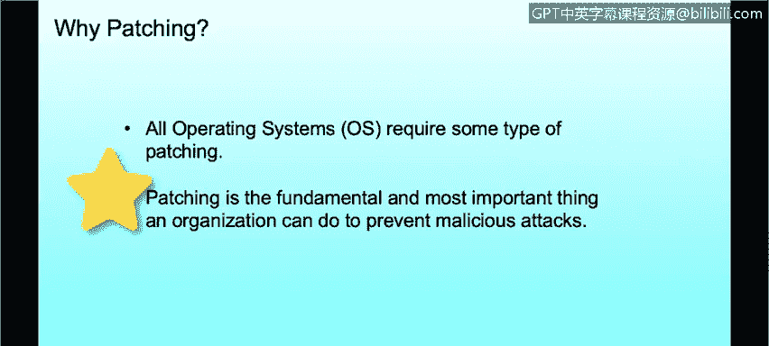

# 课程3：《网络安全合规框架与系统管理》：73：补丁管理概述 🛡️


在本节课程中，我们将学习补丁管理的定义，并理解为何及时打补丁对于防范网络安全威胁至关重要。

## 概述

无论您使用何种操作系统，补丁管理都是一项至关重要的安全实践。我们经常听到Windows系统需要更新补丁，因为大多数个人电脑都运行Windows，并且我们会在屏幕右下角看到提示重启的通知。然而，补丁的核心概念和重要性在所有操作系统（如macOS、Linux或Unix）上都是一致的。对于组织而言，及时打补丁是保护自身免受恶意攻击最基本、也是最重要的一项措施。

## 补丁的重要性：现实世界的教训




我们经常在新闻中看到公司被黑客攻击或遭受勒索软件袭击的案例。在美国，有许多公共机构成为受害者，例如亚特兰大市、佛罗里达州莱克城等，它们近期都遭受了勒索软件攻击。

勒索软件攻击通常由外部实体发起，攻击者侵入系统后，会部署一段代码来加密硬盘上的所有数据。这种加密会传播到环境中的所有机器，导致所有文件和文件夹无法使用，除非支付赎金——这也是“勒索软件”名称的由来。赎金通常以比特币形式支付，支付后，受害者会获得解密密钥以恢复文件。虽然支付赎金的组织大多能成功恢复文件，但许多机构和政府选择不支付，而他们为恢复文件所花费的成本往往远高于赎金本身。

这个例子清楚地表明，保持系统补丁更新至关重要。虽然刚才有些偏离主题，但讨论一个真实案例有助于我们理解问题的严重性。

## 什么是补丁？

正如之前提到的，无论是macOS、Windows还是Linux/Unix系统，打补丁的核心原因是一致的，尽管具体实施机制可能因操作系统而异。

**补丁** 是指对计算机程序或其支持数据所做的一系列更改，旨在更新、修复或改进它。这包括修复安全漏洞和其他程序缺陷（因此有些补丁被称为“漏洞修复”）。当我们讨论打补丁时，通常也指对操作系统本身进行更新。

**核心概念公式化描述**：
```
补丁 = 程序或数据的一组更改
目的 ∈ {更新， 修复， 改进}
修复对象 ∈ {安全漏洞， 软件缺陷（Bug）， ...}
```

## 总结


本节课我们一起学习了补丁管理的基础知识。我们定义了补丁的概念，并通过现实中的勒索软件案例，深刻理解了及时应用补丁对于维护网络安全、防范威胁的重要性。记住，保持系统更新是网络安全防御的第一道防线。