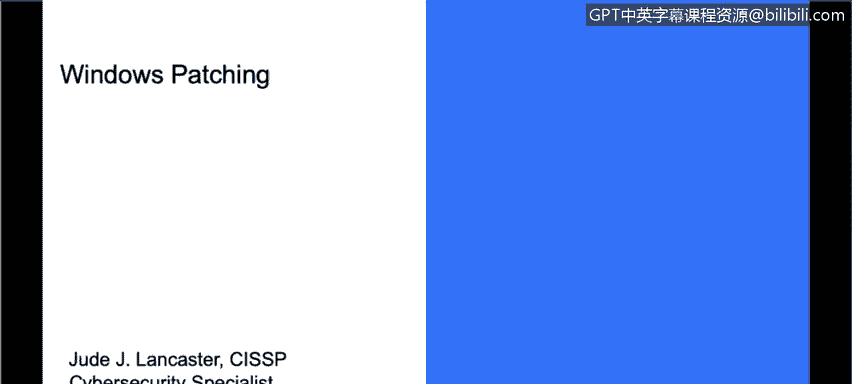
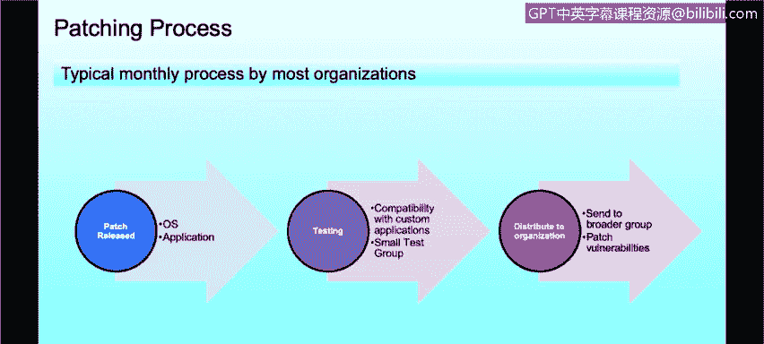

# 课程3：《网络安全合规框架与系统管理》：74：Windows系统补丁管理 🛡️

在本节课程中，我们将学习Windows系统补丁管理的基础知识。我们将了解补丁的工作原理，并探讨补丁管理的最佳实践。

## 补丁概述与重要性

补丁是修复软件中已知缺陷的程序。在Windows环境中，我们熟悉的“Windows更新”功能，就是用来修复Microsoft产品及操作系统中的已知漏洞。这些更新不仅针对软件，有时也涉及硬件驱动程序，以提升系统的性能、可靠性，最重要的是安全性。

## Windows更新的类型与周期

Microsoft通常按月发布补丁，业界常称之为“补丁星期二”，因为Microsoft会在每个月的第二个星期二发布更新。Windows操作系统的更新主要分为四种类型，这些概念同样适用于Linux和Mac等其他操作系统。

以下是主要的更新类型：

1.  **安全更新**：这是最重要的更新类型，用于修补操作系统中的漏洞。许多组织只部署安全更新，因为他们认为应用程序的功能性更新并非必需。安全更新通常被分类为**关键、重要、中等、低**等级别，许多组织只选择安装关键和重要的安全更新。组织需要权衡，因为有时补丁可能会与业务所需的应用程序产生兼容性问题。
2.  **关键更新**：这些是高优先级更新，可能不涉及安全漏洞，但用于修复可能导致严重问题的程序错误。许多组织会同时应用安全更新和关键更新。
3.  **软件更新**：由Microsoft发布，但不被视为关键。这类更新通常涉及功能升级或可靠性改进，与安全漏洞无关。例如，修复某个软件特定崩溃问题的更新。
4.  **服务包**：这是以往所有更新的汇总包，旨在确保系统更新至最新状态，有时也包含操作系统的功能增强。但随着Microsoft更新策略的改变（例如，Windows 10的持续功能更新模式），服务包的重要性已大不如前。

## 应用程序补丁管理

上一节我们介绍了操作系统补丁，本节中我们来看看应用程序的补丁管理。这里的“应用程序”指的是安装在终端用户系统或服务器上的第三方软件，与操作系统是Windows、Linux还是Mac无关。

应用程序补丁管理同样至关重要，有时甚至比操作系统补丁更重要。据统计，在排名前50的网络安全程序中发现的漏洞，有80%影响了第三方应用程序，如Flash Player、Reader、Java、Skype或媒体播放器等。

因此，高度重视网络安全的组织会像对待操作系统补丁一样，严肃对待应用程序补丁。

## 企业补丁管理流程

大多数组织按月进行补丁管理，对于Windows系统，流程通常围绕“补丁星期二”展开。

以下是典型的补丁管理流程步骤：

1.  **补丁发布与收集**：在“补丁星期二”后，收集Microsoft发布的补丁以及当月出现的第三方应用程序补丁。
2.  **测试与验证**：将这些补丁分发给一个“测试组”，通常是IT部门的设备或特定的虚拟测试系统。
3.  **兼容性测试**：在测试环境中运行日常业务所需的定制或商用软件，确保新补丁不会引发兼容性问题。
4.  **全面部署**：一旦确认没有兼容性问题，这些补丁就会被部署到整个组织的终端设备上，以确保系统安全，避免漏洞被利用。

## 总结

本节课中，我们一起学习了Windows系统补丁管理的核心概念。我们了解了补丁的四种主要类型（安全更新、关键更新、软件更新、服务包），认识到应用程序补丁与操作系统补丁同等重要，并熟悉了企业在部署补丁前所遵循的测试与验证流程。补丁管理是网络安全中一项基础且持续的重要工作，需要定期、谨慎地执行。