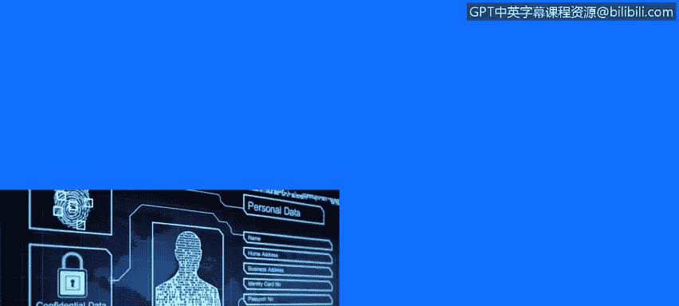
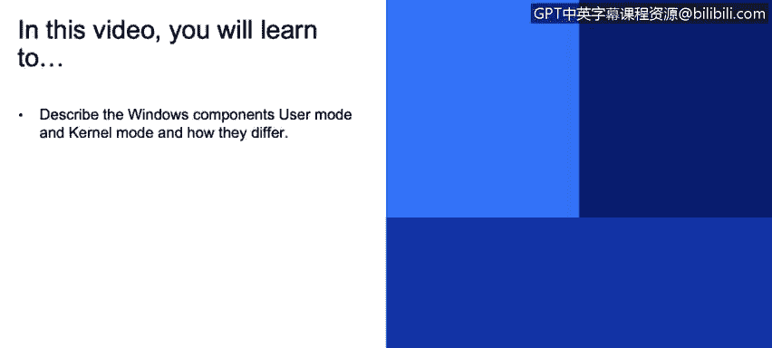
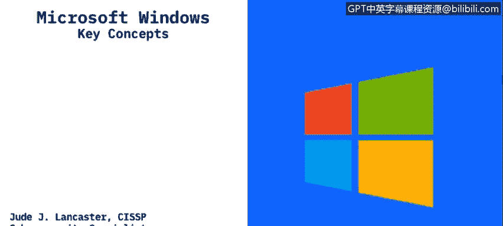
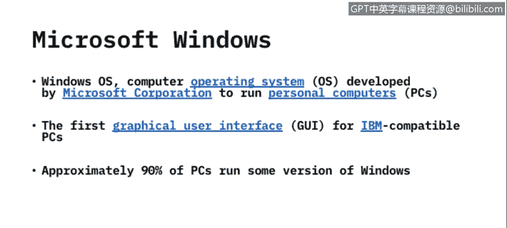
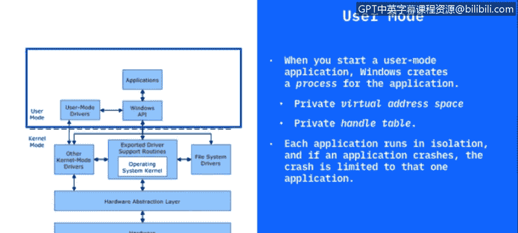
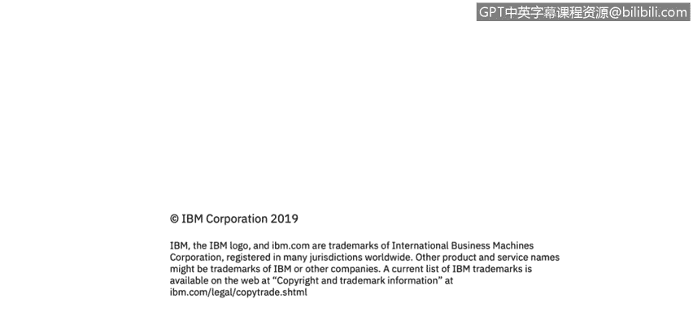

# 课程3：《网络安全合规框架与系统管理》：76：用户模式与内核模式

在本节课程中，我们将学习微软Windows操作系统中的两个核心概念：用户模式与内核模式。我们将了解它们是什么，以及它们之间的主要区别。

## Windows操作系统简介

微软公司开发的Microsoft Windows操作系统已经存在很长时间。

过去20年里，几乎所有使用过个人电脑的人都可能接触过Windows。

Windows最大的优点在于，它创造了我们如今习惯使用的第一个图形用户界面。用户可以使用鼠标进行点击操作，而无需输入命令。

Windows是为IBM兼容的个人电脑设计的。

苹果公司的Macintosh和Apple设备运行其自身的操作系统。

Windows则运行在我们所说的IBM兼容个人电脑上。

许多人都知道，IBM在80年代初制造了第一台个人电脑。

全球大约90%的个人电脑运行某个版本的Windows操作系统，服务器也同样运行Windows版本。

因此，这是一个我们大多数人都非常熟悉的系统。

## 用户模式与内核模式概述

Windows操作系统包含几个关键组件，其中两个核心部分是用户模式和内核模式。

**用户模式**是您在使用应用程序时直接接触的部分。当您打开Microsoft Word，或者使用Chrome、Firefox等浏览器上网时，您实际上正在访问用户模式。

驱动程序被用来创建这些应用程序所利用的输入/输出功能。

**内核模式**则是Windows内部的底层技术。在这里，不同的进程和线程实际控制着您在Windows用户模式下使用的应用程序。

接下来，让我们更详细地探讨这两种模式。

## 深入理解用户模式

当您启动一个用户模式应用程序时，Windows会为该应用程序创建一个所谓的“进程”。

任何打开过任务管理器的人都可以看到，当应用程序运行时，您会在任务管理器内部看到这些正在运行的进程。任务管理器会告诉您该进程使用了多少内存、占用了多少CPU（即您的处理器）资源。

应用程序的一个优点是它们彼此之间是高度隔离的。

当您启动一个应用程序时，系统会为其创建一个私有的虚拟地址空间。

这意味着该应用程序与系统中的其他应用程序是分隔开的。

一个应用程序无法修改属于另一个应用程序的数据。

每个应用程序都在我们称之为“隔离”的环境中运行。因此，如果某个应用程序崩溃，它不会导致整个操作系统宕机，而只会影响该应用程序本身。其他正在运行的程序不会受到这次崩溃的影响。

## 深入理解内核模式

现在，让我们来看看内核模式。在内核模式下运行的所有内容共享一个单一的虚拟地址空间。

这意味着内核模式驱动程序与其他驱动程序以及操作系统本身之间并不是隔离的。

因此，如果一个内核模式驱动程序意外地写入错误的虚拟地址或操作系统的其他部分，操作系统内部的数据就可能遭到破坏。

如果内核模式驱动程序崩溃，整个操作系统都会随之崩溃。

您可能见过这种情况：当操作系统停止运行时，会出现通常被称为“蓝屏死机”的画面，然后您必须重新启动电脑。这通常就是由内核模式故障或内核模式中的驱动程序写入虚拟地址导致操作系统出现问题所引起的。

## 总结

本节课中，我们一起学习了微软Windows操作系统的两个核心组件：用户模式和内核模式。

我们了解到，**用户模式**是应用程序运行的环境，具有隔离性，一个程序的崩溃通常不会影响系统其他部分。而**内核模式**是操作系统的核心，负责管理硬件和系统资源，其组件共享地址空间，一旦发生故障可能导致整个系统崩溃。

理解这两种模式的区别对于进行系统管理、故障排查和安全性分析至关重要。