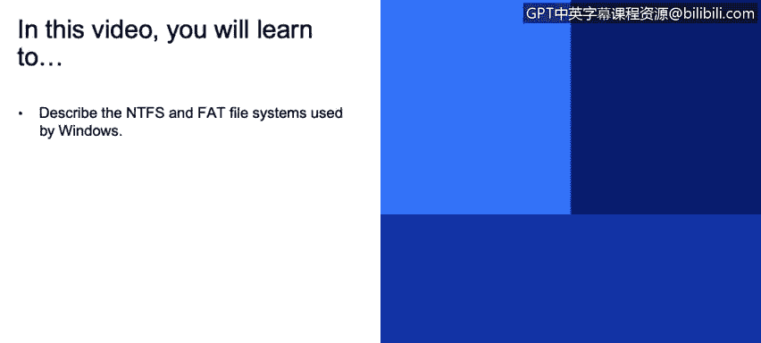
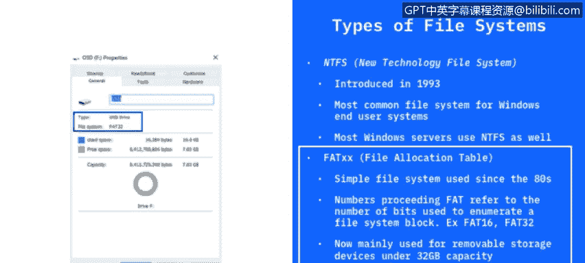
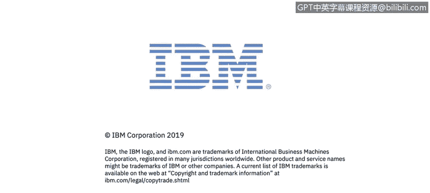

# 课程3：《网络安全合规框架与系统管理》：77：Windows文件系统

在本节课程中，我们将学习Windows操作系统中使用的两种主要文件系统：NTFS和FAT。文件系统是应用程序在存储设备上存储和接收文件的基石。我们将了解它们的基本概念、特点以及应用场景。

文件系统使得应用程序能够在存储设备上存储和接收文件。在Windows环境中，我们讨论的存储设备主要指计算机内置的硬盘驱动器。硬盘可以是机械式的旋转盘片，也可以是非机械式的固态硬盘（SSD）。文件被放置在一种称为**分层结构**的体系中，即文件夹中可以包含子文件夹和文件。文件系统规定了文件的命名规则，以及在该树状结构中定位文件路径的格式。

从定义上讲，**文件**是一个可供用户访问或管理的**数据单元**。例如，一张图片文件（如JPEG或PNG格式）就是一个文件。每个文件在其所属的目录中必须拥有唯一的名称。如果你尝试在同一个目录内复制并粘贴一个文件，系统通常会在文件名后添加数字以示区分。

**目录**（在Windows中常被称为“文件夹”）是文件和子目录的层次化集合。接下来，我们将深入探讨Windows中常见的几种文件系统类型。

Windows中主要使用几种不同类型的文件系统。其中，**NTFS**是目前最主流的文件系统，广泛应用于Windows 10、Server 2012和2016等操作系统中。自1993年问世以来，NTFS已成为Windows个人电脑和服务器的标准文件系统。

在NTFS之前，另一种广泛使用的文件系统是**FAT**。这是一个更简单的文件系统，自20世纪80年代起开始使用。你可能会看到FAT前面带有不同的数字，例如FAT16或FAT32。这些数字代表了用于枚举文件系统块的**比特位数**。

如今，FAT32文件系统主要用于**可移动驱动器**，如U盘或可擦写光盘。FAT32适用于容量小于32GB的设备。随着硬盘容量不断增大，我们需要一种新的文件系统，这就是NTFS出现的原因。目前，FAT主要应用于小型驱动器和可移动存储设备。

---

**本节课总结**

在本节课中，我们一起学习了Windows操作系统的核心文件系统。我们首先了解了文件系统的基本作用，即管理存储设备上的文件和目录结构。接着，我们重点介绍了两种主要的文件系统：**NTFS**和**FAT**。NTFS是现代Windows系统的标准，功能强大；而FAT（尤其是FAT32）则因其简单性，常用于U盘等可移动存储设备。理解这些文件系统的区别，是进行有效系统管理和安全配置的基础。