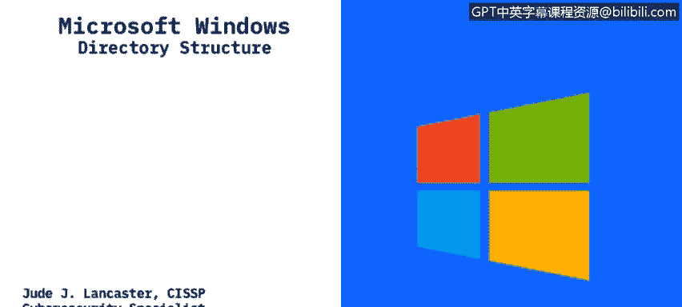
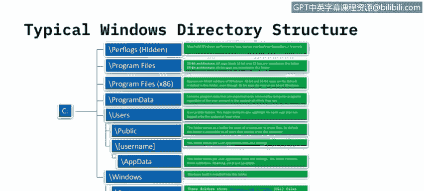
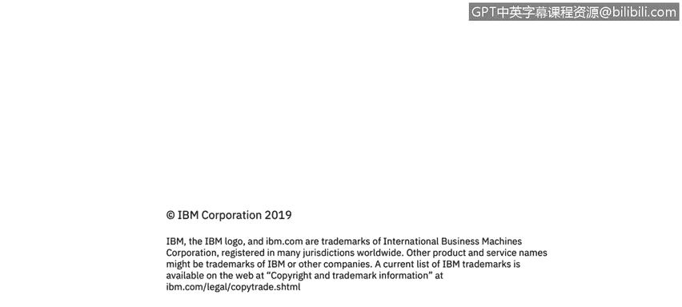

# 课程3：《网络安全合规框架与系统管理》：78：Windows目录结构

## 概述
在本节课程中，我们将学习Windows操作系统的目录结构，并了解Windows如何处理32位与64位应用程序的分离。

---

## Windows目录结构详解

上一节我们介绍了课程背景，本节中我们来看看Windows系统的典型目录结构。

大多数使用过Windows的用户可能都注意到，所有内容通常都存储在C盘上。C盘是主硬盘驱动器的通用名称。以下是一个Windows 10设备上常见的标准文件结构。

你会看到一些被隐藏的文件夹。隐藏意味着这些文件夹对最终用户不可访问，除非你通过控制面板取消隐藏。这些是微软认为用户通常不需要访问的文件夹。

### 主要目录介绍
以下是Windows C盘根目录下的主要文件夹及其功能：

*   **PerfLogs**：这是一个通常被隐藏的文件夹，用于存放性能日志。不过，它通常是空的。
*   **Program Files** 与 **Program Files (x86)**：这是C盘的核心部分。随着操作系统能够寻址更多内存，我们进入了64位时代。Windows 3.1是16位系统，Windows 95是32位系统，之后出现了各种32位和64位版本。

    32位与64位操作系统的主要区别在于可寻址的内存容量。32位系统最多只能寻址4GB内存，这对于现代应用远远不够。因此，操作系统升级到64位以支持更多内存。从Windows 2000开始出现64位系统，直到Windows 10，微软已停止发布32位版本，Windows 10仅提供64位版本。大多数服务器架构也是64位的。

    这两个文件夹的区别如下：
    *   在**64位**Windows系统上：
        *   `Program Files` 目录存放**64位**应用程序。
        *   `Program Files (x86)` 目录存放**32位**应用程序。32位应用可以在64位系统上运行，只是被分开存放。
    *   在**32位**Windows系统上，你**不会**看到`Program Files (x86)`目录，所有应用程序都安装在`Program Files`目录中。

*   **ProgramData**：此文件夹存放计算机程序访问的文件，与当前登录系统的用户无关。这些是应用程序运行所需的核心文件，独立于任何登录用户。

*   **Users**：此目录存放用户配置文件。每个子文件夹对应一个不同的用户名。
    *   所有Windows系统都有一个`Public`文件夹，供用户共享文件。多个用户登录同一系统时，可将文件放入此处供所有人访问。
    *   在`Users`目录下，你会看到每个授权用户的用户名文件夹。用户文件通常存储在这里。
    *   用户名目录下包含多个子文件夹，如`Documents`、`Pictures`、`Music`等，这是现代Windows系统的常见布局。
    *   还有一个`AppData`文件夹，类似于`ProgramData`，但存放的是**特定于最终用户**的应用程序数据。例如，Microsoft Word中的自定义模板会存储在你的用户名下的`AppData`文件夹中，以便与其他登录用户的数据分离。

*   **Windows**：这是Windows系统实际安装的目录。其下主要有三个关键文件夹，它们是Windows核心功能和API的所在地：
    *   **System**：存放16位DLL文件。在64位Windows版本上，此文件夹通常是空的，但目录结构仍然存在。
    *   **System32**：根据系统是32位还是64位，存放对应位数的DLL文件（32位或64位）。
    *   **SysWOW64**：此文件夹**仅出现**在64位版本的Windows上，用于存放**32位**DLL文件。

    当程序请求Windows加载动态链接库文件（DLL）且未指定路径时，系统会搜索这些文件夹。这里存储了运行Windows和为最终用户提供图形界面所需的所有系统文件。

---

## 总结
本节课中，我们一起学习了Windows操作系统的标准目录结构。我们了解了`Program Files`与`Program Files (x86)`文件夹在区分32位和64位应用程序中的作用，认识了存放用户数据的`Users`目录、存放系统级程序数据的`ProgramData`目录，以及构成Windows核心的`Windows`系统目录及其子文件夹（`System`、`System32`、`SysWOW64`）的功能。理解这些结构对于系统管理和安全分析至关重要。