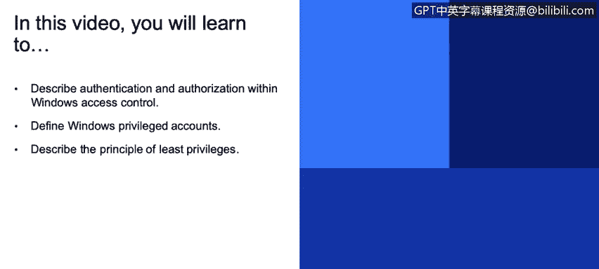

# 课程3：《网络安全合规框架与系统管理》：79：基于角色的访问控制与权限

在本节课程中，我们将学习Windows操作系统中的访问控制机制。我们将探讨身份验证与授权、特权账户的概念，并深入理解**最小权限原则**。这些知识对于构建安全的系统环境至关重要。

## 身份验证、授权与访问控制模型

Windows操作系统通过几种不同的方式处理访问控制，核心在于**身份验证**和**授权**。用户首先通过身份验证登录系统，随后操作系统根据授权机制决定该用户对系统资源（如文件、文件夹等）拥有哪些访问权限。稍后我们会讨论**Active Directory**，它将身份验证和访问控制移至服务器端，以实现对网络资源的统一管理。但目前，我们聚焦于本地访问控制模型。

在这个模型中，核心概念是**用户**和**组**，它们被称为**安全主体**。这里的“主体”指的是人或实体，而非指导性原则。这些安全主体拥有**权利**和**权限**，它们告知操作系统每个用户或组可以执行哪些操作。

例如，**管理员**用户组的成员几乎可以访问系统上的一切。**来宾**用户则拥有非常有限的访问权限。还存在介于两者之间的访问级别，允许用户访问特定资源而非全部。这些权限可以通过组来分配，例如，**管理员组**可以包含多个用户。

安全主体对**对象**执行操作，例如保存文件、创建文件或删除文件夹内容。这些操作正是由Windows操作系统的访问控制和安全性机制所规定的。

## 访问控制列表与特权账户

由多个安全主体或用户共享的资源，使用**访问控制列表**来分配权限。ACL通过以下方式强制执行访问控制：
*   **拒绝未授权用户和组的访问**：例如，一个仅对管理员组可用的文件夹，其他用户将无法访问。
*   **限制授权用户的访问**：可以精细控制用户或组在系统内的权限，包括登录时间、可见内容等，这些都基于操作系统内设置的权限。

接下来，我们讨论**特权账户**。特权账户是指那些直接或间接拥有访问IT组织内所有资产权限的账户。正如之前提到的，**Active Directory**可以在管理层面集中控制所有接入网络的机器和用户。管理员可以配置Windows操作系统，以管理不同角色和用途的访问控制。

## 最小权限原则

我们遵循**最小权限原则**。根据维基百科的定义，该原则意味着**仅授予用户账户或进程执行其预期功能所必需的最低权限**。这在安全领域极为重要。

IT安全的核心概念之一是访问控制，确保只有需要访问特定特权信息（如人力资源记录、客户数据等）的人员才能访问这些数据。这一点在用户隐私法律（如HIPAA、GDPR）的背景下显得尤为重要。

此外，最小权限原则还能带来更好的系统稳定性。你不仅保护了数据，还通过禁止用户安装应用程序、驱动程序等可能危害系统的操作，使操作系统和硬件本身更加安全。这带来了更好的系统安全性。

同时，它也使得部署更加容易。因为环境中减少了差异性，并非每个人都能在自己的系统上随意操作，一切可以从中央位置进行控制，从而节省时间和成本。

从管理角度来看，这实现了我们谈到的三点：更好的系统稳定性、更好的系统安全性以及更便捷的部署。

## 访问控制的四个核心概念

在讨论访问控制时，我们主要涉及四个核心概念：
*   **权限**：决定用户或组可以对对象执行哪些操作。
*   **对象所有权**：每个对象都有一个所有者，所有者通常可以更改对象的权限。
*   **权限继承**：子对象（如子文件夹中的文件）可以从父对象（如文件夹）继承权限设置。
*   **用户权利**：允许用户在系统上执行特定任务，例如更改系统时间或备份文件。
*   **对象审计**：跟踪和记录对对象的访问尝试，用于安全监控和故障排查。

## 总结

本节课我们一起学习了Windows访问控制的基础。我们明确了身份验证与授权的区别，认识了特权账户，并深入理解了**最小权限原则**的重要性及其对系统安全、稳定性和可管理性的益处。最后，我们概述了访问控制的四个核心组成部分：权限、所有权、继承和审计。掌握这些概念是有效实施系统安全策略的第一步。

