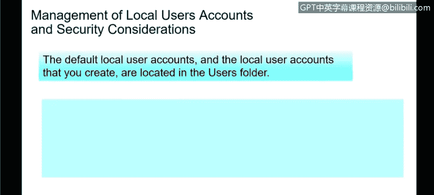
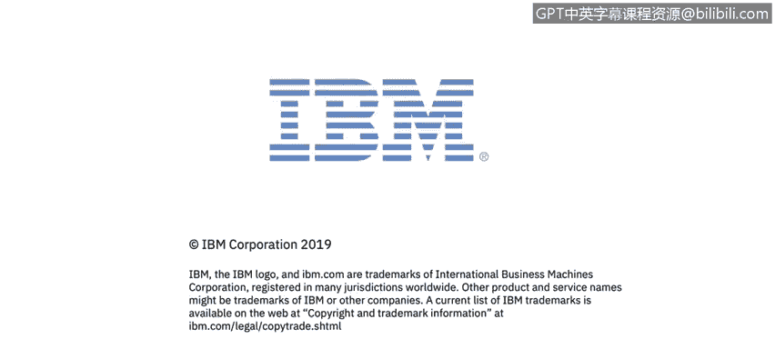

# 课程3：《网络安全合规框架与系统管理》：80：本地用户账户管理 🔐

在本节课程中，我们将学习如何定义Windows系统中的本地用户，并探讨相关的安全管理考量。

上一节我们介绍了用户账户的基本概念，本节中我们来看看Windows环境下的本地用户账户。

## 定义本地用户账户

本地用户账户是指存储在Windows工作站或服务器本地的账户。这类账户的用户可以登录到该系统，但通常不用于获取网络资源。他们的访问权限仅限于该特定PC上的本地资源。

可以将此理解为您的家庭个人电脑：它可能只连接到互联网，而未接入公司网络资源。您只能在该电脑的本地资源上进行操作。

## 默认创建的账户

Windows系统在安装时会默认创建几个账户，它们主要分为以下几类：

以下是默认的本地用户账户类型：
*   **管理员账户**：在本地环境中拥有对所有资源的完全访问权限。
*   **来宾账户**：权限受限的账户。
*   **帮助助手账户**与**默认账户**：由Windows自动创建，但实际使用频率较低。

登录系统的用户大多属于管理员账户或来宾账户。在本地系统上，默认情况下用户通常以管理员身份登录，以便能够控制系统、安装应用程序等。

## 本地系统账户

除了可见的用户账户，Windows还会创建一些称为“本地系统账户”的后台账户。

以下是主要的本地系统账户：
*   **系统账户**
*   **网络服务账户**
*   **本地服务账户**

这些账户在用户界面中不可见，用户无法像普通用户一样登录它们。它们是Windows底层运行所需的账户，允许系统在环境中执行各种任务。例如，系统账户可以在无需用户登录的情况下，在本地机器上运行服务或执行计划任务。这些操作在后台完成，不属于本地用户账户的范畴。

## 安全管理考量

对于本地用户账户，需要考虑一些重要的安全因素。所有本地用户账户的数据默认存储在 `C:\Users` 目录下。

在管理非域环境（我们稍后会详细讨论活动目录AD）的本地系统时，仍需考虑以下安全措施：

以下是保护本地账户安全的关键措施：
*   **限制并保护具有管理员权限的本地账户**：确保用户只能访问自己的文件夹。在多用户系统上，应防止用户彼此查看文件。
*   **实施密码策略**：我们后续会详细讨论，这包括使用强密码要求。
*   **强制执行本地账户的远程访问限制**：对于纯本地系统，应关闭或严格控制远程访问功能，防止他人远程入侵您的设备并进行更改。
*   **拒绝所有本地管理员账户进行网络登录**：在企业或国家网络环境中，本地管理员账户不应拥有访问网络资源的权限，这些权限应由目录服务（如活动目录）统一控制。
*   **为具有管理员权限的本地账户创建唯一密码**：确保执行密码复杂性要求、密码长度要求以及密码过期频率等策略。所有这些措施都有助于增强本地系统的安全性。

本节课中，我们一起学习了Windows本地用户账户的定义、默认账户类型、系统后台账户以及保护这些账户安全的核心管理措施。理解并实施这些考量对于维护独立系统的安全至关重要。