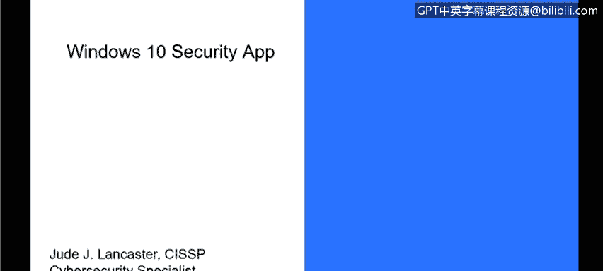
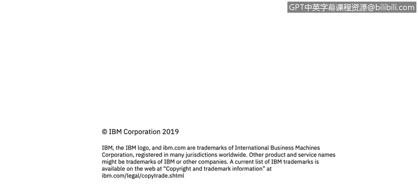

# 课程3：《网络安全合规框架与系统管理》：81：Windows 10安全应用

在本节课程中，我们将学习Windows 10操作系统内置的安全应用。我们将了解其主要功能，以及它如何整合多种安全工具来保护系统。

Windows 10是目前大多数组织中使用的主流操作系统。虽然Windows 7仍有使用，但许多组织已升级至Windows 10。Windows 10通过不同的构建版本进行迭代更新，安全应用功能自构建版本1703开始引入。微软已将Windows 10确立为未来的核心操作系统，并通过每年约两次的主要更新（春季和秋季发布）来持续改进，当前版本已更新至1903或更高。

上一节我们了解了Windows 10的普及性，本节中我们来看看其内置安全应用的核心功能。该应用整合了过去需要第三方软件实现的多种安全解决方案。

以下是Windows安全应用包含的主要功能模块：

*   **病毒和威胁防护**：这是内置的防病毒解决方案。许多组织正转向使用Windows自带的防病毒功能，而非McAfee或赛门铁克等第三方服务。它包含Windows Defender防病毒和Exploit Guard攻击防护功能。
*   **账户保护**：此功能允许用户设置PIN码替代密码登录，或集成指纹读取器等硬件进行身份验证，以增强账户安全性。
*   **防火墙和网络保护**：此模块用于控制本地计算机的防火墙设置，管理网络访问权限。
*   **应用和浏览器控制**：此功能包含名为“Windows SmartScreen”的特性。它能阻止用户安装未经微软审核或批准的应用程序，为安装软件增加了一层保护，确保其来自已知的发布者或开发者。
*   **设备性能和运行状况**：此部分提供有关驱动程序、存储空间、Windows更新等系统信息，旨在提升系统可用性并提供有用的运行状况洞察。
*   **家庭选项**：针对家庭用户，此功能提供家长控制，允许父母管理孩子在使用家庭电脑时的访问内容和活动，以获得更好的监督和控制权。

本节课中我们一起学习了Windows 10安全应用。它是一个集成的安全中心，将防病毒、防火墙、账户保护、应用控制、设备健康监控乃至家庭控制等功能统一起来，为从企业到家庭的用户提供了全面的安全管理和系统维护工具。