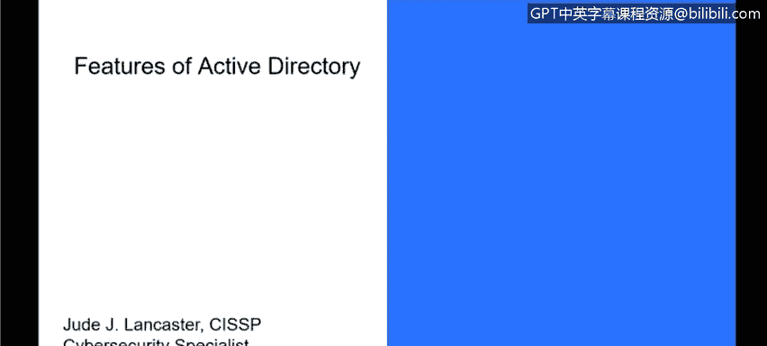
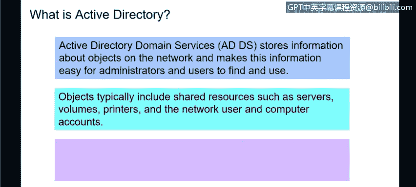
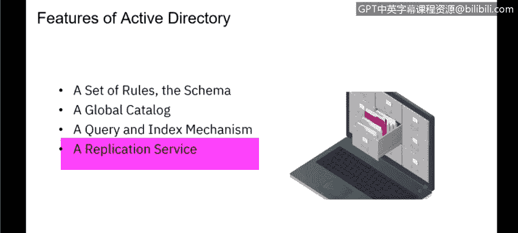
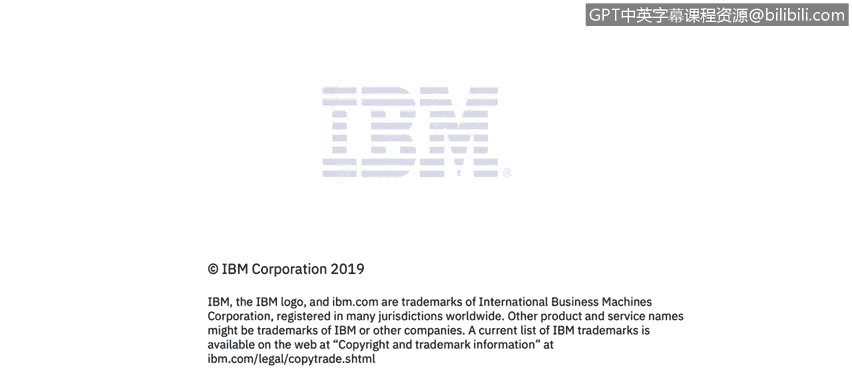

# 课程3：《网络安全合规框架与系统管理》：82：27_01_Active Directory特性

在本节课中，我们将学习如何描述Active Directory，并了解其核心特性和功能。

## 概述

Active Directory是大多数企业使用的核心目录服务系统，用于管理网络中的用户、计算机和资源。本节将详细介绍Active Directory的功能、包含的对象以及其安全特性。

## Active Directory简介

上一节我们介绍了目录服务的基本概念，本节中我们来看看Active Directory的具体实现。Active Directory是微软开发的一种目录服务，它是企业网络中最主要的目录系统。如果企业没有自建的目录系统，那么他们很可能正在使用Active Directory来控制用户、权限等事务。

Active Directory本质上是一个存储网络对象信息的系统，它使管理员和用户能够轻松地查找和使用这些信息。

## Active Directory的功能

Active Directory控制着网络中的多种资源，例如网络文件夹和网络打印机。用户工作所需访问的任何资源都可以由Active Directory管理。AD不仅存储这些资源的信息，还控制着访问这些资源的权限。

目前，包括IBM在内的许多组织正在转向使用Azure Active Directory。这是一种基于云的目录服务，取代了本地物理服务器。当用户登录笔记本电脑时，实际上是登录到位于微软云上的Active Directory。管理员通过云端控制台设置权限，无需在本地部署任何AD基础设施。这种云化趋势因其便利性而被广泛采用。

## Active Directory中的对象

以下是Active Directory中管理的主要对象类型：

*   **服务器**
*   **卷**：例如驱动器或文件夹。
*   **打印机**
*   **网络和计算机账户**：Active Directory同时包含计算机账户和用户账户。

Active Directory能够同时控制用户和计算机。这意味着，即使用户拥有有效的AD账户，如果其登录的计算机没有在AD中注册，用户也将无法登录。反之亦然，如果计算机在AD中注册，但用户账户不存在，同样无法登录。这种双重验证增强了安全性。

## Active Directory的安全性

Active Directory的安全性通过身份验证深度集成。当用户输入密码或使用指纹时，实际上是在访问Active Directory。AD会告知用户正在登录的资源，例如笔记本电脑或台式机，该用户有权访问哪些内容。

访问控制是通过基于策略的管理来实现的，这是Active Directory的一部分，由AD管理员进行配置。策略可以回答诸如“用户可以访问这台服务器吗？”、“可以进入这个目录吗？”或“可以使用这台打印机吗？”等问题。

## Active Directory的核心特性

Active Directory的特性使其成为一个强大而灵活的管理工具。它本质上是一套规则或架构，控制着最终用户的访问权限。

以下是Active Directory的一些关键特性：

*   **规则与架构**：由AD管理员控制的规则，决定了用户或组可以访问的资源。
*   **精细控制**：提供数百种设置，允许对用户在AD环境中的行为进行非常细致的控制。
*   **安全策略管理**：控制密码策略、密码复杂度等所有与安全相关的设置。
*   **全局目录**：用户可以通过全局目录查看可访问的资源，包括其他用户、计算机、服务器和打印机等信息。
*   **查询机制**：允许用户搜索Active Directory，以查找所需的服务器、打印机等资源。
*   **复制服务**：为了保障大型Active Directory的可用性或提供灾难恢复，AD支持将数据复制到多台服务器。企业可以在不同地理位置部署AD服务器以分担负载。

正如之前提到的，随着许多组织迁移到基于云的Azure AD，对复制的需求降低了，因为微软会在后端自动处理这些高可用性和冗余性。

## 总结

本节课中我们一起学习了Active Directory。我们了解到它是一个用于管理网络对象和权限的核心目录服务，能够控制用户、计算机、服务器、打印机等多种资源。其安全性通过集成的身份验证和基于策略的管理来保障。我们还探讨了其关键特性，包括精细的访问控制、全局目录、查询机制和复制服务，并注意到向云服务（如Azure AD）迁移的行业趋势。理解Active Directory是管理现代企业IT环境的基础。