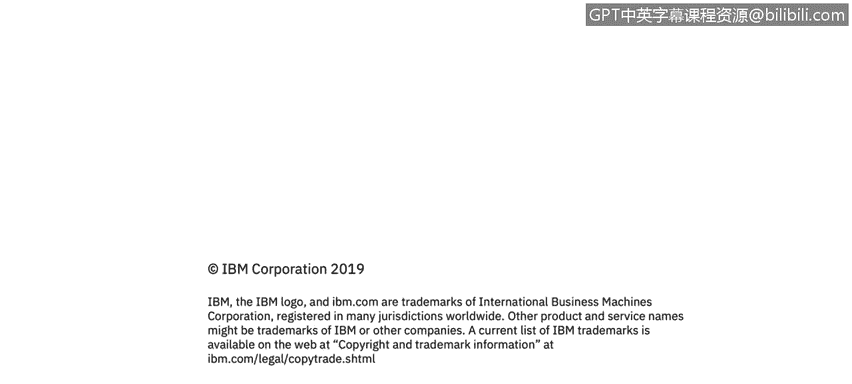

# 课程3：《网络安全合规框架与系统管理》：84：29_01：Windows管理中心服务器管理概述 🖥️

在本节课程中，我们将学习如何定义活动目录组的类型，并概述Windows管理中心的功能和工具。

现在，我们将讨论如何使用Windows管理中心进行服务器管理，以及如何利用活动目录组或安全组来管理账户和服务器。

## 活动目录管理职责类型

在活动目录环境中，主要存在两种类型的管理职责。

*   **服务管理员**：负责管理环境中的服务，例如控制用户对设备或网络资源的访问权限。
*   **数据管理员**：负责管理对环境中数据的访问，例如客户记录、员工记录或任何普通终端用户无需访问的敏感信息。

## 活动目录组类型

我们通过活动目录中的两种组类型来管理上述职责。

*   **分发组**：用于创建电子邮件分发列表。
*   **安全组**：用于为共享资源分配权限。

在活动目录中，每个人都会属于一个分发组，因为大多数组织都通过活动目录来控制电子邮件。用户登录活动目录账户后，其电子邮件便会投递到相应的设备上。例如，登录电脑并启动Microsoft Outlook后，由于使用活动目录账户登录，系统便能识别用户身份并将邮件投递到Outlook中。

安全组则用于为共享资源分配权限。如果我是某个安全组的成员，就意味着我拥有访问特定共享资源（如特定服务、打印机等）的权限。权限由活动目录管理员分配，但由安全组来控制。

## 活动目录组的作用域

在活动目录中创建的每个组都有一个作用域，这决定了该组在域中的范围及其可执行的操作。活动目录定义了三种作用域。

*   **通用作用域**
*   **全局作用域**
*   **域本地作用域**

这个层面的细节对于大多数人了解活动目录而言可能过于深入，但作为有趣的知识点值得了解。当首次创建活动目录域时，系统会预定义一些默认组，例如域管理员组。这是一个安全组，基本上控制着整个域。这些预定义的组有助于控制对共享资源的访问以及活动目录内特定的域范围管理控制。

## Windows管理中心概述

Windows管理中心是随Windows Server 2016推出的新工具。它是一个基于浏览器的管理工具，可用于管理Windows服务器。

它提供了对服务器基础设施所有方面的完全控制，对于管理私有网络上的服务器非常有用。这些服务器虽然仍连接到您的域，但可能并未连接到互联网。许多组织出于对安全漏洞的担忧，不会将服务器连接到互联网。

Windows管理中心允许您远程控制这些服务器，即使它们没有连接到互联网。这是组织通过Windows环境在活动目录环境中管理服务器的主要方式之一，当然他们可能也使用其他工具。

---

**本节总结**

在本节中，我们一起学习了活动目录中的两种管理职责（服务管理员与数据管理员）和两种组类型（分发组与安全组）。我们还了解了组作用域的概念，并介绍了Windows管理中心作为一个基于浏览器的强大工具，如何帮助管理员远程管理服务器，特别是在服务器未连接互联网的私有网络环境中。