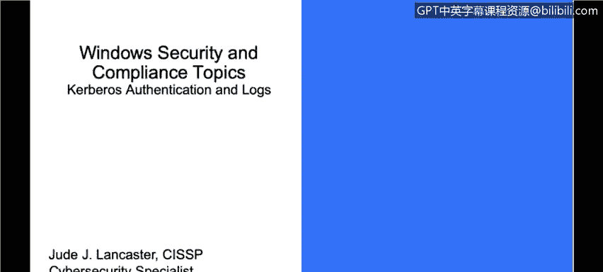
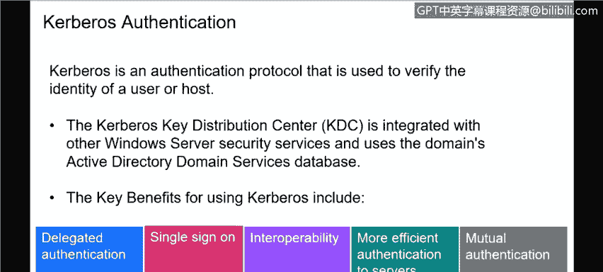
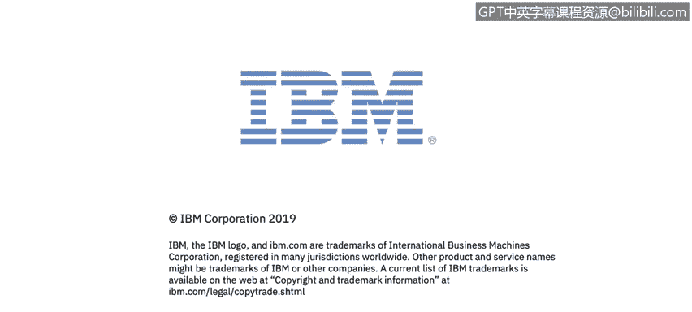

# 课程3：《网络安全合规框架与系统管理》：85：Kerberos认证与日志分析 🔐

在本节课中，我们将学习Windows操作系统环境下的两个核心安全概念：Kerberos认证协议和Windows服务器日志。我们将了解Kerberos如何保障活动目录的安全，以及如何利用日志进行安全监控和事件调查。

---

## Kerberos认证协议

上一节我们介绍了安全与合规的宏观背景，本节中我们来看看Windows系统中一个关键的认证机制——Kerberos。Kerberos是一种用于验证用户或主机身份的认证协议。在Windows环境中，它主要与活动目录（Active Directory, AD）结合使用。

当用户登录到通过AD连接的系统时，大多数AD系统会利用Kerberos作为认证协议。这确保了活动目录的安全，以验证最终用户或AD上的资源。

Kerberos的核心是**密钥分发中心（Key Distribution Center, KDC）**，它集成在活动目录和其他Windows安全服务中，并使用域活动目录服务数据库。对于初学者而言，无需深入这些细节，重要的是理解Kerberos是Windows内部用于认证和保护AD环境的主要机制。

Kerberos的主要优势包括：

以下是Kerberos认证的关键优势列表：
*   **委托认证**：认证可以委托给活动目录林中的不同资源，允许同一AD内的其他资源和用户之间进行安全交互。
*   **单点登录**：当我登录到AD后，任何利用该AD登录的资源我都自动登录了。这使我无需多次登录即可访问AD环境内的资源，在保持安全性的同时，为最终用户提供了极大的便利。
*   **互操作性**：只要资源是AD的一部分，并且我已通过AD认证，我就可以访问AD内的这些资源，而不必关心目标资源的任何特性。这也简化了最终用户的体验。
*   **高效性**：通过利用内置于AD的Kerberos，我们无需单独的认证服务，使得认证过程更加高效。
*   **相互认证**：它提供了使用内置在活动目录中的同一用户名和密码登录多个系统的能力。

> 值得注意的是，许多组织正在考虑或已经启用了双因素认证，以提供额外的安全层。双因素认证通常结合AD密码和第三方认证服务（如Google Authenticator）。然而，AD主要仍利用Kerberos进行单因素认证。

---

## Windows服务器日志

现在，我们将快速切换话题，讨论Windows服务器日志。在谈论安全和管理Windows服务器时，服务器日志至关重要，因为Windows环境中的所有信息都记录在日志中。

日志是计算机中发生事件的记录。服务器日志与台式机、笔记本电脑或任何Windows系统上的日志并无不同。实际上，无论何种操作系统，任何系统都会有日志。我们目前仅在Windows背景下讨论它们。这些事件由人员或运行进程触发，其目的是让你追踪发生的情况、排查问题，并帮助调查安全事件。

当我们与客户讨论如何管理其环境时，日志记录是一个非常重要的组成部分。我们做的工作之一就是帮助客户聚合和分析这些日志，以找出可能导致潜在漏洞、安全事件或任何需要调查的异常情况的事件。

从Windows的角度来看，这些日志最常见的位置是**Windows事件日志**。它包含操作系统以及在该服务器上运行的许多其他Windows应用程序（如SQL Server或IIS）的日志。它们使用**结构化数据格式**，这使得它们易于搜索和分析。其他日志可能以**文本格式**编写，你可以手动阅读它们。

许多组织会利用日志聚合器，以便轻松查看信息。Windows事件查看器让你可以在一个地方查看Windows事件日志，并搜索或过滤你可能感兴趣的特定类型的日志。

当我们谈论日志记录时，是从更广泛的背景来讨论的，不仅仅是一台机器，而是从一个组织可能拥有数百甚至数千台需要监控的机器的角度。考虑到这一点，如何管理这些日志对客户或组织来说很快会成为一个挑战。

因此，许多组织会寻求像**日志聚合器**，甚至是**安全信息与事件管理（SIEM）系统**这样的工具。SIEM会从他们管理的成百上千台机器中收集所有日志，将它们汇集到一个地方，然后自动分析这些日志并指出异常，以便安全人员进行调查。

这确实是网络安全的核心之一：查看系统、查看这些系统上的日志，并利用自动化工具来聚合和分析这些日志，以寻找可能需要进一步调查的事件或异常。

---

## 课程总结

本节课中，我们一起学习了Windows安全管理的两个基础但至关重要的方面。我们定义了Kerberos认证协议，了解了它如何作为活动目录的基石，提供安全、高效的单点登录体验。接着，我们探讨了Windows服务器日志的作用，明白了它是监控系统活动、排查问题和进行安全事件调查的关键工具，并介绍了使用日志聚合器和SIEM系统进行大规模日志管理的重要性。掌握这些知识是理解Windows环境安全与合规性的重要一步。