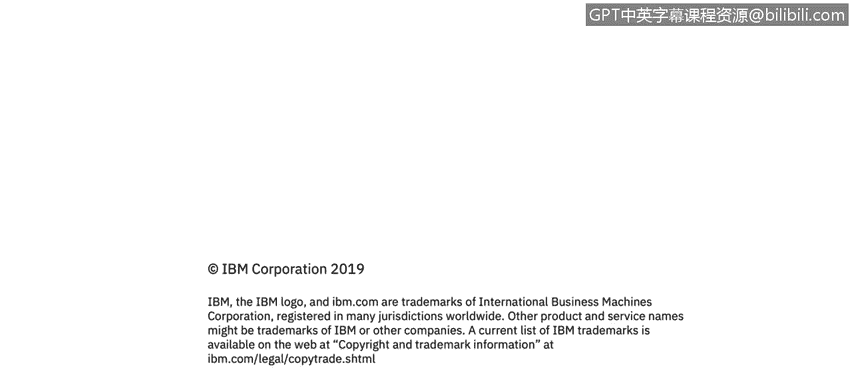

# 课程3：《网络安全合规框架与系统管理》：86：Windows审计概述

在本节课程中，我们将学习Windows Server的审计与访问控制。我们将了解审计的概念、其重要性，以及Windows系统中可审计的九类关键事件。

## 概述

网络安全的一个重要方面是审计。审计是指建立策略，并监控对象的创建或修改，以追踪潜在的安全问题。在Windows系统的语境下，监控的对象通常是文件或文件夹。审计主要有两个作用：确保用户问责制，以及在发生安全事件时提供证据。

## 用户问责制的重要性

上一节我们介绍了审计的基本概念，本节中我们来看看为何用户问责制如此关键。大约50%的网络安全事件源于内部，即由组织内部人员引发。这并非意味着所有内部事件都是恶意行为所致，很多时候是由于用户无意中点击了恶意链接或缺乏安全意识造成的。网络攻击者的手段日益复杂，他们可能通过一封看似普通的邮件诱使用户下载恶意文件，从而在环境中引发安全问题。

因此，在终端或服务器上监控和审计对象活动至关重要。大多数网络安全事件的起点，往往是一个文件被植入系统或被修改，从而启动一系列导致恶意活动的连锁反应。

## Windows可审计的事件类型

从Windows系统的角度来看，共有九类事件可以被审计。这些事件记录在**安全日志**中，该日志是Windows事件查看器的一部分。管理员通常通过事件查看器、日志分析器或安全信息与事件管理（SIEM）系统来监控这些事件。

以下是Windows系统中可审计的九类事件：

1.  **账户登录事件**：记录用户登录系统的行为，特别是远程登录。例如，如果系统在一秒内记录到上千次登录尝试，这可能是一次暴力破解攻击。
2.  **账户管理事件**：审计账户的创建、删除、启用、禁用、重命名或密码更改。短时间内大量账户被创建是需要调查的异常行为。
3.  **目录服务访问事件**：当有人访问具有自身访问控制列表的Active Directory服务对象时触发。短时间内多次尝试访问特定系统是可疑行为。
4.  **登录事件**：记录用户登录或注销计算机的行为（无论是本地还是通过网络）。需要关注登录频率、用户身份及登录来源IP地址。例如，来自异常地理位置的登录尝试值得调查。
5.  **对象访问事件**：审计对文件、文件夹、打印机或其他Active Directory内对象的访问。可以追踪谁在何时访问了何物及持续时间。
6.  **策略更改事件**：跟踪对本地安全策略或用户权限分配的更改尝试。例如，本地管理员试图禁用密码或降低密码安全强度的操作会被记录。
7.  **特权使用事件**：记录用户执行某项用户权限的行为。
8.  **进程跟踪事件**：跟踪终端上的进程活动，例如程序激活或进程退出。例如，管理员在任务管理器中停止防病毒（AV）进程的行为会被记录。
9.  **系统事件**：记录计算机关机或重启事件。更重要的是，当应用程序或进程尝试执行其没有权限的操作时，也会被记录。这可能意味着有恶意进程试图访问远程计算机或数据库以实施破坏。

## 总结

本节课中我们一起学习了Windows审计的核心概念。我们了解到审计通过监控对象变更来确保安全与问责，并详细探讨了Windows系统可审计的九类关键事件，包括账户活动、对象访问、策略变更和系统事件等。掌握这些事件的监控方法，是识别和响应潜在安全威胁的基础。