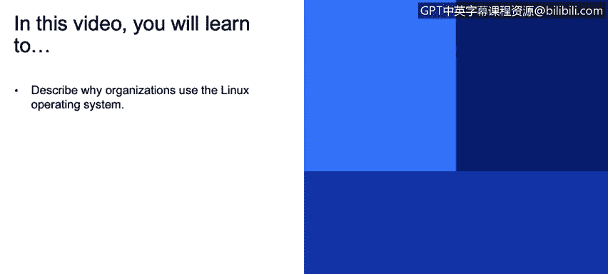
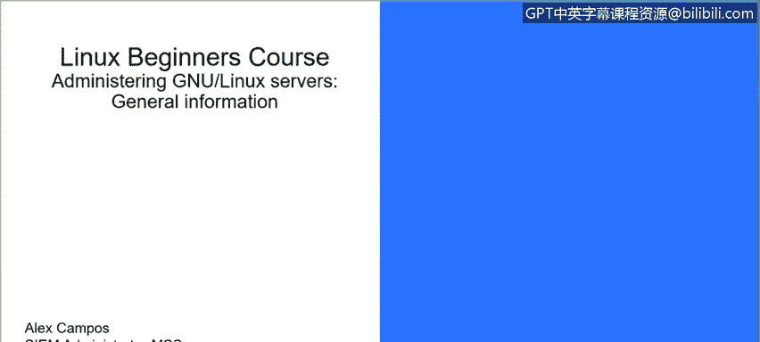
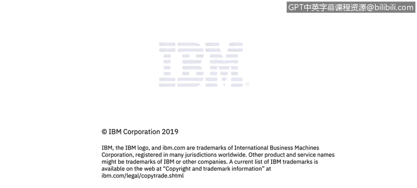

# 课程3：《网络安全合规框架与系统管理》：87：32_01_Linux入门介绍

在本节课中，我们将要学习Linux操作系统的基础知识，包括其历史、核心组件以及为何在组织中被广泛使用。

大家好，我是Alex Camps，我是IBM安全部门的一名系统管理员。今天，我们将开始为初学者讲解Linux课程。

## 🖥️ Linux概述

Linux是一个多用户、多任务的操作系统。它提供了多种功能，包括软件资源管理、目录和文件系统管理，并允许程序执行。

## 📜 Linux的历史

Unix操作系统始于1969年的贝尔实验室，最初用汇编语言编写。随后在1973年，Thompson和Ritchie成功地用C语言重写了Unix。

1991年9月，Linus Torvalds发布了后来成为Linux内核的第一个版本。Torvalds通过采用GNU通用公共许可证（GPL）发布其代码，极大地推动了开源社区的发展。

GNU GPL是一个广泛使用的自由软件许可证，它保证了最终用户运行、研究、分享和修改软件的自由。

## ❓ 为何选择Linux？

Linux系统足够灵活，允许用户利用各种支持工具（如编译器、科学库、调试器和性能监视器）来构建应用程序。

Linux具备四个使其成为科学计算领域优秀操作系统的关键特性：**性能**、**功能性**、**灵活性**和**可移植性**。Unix系统可以针对特定任务进行优化，例如运行在小型便携设备或大型超级计算机上。

## ⚙️ Linux如何工作？

Linux主要由两个核心组件构成：**内核**和**外壳**。

*   **内核**是Linux操作系统的核心。它直接与硬件交互，并管理着系统与用户的进程、设备、文件和内存。
*   **外壳**是用户与内核之间的接口。用户通过外壳输入命令，内核接收来自外壳的任务并执行它们。

外壳通常重复执行以下四个任务：
1.  显示提示符。
2.  读取命令。
3.  处理并解释命令。
4.  执行命令。

## 📝 总结

本节课中，我们一起学习了Linux操作系统的基本概念。我们了解了Linux的历史、其开源特性、选择Linux的原因，以及其核心工作组件——内核与外壳。理解这些基础知识是后续深入学习Linux系统管理和安全操作的重要第一步。