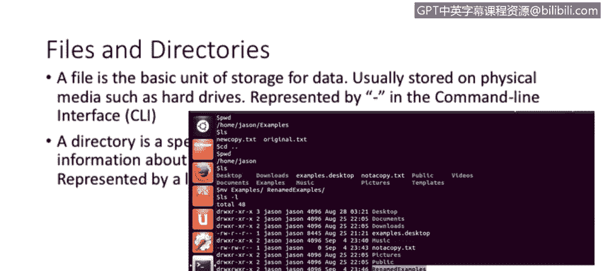
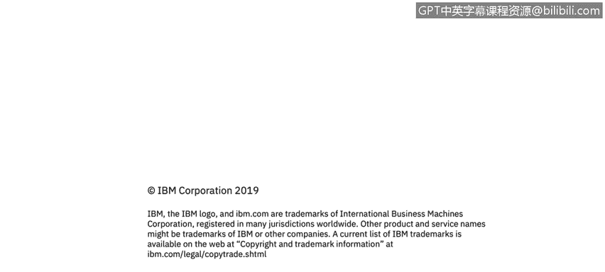

# 课程3：《网络安全合规框架与系统管理》：88：Linux文件系统与目录结构

## 概述

在本节课程中，我们将学习Linux操作系统的文件系统与目录结构。你将了解文件和目录的基本概念，并掌握Linux标准目录层次结构及其核心功能。这对于进行系统管理和安全配置至关重要。

## 文件与目录基础

在深入目录结构之前，我们首先需要理解文件和目录这两个基本概念。

文件是存储数据的基本单元。它本质上是物理存储介质（如硬盘、U盘）上用于保存信息的一个存储单元。在命令行中，文件通常用连字符 `-` 来表示其类型。

目录则是一种特殊类型的文件。它本身不直接存储用户数据，而是存储关于其他文件的信息，充当文件的容器。这类似于Windows操作系统中的“文件夹”。在Linux命令行中，目录用字母 `d` 表示。

在下面的截图中，你可以看到高亮显示的目录。在左侧，以字母 `d` 开头的条目表示这是一个目录。而在其上方，以连字符 `-` 开头的条目则表示一个普通文件。

## Linux目录结构

Linux的目录结构与Windows有很大不同。它采用一种层次化的树状结构，所有一切都从一个称为“根”的起点开始。

### 根目录 `/`

一切目录和文件的起点是斜杠 `/`，也称为根目录。系统中的所有其他文件和目录都以某种方式“挂载”或连接到这个根分区下。

只有root用户（系统管理员）对这个目录拥有完全的读写权限，这是出于系统安全性和稳定性的设计考虑。

**请注意**：根目录 `/` 与 `/root` 目录不同。`/root` 是root用户的个人家目录，我们稍后会讨论家目录。

## 核心目录详解

了解了根目录的概念后，接下来我们逐一了解Linux系统中几个最重要的一级子目录及其用途。

以下是Linux文件系统中关键目录的列表及其功能描述：

*   **`/bin`**：包含二进制可执行文件，也就是最常用的系统命令。例如，`ps`（查看进程）、`ls`（列出文件）、`cp`（复制）、`mv`（移动）等命令都位于此目录。
*   **`/sbin`**：同样包含二进制可执行文件，但这些命令主要用于系统维护和管理，通常需要root权限才能执行。例如，`iptables`（防火墙）、`reboot`（重启）、`ifconfig`（网络配置，较新系统使用 `ip` 命令）等。
*   **`/etc`**：这是系统中最重要的目录之一，包含了几乎所有系统和应用程序的配置文件。例如，如果你在Linux服务器上安装了Apache网页服务器，其配置文件通常位于 `/etc/apache2/` 或 `/etc/httpd/` 目录下。
*   **`/var`**：这个分区专门用于存放经常变化（可变）的文件。一个典型的例子是日志文件，它们通常存放在 `/var/log` 目录下。系统运行过程中产生的邮件、打印队列等也存放在这里。
*   **`/tmp`**：用于存放临时文件。任何存储在此目录下的文件，在系统重启时都会被删除。它不适合存储需要持久保存的数据。
*   **`/home`**：这是所有普通用户的个人家目录所在地。每当创建一个新用户（例如用户名为“warren”），系统就会在 `/home` 下创建一个对应的子目录（如 `/home/warren`）。用户对自己的家目录拥有完全控制权，用于存放个人文件和配置。
*   **`/boot`**：包含系统启动加载器（boot loader）所需的核心文件，如内核镜像和初始内存盘。这个目录在系统启动过程中被使用。

## 总结

本节课我们一起学习了Linux文件系统的基础知识。我们首先区分了文件（用 `-` 表示）和目录（用 `d` 表示）的概念。然后，我们深入探讨了Linux以根目录 `/` 为起点的树状目录结构，并详细介绍了 `/bin`、`/sbin`、`/etc`、`/var`、`/tmp`、`/home` 和 `/boot` 等核心目录的特定用途。理解这套标准目录结构是有效进行Linux系统管理、故障排查和安全加固的基石。