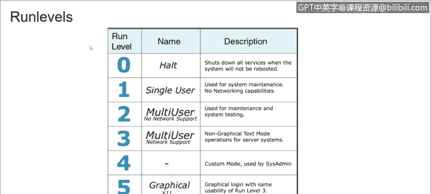
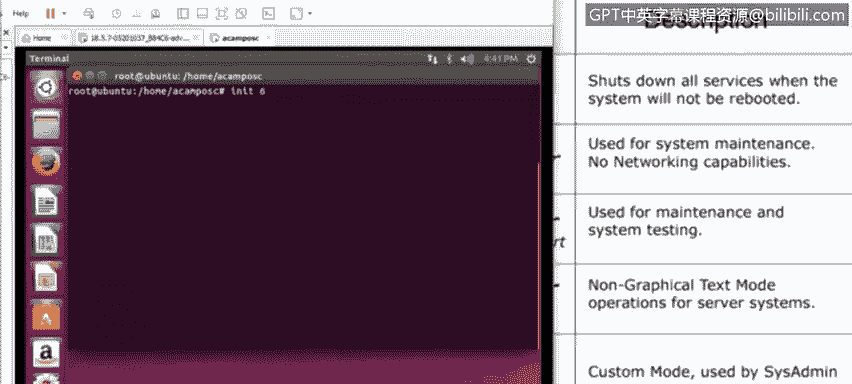

# 课程3：《网络安全合规框架与系统管理》：89：Linux运行级别


在本节课程中，我们将学习Linux操作系统中的运行级别概念。运行级别定义了系统启动时加载的服务和进程集合，是系统管理的重要基础。


## 什么是运行级别？🤔

上一节我们介绍了系统启动的基本流程，本节中我们来看看运行级别的具体定义。

当Linux系统启动时，它会启动`init`进程。`init`进程负责启动系统上的其他所有进程。例如，当你启动Linux计算机时，内核会启动`init`，然后`init`执行启动脚本来初始化硬件、启动网络服务和图形化桌面。

然而，`init`并非只执行单一的一套启动脚本。系统存在多个运行级别，每个级别都有自己对应的启动脚本。例如，一个运行级别可能启动网络服务和图形化桌面，而另一个运行级别可能不启动网络服务并禁用图形化桌面。这意味着你可以通过切换运行级别，从图形桌面模式切换到没有网络的文本控制台模式，而无需手动逐一停止或启动不同的服务。

## 运行级别详解 📊

以下是Linux系统中常见的运行级别及其含义：

*   **运行级别 0**：**关机**。此级别会关闭系统及所有服务。
*   **运行级别 1**：**单用户模式**。系统以超级用户模式启动，不启动守护进程或网络服务。此模式通常用于系统恢复或维护环境。
*   **运行级别 2, 3, 4, 5**：**多用户模式**。这些级别提供完整的、支持网络的多用户环境。其中，运行级别 5 通常代表带有图形化登录界面的多用户模式。
*   **运行级别 6**：**重启**。此级别用于重新启动系统。

## 运行级别操作演示 💻

现在，我们将在虚拟机环境中演示如何查看和切换运行级别。



以下是在终端中操作运行级别的常用命令：

*   查看当前运行级别：
    ```bash
    runlevel
    ```
*   切换到指定运行级别（例如，切换到运行级别 3）：
    ```bash
    init 3
    ```
*   重启系统（相当于运行级别 6）：
    ```bash
    init 6
    ```
    或
    ```bash
    reboot
    ```




如图所示，执行`init 6`命令后，系统开始重新启动。


## 总结 📝


本节课中我们一起学习了Linux运行级别。我们了解到运行级别是系统启动时的一组预定义状态，每个级别对应不同的服务和功能组合。掌握运行级别的概念和基本操作，对于进行系统维护、故障排查和资源管理至关重要。