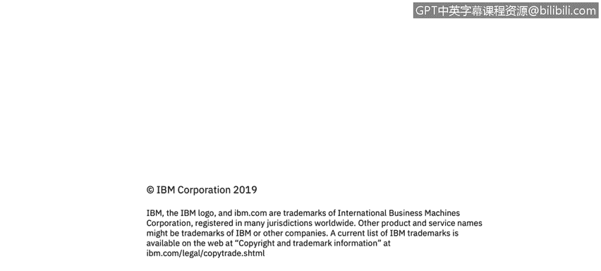

# 课程3：《网络安全合规框架与系统管理》：90：探索Shell

在本节课程中，我们将学习Linux操作系统中的Shell。你将能够描述Linux中常见的Shell类型及其特点。

上一节我们介绍了课程目标，本节中我们来看看什么是Shell。Shell是一个程序，它接收来自键盘的命令，并将其传递给操作系统执行。在过去，Shell是Linux操作系统上唯一的用户界面。如今，除了Shell这样的命令行界面，我们还拥有图形用户界面，例如桌面环境。

了解了Shell的基本概念后，接下来我们详细介绍几种常见的Shell。以下是Linux系统中几种主要的Shell类型：

*   **Bash Shell**：这是最常用的Shell，也是用户账户的默认Shell。其名称来源于 **B**ourne-**A**gain **Sh**ell。
*   **sh (Bourne Shell)**：它在Linux中不常直接使用，但通常作为指向Bash或其他Shell的符号链接。
*   **tcsh (TENEX C Shell)**：这个Shell基于早期的C Shell。它曾相当流行，但主要的Linux发行版并未将其作为默认Shell。
*   **csh (C Shell)**：这是原始的C Shell，在Linux上使用不多。但如果用户熟悉C Shell，tcsh是一个很好的替代品。它基本上用于基于C语言的程序。
*   **ksh (Korn Shell)**：它也被称为Korn Shell，设计目标是吸收Bourne Shell和C Shell的优点并进行扩展。它在Linux用户中拥有一小批但忠实的追随者。
*   **zsh (Z Shell)**：这个Shell将Shell的演化推向了一个新的高度，它融合了早期Shell的特性并增加了更多功能。

本节课中，我们一起学习了Linux Shell的基础知识。我们了解到Shell是用户与操作系统内核交互的命令行解释器，并介绍了Bash、sh、tcsh、csh、ksh和zsh这几种常见Shell的特点。理解不同的Shell是进行有效系统管理的第一步。