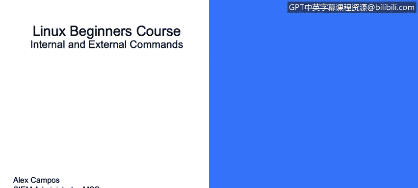
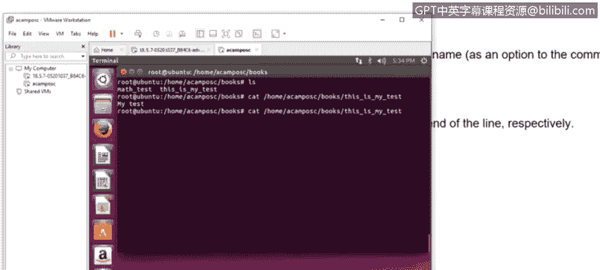
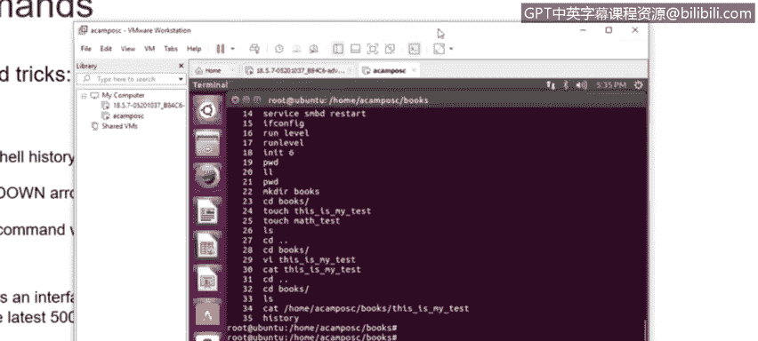
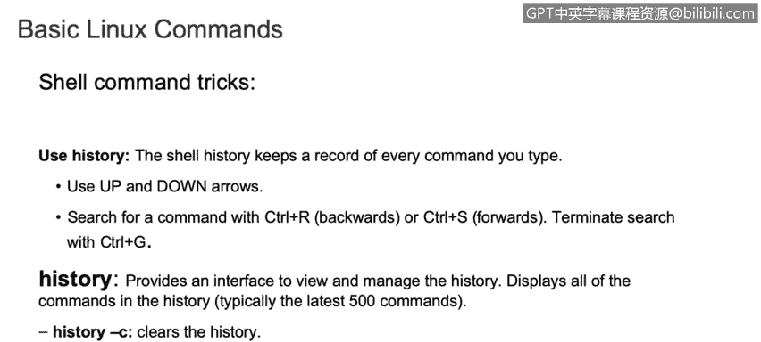
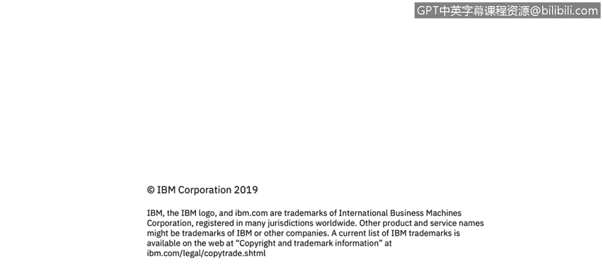

# 课程3：《网络安全合规框架与系统管理》：91：Linux内部与外部命令




## 概述
在本节课中，我们将要学习Linux操作系统中的两种基本命令类型：内部命令与外部命令。我们将了解它们的定义、区别以及如何识别它们。此外，我们还将介绍一些在命令行界面中提高效率的实用技巧。

## Linux命令简介
Linux操作系统主要通过命令行界面（CLI）进行交互和管理。这些命令可以分为两大类：内部命令和外部命令。理解这两者的区别对于高效使用Linux系统至关重要。

## 内部命令
上一节我们介绍了Linux命令的基本概念，本节中我们来看看什么是内部命令。

内部命令，也称为内置命令，是直接构建在Shell程序内部的命令。这意味着它们的执行不依赖于外部的独立程序文件。内部命令是Shell依赖的，不同的Shell（如Bash、Zsh）可能内置的命令集会略有不同。

我们可以使用 `type` 命令来确定一个命令是否为内部命令。其基本语法是：
```bash
type [命令名]
```
如果命令是内置的，输出信息中会包含“shell builtin”字样。例如，检查 `cd` 命令：
```bash
type cd
```
输出可能为：`cd is a shell builtin`。


**核心概念**：内部命令是系统已经加载的命令，当系统需要执行这些命令时，它们可以随时被调用。

## 外部命令
了解了内部命令后，我们再来看看外部命令。

外部命令是独立于Shell的程序。它们通常以可执行文件的形式存在于文件系统的特定目录中，例如 `/bin` 和 `/usr/bin`。这些命令不依赖于特定的Shell，并且在大多数Linux发行版中都能找到。

与内部命令不同，执行外部命令时，系统需要在文件系统中找到对应的可执行文件并加载运行。

## 命令行实用技巧
在继续深入之前，掌握一些命令行操作技巧可以极大地提升工作效率。以下是几个常用的技巧：




**使用Tab键自动补全**：在输入命令或文件路径时，按下Tab键可以自动补全名称。如果存在多个可能选项，按两次Tab键会列出所有匹配项。


**光标移动快捷键**：
*   `Ctrl + A`：将光标移动到行首。
*   `Ctrl + E`：将光标移动到行尾。




**查看命令历史**：
*   使用 `history` 命令可以查看之前执行过的所有命令列表。
*   使用键盘的**上箭头（↑）**和**下箭头（↓）**可以快速翻阅之前执行过的命令，方便再次调用或修改。



**使用手册（man pages）**：当你不确定某个命令的用法时，可以使用 `man` 命令查看其官方手册。例如，查看 `ls` 命令的用法：
```bash
man ls
```
手册会提供该命令的详细说明、参数选项和使用示例。




## 总结
本节课中我们一起学习了Linux内部命令与外部命令的核心区别。内部命令内置于Shell中，执行速度快且与Shell绑定；而外部命令是独立的可执行文件，存储在如`/bin`的目录中。我们还掌握了一些提高命令行效率的技巧，包括使用Tab键补全、光标移动快捷键、查看命令历史以及查阅`man`手册。理解这些基础知识是成为一名熟练的Linux系统管理员的第一步。