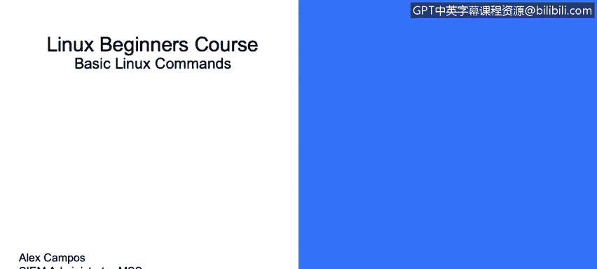
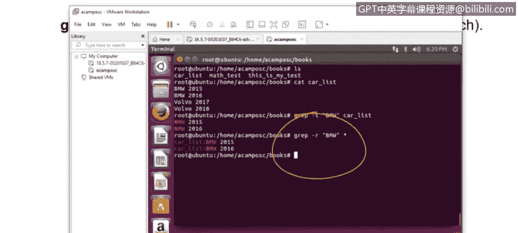

# 课程3：《网络安全合规框架与系统管理》：92：Linux基础命令（第一部分）🚀

在本节课程中，我们将学习Linux操作系统中的一些基础命令及其用途。掌握这些命令是进行系统管理和安全分析的基础。

---

## 操作系统信息与目录导航

上一节我们介绍了课程概述，本节中我们来看看如何获取系统信息和在文件系统中导航。

`uname`命令用于显示当前运行的操作系统信息。例如，运行`uname`命令可以看到系统正在运行Linux。

如果希望获得更详细的信息，可以添加`-a`标志。该命令将提供额外信息，如当前Linux内核版本、系统主机名和日期。

`cd`命令用于切换到不同的目录。例如，假设当前在`home`目录下，想要进入`Alex`子目录，只需输入`cd Alex`即可。

如果当前在`home`目录，想要进入`Jack`目录下的`test`子目录，则需要输入`cd Jack/test`。通过这种方式，可以使用`cd`在不同目录和子目录间移动。

如果当前在`test`目录，想要返回上一级的`Jack`目录，只需输入`cd ..`即可返回上一个文件夹。

有时我们可能不清楚自己当前所在的目录位置。`pwd`命令可以显示当前所在路径的完整信息。

---

## 文件归档与压缩

了解了如何导航后，接下来我们看看如何管理文件，包括归档和压缩。

`tar`命令用于创建新的归档文件。要创建归档文件，需要输入`tar`命令以及相应的标志来指定创建操作，然后指定归档文件的名称和目标目录。

要提取归档文件中的信息，同样使用`tar`命令，但需使用表示提取的标志。

如果只想查看归档文件中包含哪些信息，可以使用`-tvf`标志加上归档文件名。

`gzip`命令用于压缩文件。命令格式为`gzip`后接要压缩的文件名。也可以使用`-d`标志来解压缩文件。

`unzip`命令用于提取压缩文件中的所有信息。只需使用`unzip`后接压缩文件名即可。

若想在不解压的情况下查看压缩文件的内容，可以使用`unzip -l`后接压缩文件名。

---

## 文件搜索与列表

处理文件时，经常需要查找特定内容或列出目录信息。

`grep`命令用于执行特定搜索。例如，如果想打印匹配行及其后三行，可以使用`grep`命令。

假设在`/home/campus/books`目录下有一个包含许多书名和日期的文件`cardlist`，我们想找出所有关于“BMW”的信息。使用`grep “BMW” cardlist`命令即可显示相关信息。

如果想在所有文件中搜索“BMW”，可以使用`grep -r “BMW”`命令。

`find`命令与`grep`类似，但用于查找具有特定名称的文件。基本用法是`find -name`后接要查找的文件名，它将显示文件所在的路径。

`find`命令还可以用于查找具有特定修改时间的文件、特定扩展名的文件，或在主目录中查找空文件。

`ls`命令用于列出目录中所有文件和子目录的内容，并以人类可读的格式显示文件大小。

`ls -ltr`命令功能类似，但会显示更多信息，如最后修改时间和文件权限，并以反向顺序显示。

---

## 系统关机与重启

最后，我们来学习如何安全地关闭或重启系统。

`shutdown`命令用于关闭服务器。例如，`shutdown -h now`会立即关闭系统。

如果希望系统在10分钟或20分钟后关闭，可以使用`shutdown -h +10`或`shutdown -h +20`。如果需要在一小时三十分钟后关闭，只需将时间换算为分钟数即可。

若要关闭设备后重新启动，可以使用`shutdown -r`命令，这将执行重启。

如果希望在重启期间强制检查文件系统，可以添加`-F`标志。

`shutdown -r`、`reboot`和`init 6`命令在新旧系统中可能存在差异，但它们执行相同的内部过程，即重启设备。

---

## 总结

本节课我们一起学习了Linux的基础命令。我们涵盖了如何获取系统信息、在目录间导航、创建与提取归档文件、压缩与解压文件、搜索文件内容、列出目录详情以及安全关闭和重启系统。这些命令是日常系统管理和安全运维工作的核心工具。