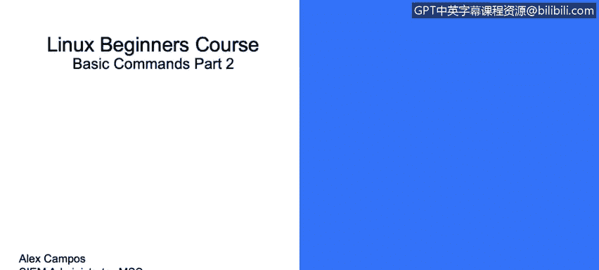
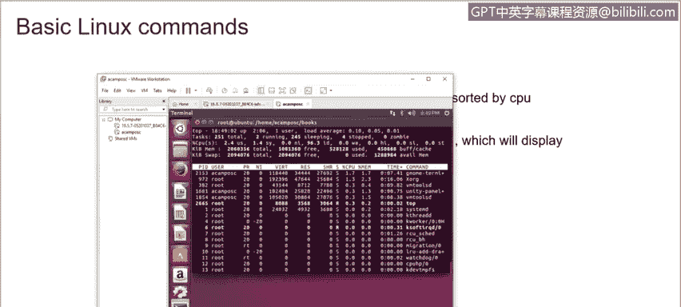
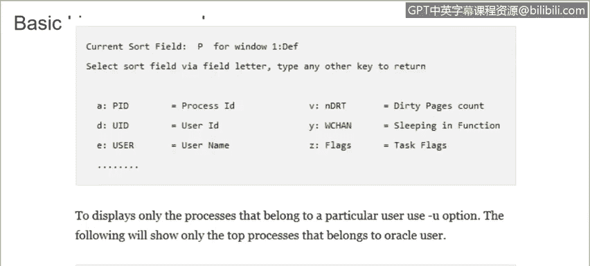
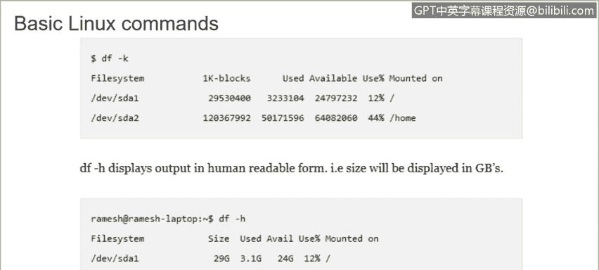
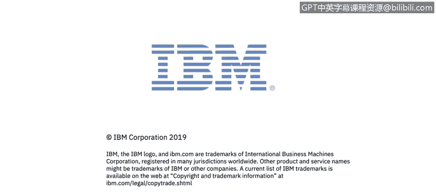

# 课程3：《网络安全合规框架与系统管理》：93：38_03_Linux基础命令（第二部分）🔧


## 概述
在本节课程中，我们将继续学习Linux操作系统中的一些核心命令。我们将重点介绍用于网络连接、进程管理、系统资源监控和磁盘空间查看的命令。掌握这些命令对于进行有效的系统管理和故障排查至关重要。




## 网络连接命令：FTP与SFTP
上一节我们介绍了文件和目录操作命令，本节中我们来看看用于网络文件传输的命令。

FTP（文件传输协议）和SFTP（安全文件传输协议）命令用于连接远程服务器并传输多个文件。两者的命令结构相似。

要连接到远程服务器，只需使用 `ftp` 命令加上目标服务器的IP地址或主机名。

```bash
ftp [远程服务器IP或主机名]
```
连接成功后，即可开始从该设备下载所需信息。

## 进程查看命令：`ps`
`ps` 命令用于显示系统中正在运行的进程信息。

如果你想查看特定服务的进程信息，可以使用 `ps -ef` 命令，并通过管道符 `|` 配合 `more` 命令分页查看。

```bash
ps -ef | more
```
若要查看当前运行进程的树状结构，可以使用 `-e f` 和 `-H` 选项。

```bash
ps -e f -H | more
```
你也可以直接使用 `ps` 命令，它会显示所有进程的ID。要查看某个特定进程的详细信息，只需使用 `ps` 命令加上该进程的ID。

```bash
ps [进程ID]
```

## 内存信息命令：`free`
`free` 命令用于显示系统中可用的内存信息。

直接运行 `free` 命令，会显示系统总内存、已用内存和空闲内存。但有时以字节显示的值难以解读。

我们可以添加 `-g` 选项，以吉字节（GB）为单位显示信息。

```bash
free -g
```
此外，你也可以使用 `-k` 查看千字节，或使用 `-m` 查看兆字节。


`free` 命令推荐用于快速查看系统的内存使用情况。



## 动态进程监控命令：`top`
`top` 命令用于动态显示系统中占用资源最多的进程。

运行 `top` 命令后，你将看到系统中所有正在运行的进程列表，同时还能实时查看CPU和内存的使用情况。

如果你想只显示属于特定用户的进程，可以使用 `-u` 选项。

```bash
top -u [用户名]
```
例如，在一个拥有众多用户的大型环境中，你可以使用此命令专门监控某个用户的进程活动。




## 磁盘空间命令：`df`
`df` 命令用于显示环境中的磁盘空间使用情况。

使用 `-k` 选项，输出将以字节为单位显示。而使用 `-h` 选项，输出将以人类易读的形式（如K、M、G）显示。



```bash
df -h
```
例如，在虚拟机中运行 `df -h`，可以清晰看到所有分区的磁盘空间使用信息。


如果使用 `-T` 标志，它将显示Linux发行版中每个分区所使用的文件系统类型。

```bash
df -T
```

## 进程终止命令：`kill`
`kill` 命令用于终止环境中正在运行的进程。

终止进程前，首先了解该进程的ID至关重要。使用 `ps -ef` 可以显示进程ID及其详细信息。

终止进程的命令格式为 `kill -9 [进程ID]`。使用此命令需要格外谨慎，因为进程一旦被终止将无法恢复。

以下是操作示例：
首先，我们查找所有属于“beam”的进程ID。

```bash
ps -ef | grep beam
```
假设命令输出显示进程ID为7243。接着，我们使用 `kill` 命令终止该进程。

```bash
kill -9 7243
```
执行后，该进程将被终止。



## 总结
本节课中我们一起学习了Linux的第二部分基础命令。我们涵盖了用于连接远程服务器的FTP/SFTP命令，用于查看和管理系统进程的 `ps` 和 `kill` 命令，用于监控内存和CPU使用情况的 `free` 和 `top` 命令，以及用于检查磁盘空间的 `df` 命令。熟练运用这些命令是进行有效Linux系统管理的基础。